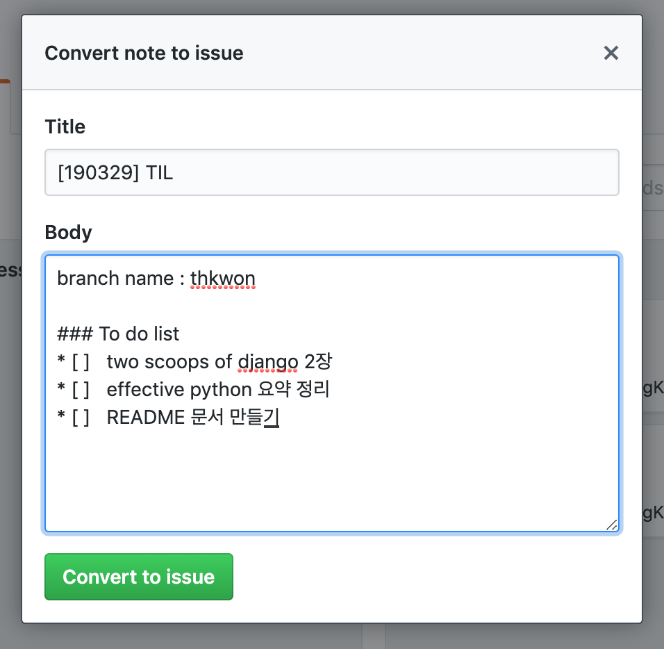

# 딜리버리 히어로 테크 인턴쉽 백엔드 - Today I Learned:smile:


## :star: Intro

> #### 이 문서는 온라인 강의, 개발 서적 , 협업 관련 각자 혹은 그룹 Study를 진행하고, 학습한 내용들을 정리하고, 레퍼런스화 시키기 위해서 작성되었습니다.


## :open_file_folder: Folder Structure


```
.
├── TIL -------------------> # 매일 학습할 내용을 기록
│   ├── mhshim -------------> # 개인 폴더 이하 동일
│   │   ├── askdjango -----> # askdjango 강의 관련 코드 이하 동일
│   │   │   └── README.md
│   │   ├── etc -----------> # askdjango, summary 이외 이하 동일
│   │   │   └── README.md
│   │   └── summary -------> # 학습한 내용에 대한 요약 정리 이하 동일
│   │       └── README.md
│   ├── srson 
│   │   ├── askdjango
│   │   │   └── README.md
│   │   ├── etc
│   │   │   └── README.md
│   │   └── summary
│   │       └── README.md
│   └── thkwon
│       ├── askdjango
│       │   └── README.md
│       ├── etc
│       │   └── README.md
│       └── summary
│           └── README.md
└── project ----------------> # 앞으로 진행할 프로젝트 폴더
```


## :ballot_box_with_check: To Do List

### 1. AskDjango 온라인 강의

* 순서대로 진행 됩니다.

  

#### 1차  :  파이썬,  Django 기초 

> * 기본적인 파이썬 문법과, Django의 기초적인 개념을 이해하고 적용한다.

* `파이썬 차근차근 시작하기 (시즌1)`
  * 필요한 부분 파트만 골라서 수강
* `Django girls 튜토리얼 따라하기(시즌2)` + `Django girls 공식 튜토리얼 문서`
* `Django 차근차근 시작하기 2/E(시즌2)`
  * Function Based View 위주
* `요기요 st 만들기`
  *  아임포트 연동 제외 / pandas 제외 / 크롤링 제외


#### 2차 :  API(DRF) 서버 만들기 기초 및 Django 중급

> * DRF를 이용해서 API 서버를 만들어본다
> * CBV, Form, 인증 과 관련해서 학습한다.

* `API 서버 만들기 및 초간단 안ㄷ로이드 앱 만들기`
  * 안드로이드 부분은 제외
* `Django 클래스 기반 뷰 잘 알고 쓰기(시즌2)`
  * Class Based View 위주
* `Django 기본 인증 뽀개기(시즌2)`
* `Form / ModelForm 잘 알고 쓰기(시즌2)`


### 2. 개발 서적 및 깃헙레포

##### AskDjango와 병행하면서, 각자 공부할 내용 입니다.

* 순서대로 진행 됩니다.

  

#### 1차 : `Two scoops of Django` 요약

> Two scoops of Django 책을 학습하고 요약합니다.

#### 2차 : `REST-API tutorial` (Pure Django API)

> Pure Django API를 활용하여서, 간단한 API를 만들어보는 튜토리얼 입니다.

#### 3차 : `Test Driven Development with Python`, `Effective Python` 

> 테스트 코드 작성 및 파이썬 Best Practice 에 대해서 학습 합니다.


### 3. 협업 프로세스

> * 기본적인 Git, Github 사용법을 익힙니다.
> * MarkDown 문법을 이용한 문서화 방법을 익힙니다.

#### Git, Github 기본적인 이해

* Github 중요 키워드 및 사용법
  * Github Flow
  * Pull Request
  * Issue
  * Project(칸반보드) 활용

* Git 중요 키워드 및 사용법
  * 기본 Git Command 혹은 Git GUI 툴 다루기
  * Rebase 와 Merge
  * Conflict 해결방법
* 레퍼런스
  * [Pro git 2.0(한글 번역판)](http://www.oss.kr/oss_guide/show/2c619df7-40d6-43de-af7a-2b0db6c16538)

#### 문서 

* 마크다운 문법
* Typora(마크다운 에디터)


## :bangbang: ​Rules

### Default Rules

1. To Do List의 1번(온라인 강의)과 2번(개발 서적)은 동시에 진행되고 강의 요약한 내용 혹은 따로 정리한 내용은 `md` 파일로 각자 개인 `summary` 폴더에 저장합니다.
2. 책 제목은 `h1`(#) , 각 Chapter는 `h2`(##) 으로 구분 짓고, **개발 서적 및 깃헙레포(ex)two scoops of django)당** 혹은 **askdjango의 1개의 강의(ex)장고 차근차근 시작하기) 당** 1개의 `md` 파일로 관리하고,  네이밍은 snake_case로 합니다.
   * Ex) `two_scoops_of_django.md` , `장고_차근차근_시작하기.md` 등등
   * 학습한 자료를 프로젝트 개발 간에 **레퍼런스로 활용하기 위해서 입니다.**(문서 내에서 `cmd + f` 를 활용)
3. 프로젝트 개발에 필요한 `AskDjango` 온라인 강의를 위의 순서대로 수강 하고, 내용을 정리합니다.
   * 중요 내용 요약 / 처음 배우는 개념 / 이해가 안되는 개념 /알긴 아는데 정리가 필요한 개념 등등을 정리합니다.
4. 프로젝트 개발에 필요한 `개발 서적 및 깃헙레포` 를 위의 순서대로 학습하고 내용을 정리합니다.
   * 중요 내용 요약 / 처음 배우는 개념 / 이해가 안되는 개념 /알긴 아는데 정리가 필요한 개념 등등을 정리합니다.
5. 3번(협업 프로세스)는 학습한 내용을 깃헙레포에 올려보면서 **스스로 학습하고 익힙니다.**
6. 잘 안되는 부분이 있거나, 궁금한점은 해당 `깃헙 issue` 에 질문을 올리거나, 다른 사람의 코드를 참고합니다.


### PR Rules && Branch Rules

* 학습내용 관련 Pull Request 날리기

  1. 깃헙 `project` 에서 카드를 만든다 

     

  2. `Conver to issue` 를 클릭한다.

     

  3. 다음과 같이 작성 하고 Convert to issue 버튼을 누른다.

     

  4. `In Progress` 탭으로 옮긴다

  5. `issue` 가 생긴 것을 확인할 수 있고, 다 했으면 체크를 한다. / `Projects` 내, 카드 에서 체크해도된다.

     

     

  6. 해당 카드에 대한 list를 완료하면, 

     * 최초의 경우

       * 본인 이니셜로 `branch` 를 생성 합니다. 

         ```shell
         git checkout -b thkwon # thkwon이라는 브랜치를 생성하고 해당 브랜치로 checkout 한다.
         ```

     * 이미 브랜치를 생성한 경우

       * 7번으로 바로 넘어간다.

  7. 본인 이니셜의 브랜치인지 확인하고, 내용정리, 작성한 코드를 `add`,  `commit` 하고 `push` 한다.

     * 처음 `push` 할 때는, 아래와 같이 해주고, 이후로는 `git push` 를 쓴다.

       ```shell
       git push --set-upstream origin thkwon
       ```

  8. 깃헙에 들어가면 아래 메세지가 뜨는 것을 확인할 수 있고, `compare & pull request` 버튼 혹은 `New pull request` 버튼을 눌러서 PR을 보낸다

     

  9. PR 내용을 작성하고, 내용 중에 `Close #issue번호` 을 써준 후, `Create pull request` 버튼을 클릭한다

     

  10. 정상적으로 master로 병합이 되면, `Issue` 는 자동으로 닫히고, 생성한 카드는 자동으로 `Done`으로 옮겨진다

      

      

  


### 해당 문서는 계속 수정 예정 입니다. :smile:

