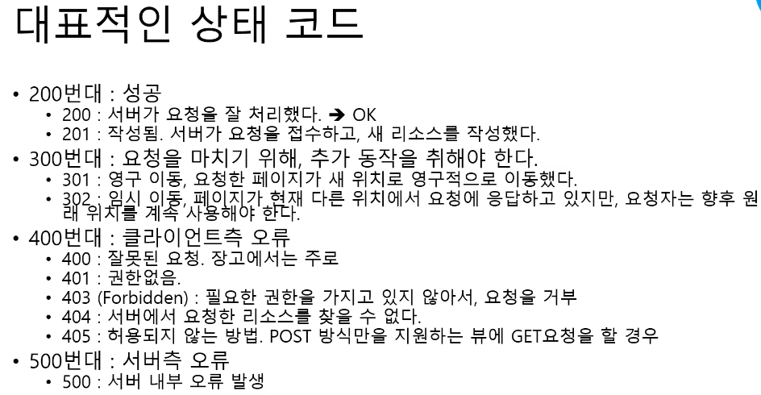
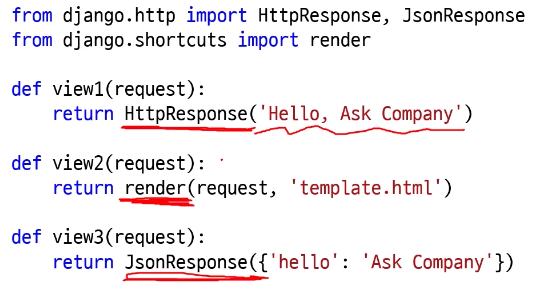
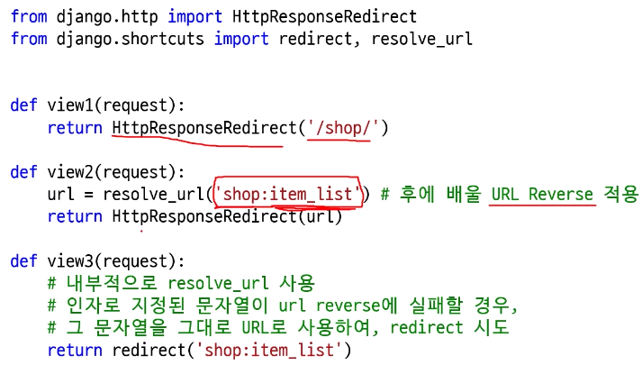
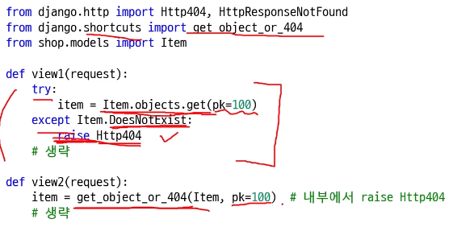
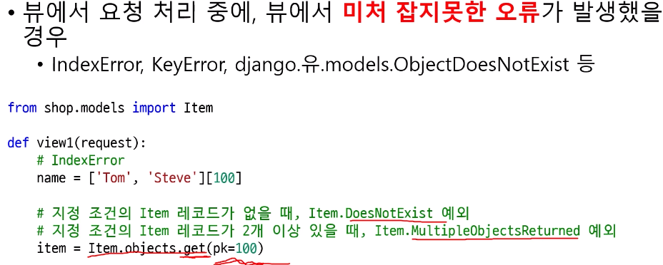

# 장고 차근차근 시작하기 기초

##3 장고앱

*   재사용성을 목적으로 한 파이썬 패키지
    *   앱을 하나의 작은 서비스로 봐도 무방
*   하나의 앱 이름은 현재 프로젝트 상에서 유일해야 한다
*   새 장고 앱 또는 외부 라이브러리 형태의 장고 앱은 settings.py의 INSTALLED_APPS에 등록해야 한다

##### models, views 모듈을 패키지로 전환

*   모듈 : 파이썬 소스코드 파일
*   패키지 : 파이썬 소스코드 디렉토리

방법 1

>   myweb/models.py에 Item 모델, Review 모델 작성

방법 2

>   myweb/models/
>
>   ​			item.py에 Item 모델
>
>   ​			review.py에 Review모델
>
>   ​			_\_init__.py에서 from .item import * 와 같이 임포트하게 되면 모델 외부에서는 방법 1과 동일하게 사용 가능

## 4 VSCode 장고 디버깅 세팅하기

##### 디버깅의 필요성

print로 출력하는 방법도 있지만 IDE에서 디버깅 툴을 사용할 수 있다

ptvsd를 통한 디버깅

디버깅을 위해 기본 적용되는 옵션

*   run server 서버 시작 옵션 : —no reload —nothreading
    *   소스 코드를 변경해도 자동 재시작하지 않는다
*   디버깅 메뉴를 통해 명시적 재시작, 정지를 해야 한다

## 5 URLConf와 정규 표현식

문자열의 패턴, 규칙, Rule을 정의하는 방법

장고 URL Dispatcher에서는 정규표현식을 통한 URL 매칭

>   대괄호 안에 문자열 예시를 나열한다.
>
>   1자리 숫자
>
>   [0123456789] 또는 [0-9] 또는 [\d]
>
>   2자리 숫자
>
>   \[0123456789][0123456789] 또는 \[0-9][0-9] 또는 \d\d
>
>   3자리 숫자
>
>   \d\d\d 또는 \d{3}
>
>   2~4자리 숫자
>
>   \d{2,4}
>
>   폰 번호
>
>   010[1-9]\d{7}
>
>   알파벳 소문자 1글자
>
>   [abcdefghijklmnopqrstuvwxyz] 또는 [a-z]
>
>   알파벳 대문자 1글자 [A-Z]

>   반복횟수 지정 문법
>
>   r"\d" : 별도 횟수 지정 없음 -> 1회 반복
>
>   r"\d{1}" : 1회 반복
>
>   r"\d{2}" : 2회 반복
>
>   r"\d{2,4}" : 2~4회 반복
>
>   r"\d?" : 0회 혹은 1회 반복
>
>   r"\d*" : 0회 이상 반복
>
>   r"\d+" : 1회 이상 반복

##### URL Dispatcher

특정 URL이 들어오면 그에 맞는 View를 호출한다. -> View에 대한 리스트

프로젝트/settings.py에서 최상위 URLConf 모듈을 지정 : ROOT_URLCONF = 'project.urls'

최상위 urlpatterns로부터 include를 통해 tree 구조로 확장된다.

HTTP 요청이 들어올 때마다 urlpatterns 상의 매핑 리스트를 처음부터 순차적으로 돌면서 URL 매칭 시도.

*   매칭되는 URL이 많아도 첫 URL만 사용
*   매칭되는 URL이 없을 경우 404 Page Not Found 응답

##### path()와 re_path()

```pyt
from django.conf.urls import url  # django 1.x 스타일
from django.urls import path, re_path  # django 2.x 스타일
```

re_path()는 url()과 동일하다

##### 기본 제공되는 Path Converters

StringConverter -> r"[ ^/]+"

IntConverter -> r"[0-9]+"

SlugConverter(StringConverter) -> r"[-a-zA-Z0-9_]+"

UUIDConverter

PathConverter(StringConverter) -> r".+"

## 6 다양한 응답의 함수 기반 뷰 만들기

##### View

1개의 HTTP 요청에 대해 -> 1개의 뷰가 호출

url patterns 리스트에 매핑된 호출 가능한 객체

*   함수도 호출 가능한 객체 중 하나

웹  클라이언트로부터 HTTP 요청을 처리

2 가지 형태의 뷰

1.  함수 기반 뷰 : 장고 뷰의 기본
2.  클래스 기반 뷰 : 클래스.as_view()를 통해 호출 가능한 객체를 생성/리턴

##### View 호출 시 인자

1.  HttpRequest 객체 : 현재 요청에 대한 모든 내역을 담고 있다.
2.  URL Captured Values : 현재 요청의 URL로부터 Capture된 문자열들

*   url/re_path를 통한 처리에서 : 모든 인자는 str 타입으로 전달
*   path를 통한 처리에서 : 매핑된 Converter의 to_python에 맞게 변환된 값이 인자로 전달

##### View 호출에 대한 리턴값

*   반드시 HttpResponse 객체를 리턴해야 한다.
    *   장고 middleware에서는 뷰에서 HttpResponse 객체를 리턴하기를 기대함. 다른 타입을 리턴하면 오류.
    *   django.shortcuts.render 함수는 템플릿 응답을 위한 shortcut 함수
*   파일 like 객체 혹은 str/bytes 타입의 응답 지원
    *   str 문자열을 직접 utf8로 인코딩할 필요가 없다.
        *   장고 디폴트 설정에서 str 문자열을 utf8로 인코딩해 줌.
    *   response = HttpResponse(파일like객체 또는 str객체 또는 bytes객체)
*   파일 like 객체
    *   response.write(str객체 또는 bytes객체)

##### HttpRequest와 HttpResponse 예시

```python
from django.http import HttpResponse

def index(request):
    # 주요 request 속성
    request.method  # 'GET', 'POST', ...
    request.META  # 요청 헤더 정보
    request.GET, request.POST, request.FILES, request.body
    
    content = '''<html></html>'''  # 문자열 혹은 이미지 등
    
    response = HttpResponse(content)
    response.write(content)  # file-like object
    response['Custom-Header'] = 'Custom Header Value'
    return response
```

##### Excel 파일 다운로드 응답

```python
from django.http import HttpResponse
from urllib.parse import quote

def response_excel(request):
    filepath = '/other/path/excel.xls'
    filename = os.path.basename(filepath)
    
    with open(filepath, 'rb') as f:
        response = HttpResponse(f, content_type='application/vnd.ms-excel')
        
        # 브라우저에 따라 다른 처리가 필요.
        encoded_filename = quote(filename)
        response['Content-Disposition'] = "attachment; filename*=utf-8''{}".format(encoded_filename)
        
    return response
```

## 7 적절한 HTTP 상태코드로 응답하기

##### HTTP 상태코드

*   웹 서버는 적절한 상태 코드로서 응답해야 한다.
*   각 HttpResponse 클래스마다 고유한 status_code가 할당
*   REST API 만들 때 특히 유용

##### 대표적인 상태 코드



##### 200 응답 예



##### 302 응답 예

redirect()는 내부적으로 resolve_url()을 사용한다.

##### 404 응답 예



##### 500 응답 예



## 8 장고 쉘

*   기본 쉘
*   ipython
*   jupyter note book

터미널에서 python 또는 ipython을 실행시켜서 DB 접근을 시도하면 오류가 난다. 장고 프로젝트 설정이 로딩된 파이썬 쉘을 써야 한다.

>   python manage.py shell

```python
from django.contrib.auth import get_user_model
User = get_user_model()
User.objects.all()
# 결과 <QuerySet [<User: admin>]>
```

##### django-extensions 내 shell_plus 명령

*   쉘 구동 시 일일이 임포트 작성할 필요 없이 자동 임포트 : 장고 앱의 모델들, 주요 함수들

pip install django-extensions

settings.py의 INSTALLED_APPS에 django_extensions 추가

python manage.py shell_plus

python manage.py shell_plus —notebook  # 주피터 노트북으로 실행

##### SQL 출력 옵션

쉘에서 python manage.py shell_plus —print-sql

또는 settings.SHELL_PLUS_PRINT_SQL = True

