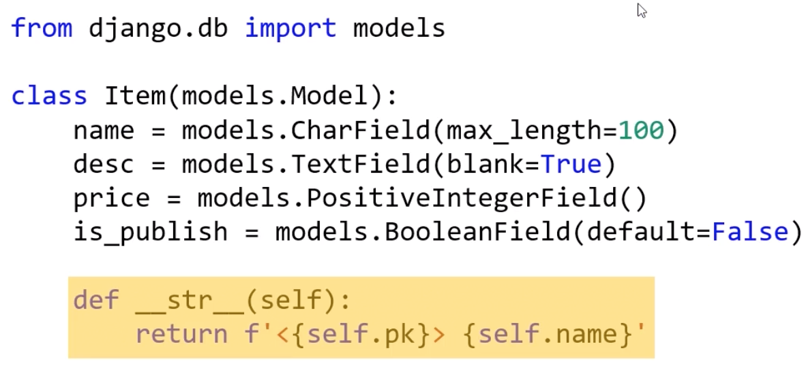
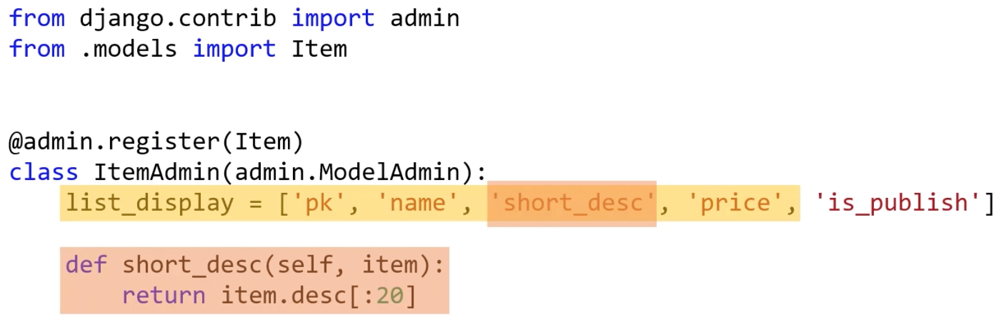
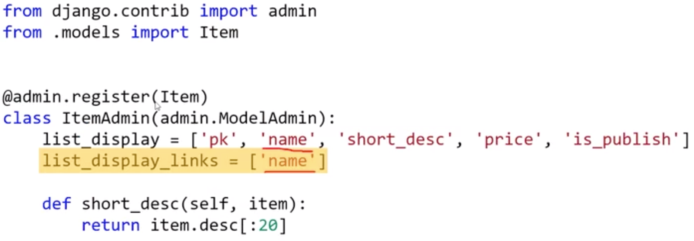
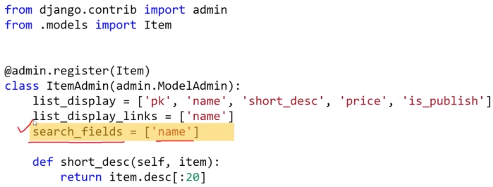
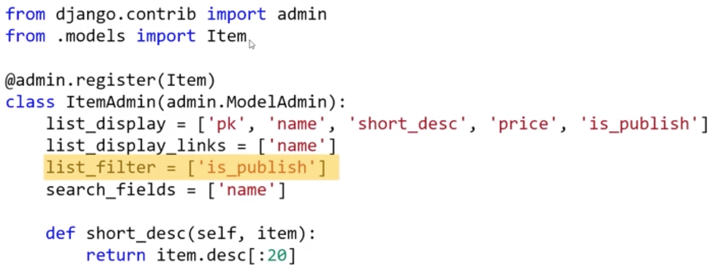

# 장고 차근차근 시작하기 기초

## 9 장고 모델 (ORM)

### 애플리케이션의 다양한 데이터 저장 방법

*   DB : RDBMS, NoSQL 등
*   파일 : 로컬, 외부 정적 스토리지
*   캐시 서버 : memcached, redis 등

### 데이터베이스와 SQL

RDBMS : PostgreSQL, MySQL, SQLite, MS-SQL 등

NoSQL : MongoDB, Cassandra, CouchDB, Google Big Table 등

SQL : DB에 쿼리하기 위한 언어

*   ORM을 쓰더라도, 작성된 ORM 코드를 통해 어떤 SQL이 실행되고 있는 지 파악하고 최적화 할 수 있어야 한다.

장고 ORM은 RDB만 지원한다. NoSQL은 DB 스키마가 지정되어 있지 않다.

##### 다양한 파이썬 ORM

*   RDB
    *   Django Models
    *   SQLAlchemy
    *   Orator
    *   Peewee
    *   PonyORM
*   NoSQL DB
    *   django-mongodb-engine
    *   hot-redis
    *   MongoEngine
    *   PynamoDB

### 장고의 강점은 Model, Form

SQL을 직접 실행할 수 있다.

```python
from django.db import connection

with connection.cursor() as cursor:
    cursor.execute("UPDATE bar SET foo = 1 WHERE baz = %s", [self.baz])
    cursor.execute("SELECT foo FROM bar WHERE baz = %s", [self.baz])
    row = cursor.fetchone()
    print(row)
```

### Django Model

DB 테이블과 파이썬 클래스가 1:1 매핑

모델 클래스명은 단수형, CamelCase

모델 클래스 필드는 DB 테이블 필드 내역과 일치해야 함

모델 만들기 전 DB 설계 필수

```python
from django.db import models

class Post(models.Model):
    title = models.CharField(max_length=100)
    content = models.TextField()
    created_at = models.DateTimeField(auto_now_add=True)
    updated_at = models.DateTimeField(auto_now=True)
```

### 모델명과 DB 테이블명

DB 테이블명 : 앱이름_모델명

blog 앱의 Post 모델 : blog_post

커스텀 지정 : 모델의 Meta 클래스에서 db_table 속성 지정

##### 적용 순서

클래스로 모델 정의

마이그레이션 파일 생성

마이그레이션 파일 적용

DB 확인

>   python manage.py dbshell
>
>   \> .tables  # 현재 존재하는 테이블들 확인
>
>   \> .schema shop_item  # shop_item 테이블에 대한 스키마 확인
>
>   \> .quit  # 나가기

## 10 장고 모델 필드

### 기본 지원하는 모델 필드 타입

Primary Key : AutoField, BigAutoField

문자열 : CharField, TextField, SlugField

날짜/시간 : DateField, TimeField, DateTimeField, DurationField

참/거짓 : BooleanField, NullBooleanField

숫자 : IntegerField, SmallIntegerField, PositiveIntegerField, PositiveSmallIntegerField, BigIntegerField, DecimalField, FloatField

파일 : BinaryField, FileField, ImageField, FilePathField

이메일 : EmailField

URL : URLField

UUID : UUIDField

아이피 : GenericIPAddressField

Relationship Types

*   ForeignKey
*   ManyToManyField
*   OneToOneField

### 모델 필드들은 DB 필드 타입을 반영

DB에서 지원하는 필드들을 반영

*   Varchar 필드 타입 -> CharField, SlugField, URLField, EmailField 등
*   파이썬 데이터 타입과 데이터베이스 데이터타입을 매핑
    *   AutoField->int, BinaryField->bytes, BooleanField->bool, CharField/SlugField/URLField/EmailField->str
*   같은 모델 필드라 할지라도, DB에 따라 다른 타입으로 생성이 될 수 있다.

### 자주 쓰는 필드 공통 옵션

*   blank : 파이썬 validation 시에 empty 허용 여부, 디폴트:False
*   null : null 허용 여부, 디폴트:False
*   db_index : 인덱스 필드 여부, 디폴트:False
*   default : 디폴트 값 지정, 혹은 값을 리턴해줄 때 함수 지정, 사용자에게 디폴트 값을 제공
*   unique : 현재 테이블 내에서 유일성 여부, 디폴트:False
*   choices : select 박스 소스로 사용
*   validators : validators를 수행할 함수를 다수 지정
*   verbose_name : 필드 레이블, 미지정 시 필드명 사용
*   help_text : 필드 입력 도움

##### 팁

설계한 DB 구조에 따라 최대한 필드 타입을 타이트하게 지정하면 입력값 오류를 막을 수 있다. 필요하다면 validators들을 추가로 타이트하게 지정

ORM은 SQL 쿼리를 만들어주는 역할일 뿐, 보다 성능 높은 애플리케이션을 위해서는 DB 엔진에 대한 깊은 이해가 필요

## 11 마이그레이션을 통한 데이터베이스 스키마 관리

### Migrations

모델의 변경 내역을 "DB Schema"로 반영시키는 효율적인 방법 제공

관련 명령

*   마이그레이션 파일 생성
    *   shell > python manage.py makemigrations 앱 이름
*   지정 DB에 마이그레이션 적용
    *   shell > python manage.py migrate
*   마이그레이션 적용 현황 출력
    *   shell > python manage.py showmigrations 앱이름
*   지정 마이그레이션의 SQL 내역 출력
    *   shell > python manage.py sqlmigrate 앱이름 마이그레이션 이름

### Migration 파일

데이터베이스에 어떤 변화를 가하는 Operation들을 나열

*   테이블 생성/삭제, 필드 추가/삭제
*   커스텀 파이썬/SQL Operation
    *   데이터 마이그레이션

대개 모델로부터 자동 생성 -> makemigrations 명령

같은 Migration   파일이라 할지라도, DB 종류에 따라 다른 SQL이 생성된다.

### 마이그레이션 파일 생성 및 적용

모델 변경 내역이 있으면 makemigrations 명령으로 마이그레이션 파일을 생성한다.

`반드시 sqlmigrate 명령으로 생성된 마이그레이션 파일 내역을 확인해야 한다.`

migrate 명령을 migration 파일에 적용하면 이 migration 파일 내역이 DB에 적용된다.

### 언제 makemigrations를 하는가?

모델 필드 관련된 어떤 변경이라도 발생하면 마이그레이션 파일 생성하기, 실제로 DB Scheme에 변화가 없더라도 수행하기

마이그레이션 파일은 모델의 변경 내역을 누적하는 역할을 함

*   적용된 마이그레이션 파일은 절대 삭제하면 안됨
*   파일이 너무 많아지면 squashmigrations 명령으로 다수의 마이그레이션 파일들을 통합할 수 있다.

## 12 장고 Admin을 이용한 데이터 관리

### django admin

django.contrib.admin 앱을 통해 제공. 프로젝트 urls.py에서 주소 지정 가능, staff, superuser 권한이 있는 사용자만 로그인 가능

실제 서비스에서는 다른 주소로 변경

또는

django-admin-honeypot 앱을 사용해서 가짜 admin 페이지를 노출시킴 -> 접속 시도한 사람의 IP 주소를 DB에 저장

모델 클래스 등록을 통해 CRUD를 위한 웹 UI 제공

내부적으로 Django Form 사용

>   모델 클래스를 admin 사이트에 등록하기
>
>   admin.py에서 모델을 import 하고
>
>   admin.site.register(모델명)

### 모델 클래스에 _\_str__ 구현

admin 모델 리스트에서 "모델명 object"를 원하는 대로 변경하기 위해

객체를 출력할 때 객체._\_str__()의 리턴값을 활용



### list_display 속성 정의

모델 리스트에 출력할 속성 지정



### list_display_links 속성 정의

list_display 지정된 이름 중에 detail 링크를 걸어 둘 속성 리스트



### search_fields 속성 정의

admin 내 검색 UI를 통해 DB를 통한 where 쿼리 대상 필드 리스트



### list_filter 속성 정의

지정 필드 값으로 필터링 옵션 제공. 인자는 GET 방식으로 넘어감



