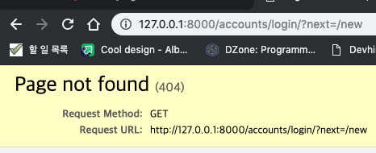

# Django girls Tutorial - 기본


## ch4. Django 본 게임 시작하기

### 18. 장고 소개

#### 누군가가 서버에 웹 사이트를 요청하면 어떤 일이 벌어질까?

1. 웹 서버에 요청이 오면 장고로 전달된다.
2. `urlresolver` (요청을 분기해준다.)
   * 함수1, 함수2, 함수3.. 이 있을 때, (views.py)
   * /f1/ , /f2/ , /f3/ 이 있을 때, 해당 url을 요청 했을 때, 매핑 되는 함수를 실행시킨다
     * Urls conf 에서 지정한다.
   * 즉, 특정 url로 요청이 왔을 떄, 매핑 되는 view 함수를 찾아내는 역할을 한다.
   * 패턴 목록을 가져와 URL과 맞는지 처음부터 하나씩 대조
   * 편지(요청)을 전달하는 집배원 역할
3. view 함수
   * 받은 편지(요청)에 대해서 어떤 작업을 수행 한후, 그 답장을 사용자의 웹브라우저에 보내주는 역할


### 19. 나의 첫 번째 장고 프로젝트

> 디렉토리와 파일명이 매우 중요
>
> * 파일 명을 마음대로 변경하거나 옮기면 안된다.
> * 가상환경을 사용하자.


```python
#config/settings.py

...

STATIC_ROOT = os.path.join(BASE_DIR, 'static')

...
```

* `STATIC_ROOT`
  * `python manage.py collectstatic` 명령어를 수행했을ㅇ 때, static folder의 모든 파일들이 `STATIC_ROOT` 디렉토리 경로에 copy 된다.


### 20. Django 모델

 ```python

from django.db import models
from django.utils import timezone


class Post(models.Model):
    author = models.ForeignKey("auth.User",
                               verbose_name="authors",
                               on_delete=models.CASCADE)
    title = models.CharField("제목", max_length=200)
    text = models.TextField("내용")
    created_date = models.DateTimeField("생성 시간", default=timezone.now)
    published_date = models.DateTimeField("발행 시간", blank=True, null=True)

    def publish(self):
        self.published_date = timezone.now()
        self.save()

    def __str__(self):
        return self.title

 ```


### 21. Django 관리자로 손쉽게 데이터 추가/수정/조회/삭제 하기

### 22. Django URLS

### 23. 들어오는 요청을 처리하는 함수 만들기 => 뷰

> 뷰는 애플리케이션의 `로직` 을 넣는 곳이다.

#### 

### 24. HTML 시작하기

```html
<!DOCTYPE html>
<html lang="en">

<head>
    <meta charset="UTF-8">
    <meta name="viewport" content="width=device-width, initial-scale=1.0">
    <meta http-equiv="X-UA-Compatible" content="ie=edge">
    <title>Django Girls</title>
</head>

<body>
    <h1>Hello World!</h1>
</body>

</html>
```


### 25. ORM과 쿼리셋

> `쿼리셋`은 전달받은 모델의 객체 목록
>
> * 데이터베이스로부터 데이터를 읽고 필터를 걸거나 정렬을 할 수 있다.


```python
# 햔재 시간과 같거나 이전에 발행된 글을 필터링 
Post.objects.filter(published_date__lte=timezone.now()) 한다
```

```python
#쿼리셋 연결하기(체이닝)
Post.objects.filter(published_date__lte=timezone.now()).order_by('published_date')
```


### 26. 템플릿 동적 데이터와 쿼리셋

```python
#views.py

from django.shortcuts import render
from django.utils import timezone
from .models import Post


def post_list(request):
    qs = Post.objects.all()
    qs = qs.filter(published_date__lte=timezone.now())
    qs = qs.order_by('published_date')

    return render(request, 'blog/post_list.html', {
        'post_list': qs,
    })

```


### 27. 장고 템플릿

### 28. CSS - 예쁘게 만들기

```html
<!-- static 폴더 상에 css 파일 불러올 때 -->



<link rel="stylesheet" href="">
```

```python
...
STATIC_URL = '/static/'
...
```


### 29. 템플릿 상속받기

> 모든 템플릿 파일의 공통부분을 base.html로 추출한다.


```html
<!-- hello.html -->




	Hello


...
```


### 30. 프로그램 애플리케이션 확장하기


```python
def post_detail(reqeust, pk):
  post = get_object_or_404(Post, pk=pk)
  #try:
  #  post = Post.objects.get(pk=pk)
  #except Post.DoesNotExist:
  #  raise Http404 # from django.http import Http404
  
  return render(request, 'blog/post_detail.html', {
    'post': post,
  })


```


* Url reverse

  * ```html
    <a href="" {{post.title}} </a>
    ```

  * `get_absolute_url` 을 사용할 수도 있다.


#### 31. 장고폼

```python
#forms.py
from django import forms
from .models import Post


class PostForm(forms.ModelForm):
    class Meta:
        model = Post
        fields = ['title', 'text']
a
```


```python
#views.py
def post_new(request):
  if request.method == 'POST':
    	form = PostForm(request.POST, request.FILES)
    	if form.is_valid():
      		post = form.save(commit=False)
          post.author = request.user
          post.published_date = timezone.now()
          post.save()
          return redirect('post_detail', post.pk)
  else:
  		form = PostForm()
  
  return render(request, 'blog/post_edit.html', {
    'form': form,
  })


 
```


```html
<!--post_edit.html-->

...

<form mehtod="POST" class="post-form">
   {{ form.as_p }}
  <button type="submit">
     save
  </button>
</form>
```


# Django Girls Tutorial - 심화


## Ch2. 숙제: 블로그 개선하기

### 3. 글 저장/수정 시에 강제로 글 게시하지 않기

```python
... # post_new

if form.is_valid():
      post = form.save(commit=False)
      post.author = request.user
      #post.published_date = timezone.now()
      post.save()
      return redirect('blog:post_detail', id=post.id)
    
...

# post_list

def post_list(request):
    qs = Post.objects.filter(published_date__lte=timezone.now())
    qs = qs.order_by('published_date')

    return render(request, 'blog/post_list.html', {
        'posts_list': qs,
    })
```

> * Post_list 는 published_date를 기준으로 필터링 하는데, 위에서 post_new를 통해 글을 생성할 때, published_date를 비워두게 되면, db에 값이 저장될 때, published_date는 공백으로 입력이된다.
> * 따라서, 해당 상태에서 글을 작성하면, post_list에 보이지 않는다.


###  4. 게시되지 않은 블로그 글 목록 페이지 만들기

```python
def post_draft_list(request):
    posts = Post.objects.filter(
        published_date__isnull=True).order_by('created_date')
    return render(request, 'blog/post_draft_list.html', {'posts': posts})


```

* `published_date` 의 속성이 null인 것들을 필터링 해서, 게시되지 않은 글 목록을 가져온다.
* 이후 보여 주는 방식은 `post_list` 와 동일 하다.


### 5.  블로그 글 상세 페이지에 글 게시 바로가기

* 발행되지 않은 글의 상세 페이지에서, `publish` 버튼을 생성하면, 글이 발행되도록 한다.

  ```python
  #views.py
  
  def post_publish(request, id):
      post = get_object_or_404(Post, pk=id)
      post.publish() #여기서 publish() 는 models.py에 구현 되어있다.
      return redirect('blog:post_detail', id=id)
  ```

  ```python
  # models.py
  ...
  
  def publish(self):
          self.published_date = timezone.now()
          self.save()
  
  ...
  
  ```

  > 위와 같이 쓸 수 있는 이유는 위의 `get_object_or_404` 의 결과값 post는 Post 모델 클래스의 인스턴스 이기 때문에, 클래스 내부 메소드를 당연히 호출할 수 있다.


### 6. 블로그 글 삭제하기

```python
def post_remove(request, id):
    post = get_object_or_404(Post, pk=id)
    post.delete()
    return redirect('blog:post_list')
```


## Ch2. 숙제: 안전한 웹사이트 만들기


### 7. 로그인한 사용자에게만 블로그 글 작성/수정/편집 허가하기

```python

from django.contrib.auth.decorators import login_required
# @login_required - login_required 데코레이터를 이용한다.

@login_required
def post_draft_list(request):
    posts = Post.objects.filter(
        published_date__isnull=True).order_by('created_date')
    return render(request, 'blog/post_draft_list.html', {'posts': posts})
```

> 로그인이 되어있지 않다면, 해당 url 호출 시, 로그인 화면 으로 이동한다.




### 8. 사용자 로그인 구현하기

* 장고 내부에 구현된 login을 사용하기위해서 아래와 같이 해준다.

```python
#config/urls.py
from django.contrib.auth.views import LoginView
...

path('accounts/login/', LoginView.as_view(), name='login'),

...
```

* 이후 registration/login.html 파일을 생성해준다.

```python
...
LOGIN_REDIRECT_URL = '/'

#로그인 성공했을 때, 기본 리다이렉팅 URL을 루트로 세팅한다.
...
```


### 9. 로그인 레이아웃 개선하기

* 로그인을 안한 상태에서 디테일 페이지로 들어 가도록 설정

```python
<a href="?next={{ request.path }}" class="top-menu"><span class="glyphicon glyphicon-lock"></span></a>
```


### 10. 로그인한 사용자를 위해 로그인 여부를 노출토록 개선

```python
LOGOUT_REDIRECT_URL = '/'
```

* 로그아웃 리다이렉팅 url을 루트로 지정


## Ch3. 숙제: 댓글 모델 만들기

### 11. Comment 모델 만들고, 마이그레이션 하기

```python
class Comment(models.Model):
    post = models.ForeignKey(
        Post, related_name='comments', on_delete=True)
    author = models.CharField(max_length=200)
    text = models.TextField()
    created_date = models.DateTimeField(default=timezone.now)
    approved_comment = models.BooleanField(default=False)

    def approve(self):
        self.approved_comment = True
        self.save()

    def __str__(self):
        return self.text
```


### 12. Comment 모델을 admin 등록

```python
admin.site.register(Comment)
```


### 13. 댓글 보여주기

```html

<div class="comment">
    <div class="date">{{ comment.created_date }}</div>
    <strong>{{ comment.author }}</strong>
    <p>{{ comment.text|linebreaks }}</p>
</div>

<p>No comments here yet :(</p>

```


### 14. 댓글 작성하기

```python
@login_required
def add_comment_to_post(request, id):
    post = get_object_or_404(Post, pk=id)
    if request.method == "POST":
        form = CommentForm(request.POST)
        if form.is_valid():
            comment = form.save(commit=False)
            comment.post = post #이 부분이 글 작성과 다르다.
            comment.save()
            return redirect('blog:post_detail', id=post.id)
    else:
        form = CommentForm()
    return render(request, 'blog/add_comment_to_post.html', {'form': form})
```

* 글을 생성하는 로직과 다르지 않다.
* 다만, 폼 유효성 검사 이후, 외래키를 지정해주는 부분이 추가됨


```python
class Comment(models.Model):
    post = models.ForeignKey(
        Post, related_name='comments', on_delete=True)
    author = models.CharField(max_length=200)
    text = models.TextField()
    created_date = models.DateTimeField(default=timezone.now)
    approved_comment = models.BooleanField(default=False)

    #ordering 설정
    class Meta:
        ordering = ['-id']
```


### 15. 댓글 관리하기

```python
# models.py

class Post(models.Model):
	###
  
  #post 인스턴스에 외래키로 묶여 있는 댓글들 중에 승인된 post 인스턴스의 댓글들을 리턴한다.
  def approved_comments(self):
        return self.comments.filter(approved_comment=True)
  ###  

```

