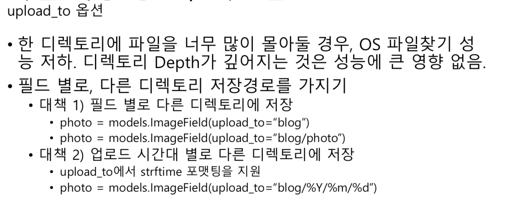

## Ep-16 django-debug-toolbar를 통한 SQL 디버깅

### django-debug-toolbar

*   현재 request/response에 대한 다양한 디버깅 정보를 보여줌.
*   다양한 Panel 지원
    *   SQL panel를 통해, 각 요청 처리 시에 발생한 SQL 내역 확인 가능
    *   Ajax 요청에 대한 내역은 미지원


### 코드를 통한 SQL 내역 확인

*   QuerySet의 query 속성 참조
    *   ex) print(Postobjects.all().query)
    *   settings.DEBUG = True 시에만 쿼리 실행 내역을 메모리에 누적

## Ep-17 장고 Logging과 SQL Loggin 처리

### 로그

*   특정 형식으로 현 상황을 기록하는 문자열 기록
*   로깅을 파이썬에서 기본지원
*   로그 레벨
    *   DEBUG : 개발환경에서 디버깅을 목적
    *   INFO : 분석이 필요한 유용한 상태 정보 ex) 주요 기능의 시작/종료
    *   WARNING: 중요도가 낮은 문제를 발생할 가능성 ex) 403 Forbidden, admin 침입시도
    *   ERROR : 상용 환경의 에러 ex) 500 / 400 에러
    *   CRITICAL : 급하게 주의가 요구되는 심각한 상황 ex) 내부 API 서비스에 접근 불가

*   [ ] ### named bucket 

*   [ ] ### 주요 loggin.handlers

## Ep-18 데이터베이스 정규화/비정규화(제외)


## Ep-19 장고 템플릿 엔진


## Ep-20 Jinja2 템플릿 엔진도 같이 써보기


## Ep-21 장고가 템플릿 파일을 찾는 원리


## Ep-22 템플릿 상속을 통한 중복 제거


## Ep-23 자주 사용하는 템플릿 필터


## Ep-24 자주 사용하는 템플릿 태그


## Ep-25 Static 파일을 다루는 방법

### Static & Media 파일

*   Static 파일
    *   개발 리소스로서의 정적인 파일(js, css, image 등)
    *   앱 / 프로젝트 단위로 저장 / 서빙
*   Media 파일
    *   FIleField/ImageField를 통해 저장한 모든 파일
    *   DB필드에는 저장경로를 저장하며, 파일은 스토리지에 저장
    *   프로젝트 단위로 저장 / 서빙

### Static 파일

### Static 파일, 관련 settings 예시

*   각 설정의 기본 값

    *   `STATIC_URL = None`
        *   템플릿 태그 `` 에 의해서 참조되는 설정
        *   항상 / 로 끝나도록 설정
    *   `STATICFILES_DIRS = []`
        *   File System Loader에 의해 참조되는 설정
    *   `STATIC_ROOT = None`
        *   python manage.py collectstatic 명령이 참조되는 설정
        *   여러 디렉토리오 나눠진 static 파일들을 이 경로의 디렉토리오 복사하여, 서빙
        *   배포에서만 의미가 있는 설정

*   추천 settings

    ```python
    STATIC_URL = '/static'
    STATIC_ROOT = os.path.join(BASE_DIR, 'static')
    STATICFILES_DIRS = [
        os.path.join(BASE_DIR, 'askdjango', 'static')
    ]
    ```

### Static Files Finder - ~~내용설명에 대한 이해가 필요~~


### 템플릿에서 static URL 처리 예시

1.  settings.STATIC_URL, Prefix를 하드 코딩하기

    *   settings.STATIC_URL 설정은 언제라도/프로젝트마다 변경될 수 있음 하드코딩하는 것이 번거롭기도 하고 변경이 되었을 떄 하나하나 수정해줘야함
    *   무엇보다 배포 시에는 static_url 설정 값이 변경된다.

2.  Template Tag를 통한 처리

    *   프로젝트 설정에 따라 유연하게 static url prefix가 할당

        ```html
        
        
        ```

### 개발 환경에서의 static 파일 서빙

*   개발 서버를 쓰고 setting.DEBUG = True 일때만 지원
    *   프로젝트 /urls.py에 Rule이 명시되어 있지 않아도, 자동 Rule 추가
    *   이는 **순수 개발 목적**으로만 제공
*   **개발 서버를 쓰지 않거나, settings.DEBUG = False 일 때에는**
    *   **별도로 static 서빙 설정을 해줘야 한다.**


### static 서빙을 하는 여러가지 방법

1.  클라우드 정적 스토리지나 CDN 서비스를 활용

2.  Apache/nginx 웹서버 등을 통한 서빙

3.  *   [ ] 장고를 통한 서빙 - ~~구체적으로 어떤 것인지 잘 모르곘음~~

    *   whitenoise 라이브러리 활용


#### Collectstatic 명령

*   실 서비스 배포 전에는 필히 본 명령을 통해, 여러 디렉토리에 나눠져 있는 static 파일들을 한곳으로 복사
    *   복사하는 대상 디렉토리 : settings.STATIC_ROOT
    *   여러 디렉토리에 나눠 저장된 static 파일들의 위치는 "현재 장고 프로젝트" 만이 알고 있음 외부 웹서버는 전혀 알지 못함
    *   외부 웹서버에서 Finder의 도움없이도 static 파일을 서빙하기 위함
    *   한 디렉토리에 모두 모여있기에, FInder의 도움이 필요가 없음


### 배포 시에 static 처리 프로세스 - ~~직접구현해보기~~

1.  "서비스용 settings"에 배포 static 설정
2.  관련 클라우드 스토리지 설정, 혹은 아파치/nginx static 설정
3.  개발이 완료된 static 파일을, 한 디렉토리로 복사
    *   python manage.py collectstatic —settings=서비스용 settings
        *   Storage 설정에 따라, 한 번에 클라우드 스토리지로 의 복사를 수행되기도 함
4.  Settings.STATIC_ROOT 경로에 복사된 파일들을 배포서버로 복사
    *   대상 : 클라우드 스토리지, 혹은 아파치 /nginx에서 참조할 경로
5.  static 웹 서버를 가리키도록 settings.STATIC_URL 수정


### 외부 웹서버에 의한 static/media 컨텐츠 서비스

*   정적인 컨텐츠는, 외부 웹서버를 통해 처리하면, 효율적인 처리 가능
*   정적 컨텐츠만의 최적화 방법 사용
    *   memcache/redis 캐시 등
    *   CDN

## Ep-26 Media 파일을 다루는 방법

### Media 파일 처리 순서

1.  HttpRequest.FILES를 통해 파일이 전달
2.  뷰 로직이나 폼 로직을 통해, 유효성 검증을 수행하고
3.  Field/ImageField 필드에 "경로(문자열)"을 저장하고,
4.  Settings.MEDIA_ROOT 경로에 파일을 저장


### Media 파일, 관련 settings 예시

*   각 설정의 디폴트 값
    *   MEDIA_URL = ""
        *   각 media 파일에 대한 URL Prefix
            *   필드명.url 속성에 의해서 참조되는 설정
    *   MEDIA_ROOT = ""
        *   파일필드를 통한 저장 시에, 실제 파일을 저장할 ROOT 경로
*   추천 settings
    *   MEDIA_URL = '/media/'
    *   MEDIA_ROOT = os.path.join(BASE_DIR, 'media')


### FileField와 ImageField

*   FileField
    *   File Storage API를 통해 파일을 저장
        *   장고에서는 File System Storage만 지원, django-storages를 통해 확장ㄹ 지원
    *   해당 필드를 옵션 필드로 두고자 할 경우, blank=True 옵션 적용
*   ImageField
    *   Pillow를 통해 이미지 width/height 획득
    *   위 필드를 상속받은 커스텀 필드를 만들 수 도 있다.
        *   PDFField, ExcelField


### 사용할 만한 필드 옵션

*   Blank 옵션
    *   업로드 옵션처리 여부
    *   디폴트: False
*   upload_to 옵션
    *   Settings.MEDIA_ROOT 하위에서 저장한 파일명/경로명 결정
    *   디폴트: 파일명 그대로 settings.MEDIA_ROOT에 저장
        *   추천) 성능을 위해, 한 디렉토리에 너무 많은 파일이 저장되지 않도록 조정해야한다.
    *   동일 파일명으로 저장 시에 파일명에 더미 문자열을 붙여 파일 덮어쓰기 방지


### 파일 업로드 시에 HTML Form enctype

*   form method는 필히 POST로 지정

    *   GET의 경우 enctype이 "application/x-www-form-urlencoded"로 고정

*   Form enctype을 필히 "multipart/form-data"로 지정

    *   application/x-www-form-urlencoded의 경우, 파일명만 전송

        ```html
        <form action="" method="post" enctype="multipart/form-data">
            
            <table>
                {{ form.as_table }}
            </table>
            <input type="submit">
        </form>
        ```

        

### upload_to 인자

*   파일 저장 시에 upload_to 함수를 호출하여, 저장 경로를 계산
    *   파일 저장시 upload_to 인자를 변경한다고 해서, DB에 저장된 경로 값이 갱신된지는 않는다.
*   인자 유형
    *   문자열로 지정
        *   파일을 저장할 "중간 디렉토리 경로"로서 활용
    *   함수로 지정
        *   중간 디렉토리 경로 및 파일명까지 결정 가능


### 파일 저장경로


### 파일 저장 경로 / 커스텀




### 템플릿에서 media URL 처리 예시

*   필드의 .url 속성을 활용하세요

    *   내부적으로 settings.MEDIA_URL 조합을 처리

        ```python
        
        ```

    *   필드에 저장된 경로에 없을 경우, .url 계산에 실패함에 유의

    *   그래서 안전하게 필드명 저장유무를 체크해야한다!

        ```html
        
        	
        
        ```

    *   참고

        *   파일 시스템 상의 절대경로가 필요하다면 .path 속성을 활용
            *   Settings.MEDIA_ROOT와의 조합


### 개발환경에서의 media 파일 서빙

*   static 파일과 다르게, 장고 개발서버에서 서빙 미지원
*   개발 편의성 목적으로 직접 서빙 룰 추가 가능

```python 
from django.conf import settings
from django.conf.urls.static import static

urlpatterns += static(settings.MEDIA_URL, 
                      document_root=settings.MEDIA_ROOT)
```


### File Upload Handler

*   파일 크기가 2.5MB 이하일 경우
    *   메모리에 담겨 전달
    *   MemoryFileUploadHandler
*   파일크기가 2.5MB 초과일 경우
    *   디스크에 담겨 전달
    *   TemporaryFileUploadHandler
*   관련 설정
    *   settings.FILE_UPLOAD_MAX_MEMORY_SIZE
        *   2.5MB