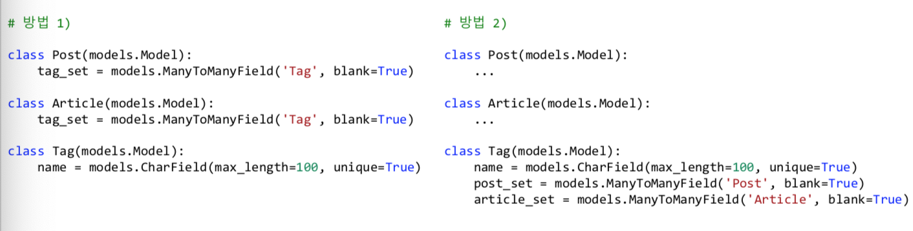

# 장고 차근차근 시작하기 - Ask Django

장고 기초 내용 정리

## Ep-01 Overview,  개발환경 구축하기

### 웹프레임워크가 왜 필요한가?

* 서버의 역할
* 모든 서비스의 근간
* 만들 수 있는 것
  * 웹 서비스, 앱 서버, 챗봇 서비스 등등
* 웹 서비스를 만들 때마다 **반복되는 것들을 표준화해서 묶어놓음**

### Django의 강점

* Python
* 풀스택 웹 프레임워크
* 10년동안 충분히 성숙

### 기본 생성된 파일/디렉토리 목록

* `manage.py`
  * 명령행을 통해 각종 장고 명령을 수행
* 프로젝트 폴더(`config`)
  * `__init__.py`
    * 모든 파이썬 패키지에는 `__init__.py`르ㄹ 둔다. 
    * [ ] ~~패키지를 임포트할 때의 임포트 대상(?)~~
      * 내용 확인 필요
  * `settings.py`
    *  현재 프로젝트에서 장고 기본설정을 덮어쓰고, 새롭게 지정할 설정들을 추가
  * `urls.py`
    * 최상위 URL 설정
  * `wsgi.py`
    *  실서비스에서의 웹서비스 진입점

### 프로젝트 초기화 작업 및 개발 서버 구동

```shell
python manage.py runserver
```


## Ep-02 장고의 주요 구성 요소

### 장고 주요 기능들 - 1

1. FBV
   * 함수로 HTTP 요청 처리
2. Models
   * 데이터베이스와의 인터페이스
3. Templates
   * 복잡한 문자열 조합을 보다 용이하게, 주로 HTML 문자열 조합 목적으로 사용하지만, 푸시 메세지나 이메일 내용을 만들 때에도 쓰면 편리
4. Admin 
   * 심플한 데이터베이스 레코드 관리 UI
5. Loggin
   * 다양한 경로로 메세지 로깅
6. Static files
   * 개발 목적으로의 정적인 파일 관리
7. Messages framework
   * 유저에게 1회성 메세지 노출 목적


### 장고 주요 기능들 - 2

1. CBV
   * 클래스로 함수 기반 뷰 만들기
2. Forms
   * 입력 폼 생성
3. 테스팅
4. 국제화 & 지역화
5. 캐싱
6. Geographic : DB의 Geo 기능 활용
7. Sending Emails
8. * [ ] Syndication Feeds(RSS) - ~~무엇인가?이것은~~
9. Sitemaps

## Ep-03 장고 앱

### 장고 앱의 필요성

* 현재 프로젝트의 블로그 기능을 다른 프로젝ㅌ에서도 사용하려고 한다면?

  * 블로그를 장고앱 형태로 격리해서 만들어둔다면, 다른 프로젝트에도 적용하기 편리

* ```shell
  python manage.py startapp <앱 이름>
  ```

### 장고 앱

* **재사용성** 을 목적으로한 파이썬 패키지
  * 재사용성을 목적으로 둔 것이 아니라면, 하나의 장고 앱에서 현재 프로젝트의 거의 모든 기능을 구현해도 무방하다.
  * 앱을 하나의 작은 서비스로 봐도 무방
* 하나의 앱이름은 현재 프로젝트 상에서 **유일**
* 새롭게 생성한 장고앱이나 외부 라이브러리 형태의 장고앱은 필히 `settings.INSTALLED_APPS`에 등록

### models/views 모듈을 패키지로 전환?

* 모듈
  * 파이썬 소스코드 파일
* 패키지
  * 파이썬 소스코드 디렉토리
* 1안) 다음 기본 구성을
  * Shop/modelspy 내 Item 모델, Review 모델
* 2안) 앱 족잡도에 따라 다음과 같이 변경해 볼 수 있다.
  * shop/models/
    * Item.py 내 item 모델
    * review.py 내 Review 모델
    * [ ] `__init__.py` 내에서 `from .item import *` 와 같이 임포트하게되면, 모델 외부에서는 (1안)과 동일하게 사용 가능 - ~~이건 무슨 소리인가?~~

## Ep-04 VSCode 장고 디버깅 세팅하기

> 아래와 같이 디버그 탭에서 Django를 선택하면 visual studio에서 디버깅하듯이 디버깅 가능하다.


### Pylint 관련

* [ ] ~~Pylint 관련해서 심화적인 내용 이해가 필요하다~~


## Ep-05 URLConf와 정규 표현식

### URL Dispatcher - ~~강의 내용 이상의 동작원리 추가 기술 필요~~ 

* [ ] URL Dispatcher의 원리

* 프로젝트/settings.py에서 최상위 URLConf 모듈을 지정
  * 최초의 urlpatterns로 부터 include를 통해 Tree 구조로 확장
* HTTP 요청이 들어올 때마다, 등록된 urlpatterns 상의 매핑 리스트를 **처음부터 순차적으로 훑으며 URL 매칭을 시도**
  * 매칭이 되는 **URL Rule이 다수 존재하더라도, 처음 Rule만을 사용**
  * 매칭되는 URL Rule이 없을 경우, `404 page Not Found` 응답을 발생

### path()와 re_path()의 등장

* 장고 1.x에서의 `Django.conf.urls.url()` 사용이 2가지로 분리

* `djangourls.re_path()`

* `django.urls.path()`

  * 기본 지원되는 Path converters를 통해 정규표현식 기입이 간소화 -> **만능은 아님!**

  * **자주 사용하는 패턴을 Converter로 등록하면, 재활용 면에서 편리**

    * [ ] ~~자주 사용하는 패턴을 Converter로 등록한다는 것에 대한 내용 이해 필요~~

    ```python
    from django.conf.urls import url 			# django 1.x 스타일
    from django.urls import path, re_path # django 2.x 스타일
    
    urlpatterns = [
        # 장고 1.x에서의 다음 코드를
        url(r'^articles/(?P<year>[0-9]{4})/$', views.year_archive),
      
        # 다음과 같이 간소화 가능
     	  path('articles/<int:year>/', views.year_archive),
      
        #re_path를 써서 다음과 같이 쓸 수 있다.
        re_path(r'^articles/(?P<year>[0-9]{4})/$', views.year_archive),
    ]
    ```

    

### 기본 제공되는 Path Converters - ~~정규표현식 관련해서 학습 필요~~

* `StringConverter`

  ```
  r"[^/]+"
  ```

* `IntConverter`

  ```
  r"[0-9]+"
  ```

* `SlugConverter(StringConverter)`

  ```
  r"[-a-zA-Z0-9_]+"
  ```

* `UUIDConverter`

  ```
  r"[0-9a-f]{8}-[0-9a-f]{4}-[0-9a-f]{4}-[0-9a-f]{4}-[0-9a-f]{12}"
  ```

* `PathConverter(StringConverter)`

  ```
  r".+"
  ```


### 커스텀 Path Converter - ~~커스텀 해서 프로젝트에 적용해보기~~

```python
# 앱이름/converters.py

class FourDigitYearConverter:
    regex = '\d{4}'
  
    def to_python(self, value): # url로 부터 추출한 문자열을 뷰에 넘겨주기 전에 변환
      	return int(value)

    def to_url(self, value): #url reverse 시에 호출
      	return "%04d" % value
```

```python
# 앱이름/urls.py
from django.urls import register_converter

register_converter(FourDigitYearConverter, 'yyyy')

urlpatterns = [
    path('articles/<yyyy:year>/', views.year_archive),
]
```


### Slug Unicode - ~~프로젝트에 slug를 직접 적용해보기~~

* 정규 표현식

  * slug_unicode_re = [-\w]+

* Converter

  ```python
  from django.urls.converters import StringConverter
  
  class SlugUnicodeConverter(StringConverter):
      regex = r"[-\w]+"
  ```

  


## Ep-06 다양한 응답의 함수 기반 뷰 만들기 

### View

* 1개의 http 요청에 대해 1개의 뷰가 호출
* urls.py/urlpatterns 리스트에 매핑된 **호출 가능한 객체**
  * 함수도 **호출 가능한 객체** 중의 하나
* 웹 클라이언트로부터의 HTTP 요청을 처리
* 크게 2가지 형태의 뷰
  * 함수 기반 뷰(FBV)
    * **호출 가능한 객체** 그 자체
  * 클래스 기반 뷰(CBV)
    * 클래스.as_view() 를 통해 **호출 가능한 객체**를 생성/리턴


### View 호출 시, 인자

#### HttpRequest 객체 및 URL Captured Values

```python
# 앱name/urls.py
urlpatterns=[
    path(<int:id>/,views.post_detail, name='detail')
]

# views.py
def post_detail(request, id):
		pass
```

1번째 인자 : HttpRequest 객체 - `request`

* 현재 요청에 대한 모든 내역을 담고 있습니다.

2번째 인자 : 현재 요청의 URL로 부터 Capture된 문자열들 - `id`

* url/re_path를 통한 처리에서는 -> 모든 인자는 str 타입을 전달
* path를 통한 처리에서는 -> 매핑된 Converter의 to_python에 맞게 변환된 값이 인자로 전달


### View 호출에 대한 리턴값

#### HttpResponse 객체

* 필히 HttpResponse 객체를 리턴해야한다.
  * 장고 middleware에서는 뷰에서 httpresponse 객체를 리턴하기를 기대한다.
  * 다른 타입을 리턴하면 middleware에서 처리 오류가 발생한다. 
    * [ ] ~~middleware 코드 확인 필요~~
  * `django.shortcuts.render` 함수는 템플릿 응답을 위한 shortcut 함수
* 파일 like 객체 혹은 str/bytes 타입의 응답 지원 - ~~파일 like 객체??~~
  * **Str 문자열을 직접 utf-8로 인코딩할 필요가 없습니다.**
    * 장고 디폴트 설정에서 str 문자열을 utf-8로 인코딩해줍니다.
  * response = HttpResponse(파일like객체 또는 str객체 또는 bytes 객체)
* 파일 like 객체
  * response.write(str객체 또는 bytes 객체)
  * ~~파일like 객체는 무엇일까?~~

### HttpRequest와 HttpResponse 예시


### CBV의 예

#### item 목록 보기

```python
# urls.py
from django.urls import path
from .views import item_list

urlpatterns = [
  	path('items/', item_list, name='item_list')
]

# views.py
from django.views.generic import ListView
from shop.models import Item

item_list = ListView.as_view(model=Item)
```


```python
# urls.py
from django.urls import path
from .views import item_list

urlpatterns = [
  	path('items/', item_list, name='item_list')
]

# views.py
from django.views.generic import ListView
from shop.models import Item

class ItemListView(ListView):
    model = Item
  
item_list = ItemListView.as_view()
```


### 다양한 타입의 HTTPResponse

* csv 응답
* 엑셀 응답
* 이미지 응답

## Ep-07 적절한 HTTP 상태코드로 응답하기

### 대표적인 상태 코드

* 200번 대 : 성공
  * `200`: 서버가 요청을 잘 처리했다.
  * `201`: 작성됨. 서버가 요청을 접수하고 새 리소스를 작성했다.
* 300번 대 : 요청을 마치기 위해 추가 동작을 취해야 한다.
  * `301`: 영구 이동, 요청한 페이지가 새 위치로 영구적으로 이동했다.
  * `302`: 임시 이동, 페이지가 현재 다른 위치에서 요청에 응답하고 있지만, 요청자는 향후 원래 위치를 계속 사용해야 한다.
* 400번 대 : 클라이언트측 오류
  * `400` : 잘못된 요청
  * `401`: 권한 없음.
  * `403 (Forbidden)` : 필요한 권한을 가지고 있지 않아서, 요청을 거부
  * `404`: 서버에서 요청한 리소스를 찾을 수 없다.
  * `405`: 허용되지 않는 방법. POST 방식만을 지원하는 뷰에 GET요청을 할 경우
* 500번 대: 서버측 오류
  * `500` : 서버 내부 오류 발생


### 200 응답하는 몇 가지 예

```python
from django.http import HttpResponse, JsonResponse
from djangoshortcuts import render

def view1(request):
		return HttpResponse('Hello, Ask Company')
  
def view2(request):
		return render(request, 'template.html')
  
def view3(request):
		return JsonResponse({"Hello": "World"})
```


### 302 응답하는 몇 가지 예

```python
from django.http import HttpResponseRedirect
from django.shortcuts impore redirect resolve_url

def view1(request):
  	return HttpResponseRedirect('/shop/')
  
def view2(request):
  	url = resolve_url('shop:item_list')
    return HttpResponseRedirect(url)
  
def view3(request):
  	# 내부적으로 resolve_url 사용
    # 인자로 지정된 문자열이 url reverse에 실패할 경우,
    # 그 문자열을 그대로 URL로 사용하여, redirect 시도
  	return redirect('shop:item_list')
```

* [ ] ~~`redirect` 와 관련해서, 인자로 지정된 문자열이 url reverse에 실패할 경우, 그 문자열을 그대로 url로 사용하여, redirect 시도 한다가 무슨 뜻인지 잘 모르겠다.~~

* [ ] ~~`resolve_url()` 의 기능은?~~


### 404 응답하는 몇 가지 예

```python
from django.http import Http404, HttpResponseNotFound
from django.shortcuts import get_object_or_404
from shop.models import Item

def view1(request):
  	try:
    		item = Item.objects.get(pk=100)
   	except Item.DoesNotExist:
    		raise Http404
    #생략
    
def view2(request):
  	item = get_object_or_404(Item, pk=100) # view1과 같은 동작을 한다.
    #생략
```


### 500 응답하는 몇 가지 예

* 뷰에서 요청 처리 중에, 뷰에서 미처 잡지못한 오류가 발생했을 경우
  * `IndexError`, `KeyError`, `django.db.models.ObjectDoesNotExist` 등

```python
from shop.models import Item

def view1(request):
  	#IndexError
  	name = ['Tom', 'Steve'][100]
  
  	# model에서 get을 쓸 때,
  	# Item 레코드가 없을 경우, Item.DoesNotExist 예외 발생
  	# Item 레코드가 2개 이상 있을 때, Item.MultipleObjectsREturned 예외 발생
  	item = Item.objects.get(pk=100)
  

```


## Ep-08 장고 쉘

### 장고 프로젝트 설정이 로딩된 파이썬 쉘

```shell
> python manage.py shell
```


###  Django-extensions 내 shell_plus

* shell 구동시에 장고 앱의 모델들, 주요 함수들을 자동 임포트 해준다.

## Ep-09 장고 모델 (ORM)

### 데이터베이스와 SQL

데이터베이스를 쿼리하기 위한 언어 -> SQL

* 같은 작업을 하더라도, 보다 적은 수의 SQL, 보다 높은 성능의 SQL를 짜야한다.
* **ORM을 쓰더라도, 내가 작성한 ORM 코드를 통해서 어떤 SQL이 실행되고 있는지를 파악하고, 최적화 할 수 있어야 한다.**


### 장고의 강점은 Model과 Form

* Raw Query 를 직접 사용할 수 있지만,  인자로 처리하자 -> sql Injection 방지
  * [ ] ~~Raw Query로 사용할 때 주의할 점 체크~~


### Django Model

* **데이터베이스 테이블**과 **파이썬 클래스** 를 **1:1로 매핑**
  * 모델 클래스명은 단수형으로 지정 -> Post(0), Posts(X)
    * CapWordsCase로 네이밍
  * 매핑되는 모델 클래스는 DB 테이블 필드 내역과 일치

### 모델 활용 순서

* 장고 모델을 통해, 데이터베이스 형상을 관리할 경우
  1. 모델 클래스 작성
  2. 모델 클래스로부터 마이그레이션 파일 생성 -> `makemigrations`
  3. 마이그레이션 파일을 데이터베이스에 적용 -> `migrate`
* 쟝고 외부에서, 데이터베이스 형상을 관리할 경우
  * 데이터베이스로부터 모델 클래스 소스 생성 -> `inspectdb`


### 모델명과 DB 테이블명

* DB 테이블명 : '앱이름_모델명'
* ex)
  * blog app
    * blog_post
    * blog_comment
* 커스텀 지정
  * 모델 Meta 클래스의 db_table 속성에서 수정

## Ep-10 장고 모델 필드

### 기본 지원하는 모델필드 타입

* Primary Key: `AutoField`, BigAutoField
* 문자열: `CharField`, `TextField`, `SlugField`
* 날짜/시간: DateField, TimeField, `DateTimeField`, DurationField
* 참/거짓: `BooleanField`, NUllBooleanField
* 숫자: IntegerField, SmallIntegerField, PositiveIntegerField, PositiveSmallIntegerField, BigIntegerField, DicimalField, FloatField
* 파일: `FileField`, `ImageField`


### 기본 지원하는 모델필드 타입 (2)

* 이메일: `EmailField`
* URL: `URLField`
* UUID:`UUIDField`
* 아이피: `GenericIPAddressField`
* Relationship Types
  * `ForeignKey`
  * `ManyToManyField`
  * `OneToOneField`


### 모델필드들은 DB 필드타입을 반영

* DB에서 지원하는 필드들을 반영
  * Varchar 필드타입 —> `CharField`,` SlugField`, `URLField`,` EmailField` 등
* 파이썬 데이터타입과 데이터베이스 데이터타입을 매핑
  * `AutoField` —> int,` BinaryField` —> bytes,` BooelanField` —> bool, `CharField`/`SlugField`/`URLField`/`EmailField` —> str
* 같은 모델필드라 할지라도, DB에 따라 다른 타입으로 생성이 될 수도 있다.
  * DB에 따라 지원하는 기능이 다름


### 자주 쓰는 필드 공통 옵션

* `blank`
  * 파이썬 validation시에 empty 허용여부(디폴트=False) - ~~명확한 의미 이해 필요~~
* `null`(DB옵션)
  * null 허용 여부 (defalut=False)
* `db_index`(DB 옵션)
  * 인덱스 필드 여부 (default=False)
* `default`
  * 디폴트 값 지정, 혹은 **값을 리턴해줄 함수 지정**
* `unique`(DB 옵션)
  * 현재 테이블 내에서 유일성 여부(default=False)
* `choice`
  * select 박스 소스로 사용
* `validators`
  * validators를 수행할 함수를 다수 지
* `verbose_name`
  * 필드 레이블, 미 지정시 필드명이 사용
* `help_text`
  * 필드 입력 도움말

### Tip

* 설계한 데이터베이스 구조에 따라, 최대한 필드타입을 타이트하게 지정해주는 것이 입력값 오류를 막을 수 있다.
  * validators 들이 다양하게 / 타이트하게 지정된다.
  * 필요하다면, validators들을 추가로 타이트하게 지정해
* ORM은 SQL 쿼리를 만들어주는 역할일 뿐, 보다 성능높은 애플리케이션을 위해서는, 사용하려는 DB 엔진에 대한 깊은 이해가 필요하다.

## Ep-11 마이그레이션을 통한 데이터베이스 스키마 관리

### Migrations

- 모델의 변경내역을 "데이터베이스 스키마"로 반영 시키는 방법

- 관련 명령어

  ```shell
  > python manage.py showmigrations <앱 이름>
  ```

- 지정 마이그레이션의 SQL 내역 출력

  ```shell
  > python manage.py sqlmigrate <앱 이름> <마이그레이션-이름>
  ```

- 데이터베이스에 어떤 변화를 가하는 Operation들을 나열

  - 테이블 생성/삭제, 필드 추가/삭제 등
  - 대개 makemigrations 명령으로 생성
    - 같은 migration 파일이라도 DB 종류에 따라 다른 SQL이 생성

### 마이그레이션 파일 생성 및 적용


### 언제 makemigrations를 하는가?

* 모델 필드 관련된 어떠한 변경이라도 발생 시에 마이그레이션 파일 생성
  * 실제로 DB Scheme에 가해지는 변화가 없더라도 수행
* 마이그레이션 파일은 모델의 변경내역을 누적하는 역할
  * 적용된 마이그레이션 파일은 삭제하면 안된다.
  * 마이그레이션 파일이 많아질 경우 `squashmigrations` 명령으로 다수의 마이그레이션 파일을 통합할 수 있다.


### 마이그레이션 migrate (정/역 방향) - ~~migrate 적용에 대한 내용 정리 필요~~

```shell
python manage.py migrate <앱 이름>
```

* 미 적용 <마이그레이션-파일> 부터 <최근-마이그레이션-파일> 까지 정방향적으로 순차적으로 수행


```shell
python manage.py migrate <앱 이름> <마이그레이션-이름>
```

* 지정된 <마이그레이션-이름>이 현재 적용된 마이그레이션보다
  * 이후라면, 정방향으로 순차적으로 지정 마이그레이션까지 forward 수행
  * 이전이라면, 역방향으로 순차적으로 지정 마이그레이션 이전까지 backward 수행


### Id 필드는 왜 생기나요?

* 모든 데이터베이스 테이블에는 각 Row의 식별기준인 "기본 키"가 필요
  * 장고에서는 기본키로서 id(AutoField) 필드를 디폴트 생성
  * 다른 필드를 기본키로 지정하고 싶다면 `primary_key=True` 옵션 적용해야된다.


### 협업 TIP - ~~직접 프로젝트에 적용해보고 어떤 문제가있고, 장점이 있는지 확인~~

* 절대 하지 말아야할 일
  * 팀원 각자가 마이그레이션 파일을 생성 —> 충돌 발생
* 추천) 마이그레이션 파일 생성은 1명이 전담해서 생성
  * 생성한 마이그레이션 파일을 버전관리에 넣고 다른 팀원들은 이를 받아서 migrate만 수행
* 개발 시 **서버에 아직 반영하지 않은** 마이그레이션을 다수 생성했었다면?
  * 서버에 반영을 바로 하지 말고,
  * 하나의 마이그레이션으로 합쳐서 적용
    1. 서버로의 미적용 마이그레이션들을 모두 롤백하고, 롤백된 마이그레이션들을 모두 제거, 새롭게 마이그레이션 파일 생성
    2. 미적용 마이그레이션들을 하나로 합치기 —> `squashmigrations`

## Ep-12 장고 Admin을 통한 데이터 관리

### django admin

* `django-admin-honeypo` 을 이용해 가짜 admin 페이지 노출
* 모델 클래스 등록을 통해 조회/추가/수정/삭제 웹 UI를 제공
  * 서비스 초기에, 관리도구로서 사용하기에 제격
  * 관리도구 만들 시간을 줄이고, End-User 서비스에 집중


### 모델 클래스를 admin에 등록하기

```python
from django.contrib import admin
from .models import Item

# 방법1
admin.site.register(Item)

# 방법2
class ItemAdmin(admin.ModelAdmin):
    pass
  
admin.site.register(Item, ItemAdmin)

# 방법3
@admin.register(Item)
class ItemAdmin(admin.ModelAdmin):
    pass
```


## Ep-13 모델을 통한 데이터 조회

### Model Manager

* 데이터베이스 질의 인터페이스를 제공
* 디폴트 Manager로서 **ModelCls.objects** 가 제공

```python

ModelCls.objects.all()
ModelCls.objects.all().order_by('-id')[:10]
ModelCls.objects.create(title="New Title")
```

### QuerySet
* SQL을 생성해주는 인터페이스
* 순회가능한 객체
* Model Manager를 통해 해당 Model에 대한 QuerySet을 획득


### QuerySet은 Chaining을 지원
* Post.objects.all()filter(...).exclude(...).filter --> QuerySet
* QuerySet은 Lazy한 특성
    * QueyrSet을 만드는 동안에는 DB 접근을 하지 않는다.
    * 실제로 데이터가 필요한 시점에 접근을 한다.
* 데이터가 필요한 시점
    1. queryset
    2. print(queryset)
    3. list(queryset)
    4. for instance in queryset: print(instance)


### 다양한 조회요청 방법

* 조건을 추가한 Queryset 획득할 준비
    * queryset.filter(...)--> queryset
    * queryset.exclude(...) --> queryset
* 특정 모델객체 1개 획득을 시도
    * queryset[숫자 인덱스]
        * --> 모델 객체 혹은 예외발생 가능(IndexError)
    * queryset.get()
        * --> 모델 객체 혹은 예외 발생 (DoesNotExist, MultipleObjectsReturned)
    * queryset.first() —> 모델 객체 혹은 None
    * queryset.last() -> 모델 객체 혹은 None

### filter <-> exclude

* SELECT 쿼리에 WHERE 조건 추가

* 1개 이상의 인자 지정 -> 모두 AND 조건으로 묶임.
* OR 조건을 묶으려면, DJango.db.models.Q 활용


### 정렬 조건 추가

* SELECT 쿼리에 'ORDER BY' 추가

* 정렬 조건을 추가하지 않으면 일관된 순서를 보장받을 수 없음.

* DB에서 다수 필드에 대한 정렬을 지원
    * 가급적 단일 필드로 하는 것이 성능에 이익
    * 시간순/역순 정렬이 필요한 경우, id 필드를 활용해볼 수 있음

* 정렬 조건을 지정하는 2가지 방법
    1. (추천) 모델 클래스의 Meta 속성으로 ordering 설정: list로 지정
    2. 모든 queryset에 order_by() 에 지정

* 쿼리셋은 역순슬라이싱은 지원하지 않는다.

    ```python
    qs = Item.objects.all().order_by('id)
    qs[-10:]#오류가 발생
                                     
    reversed(qs.reverse()[:10])
                                     
    ```

    
## Ep-14 모델을 통한 데이터 생성/수정/삭제

### 다양한 INSERT 예시

```python
# 방법1) 각 Post.objects의 create 함수 호출 -> 반환 값 : 모델 객체
post = Post.objects.create(field1=value1, field2=value2, ...)
post.pk #DB로부터 할당받은 pk

# 방법2) 각 모델 인스턴스의 save 함수 호출 -> 반환 값 : None
post = Post(field1=value1, field2=value2)
post.pk # -> None
post.save()
post.pk

# 방법3) 관련 ModelForm을 통한 save 함수 호출 -> 반환값 : 모델 객체
form = PostModelForm(request.POST, request.FILES)
if form.is_valid(): #유효성 검사 수행
  	post = form.save() # 내부적으로 모델객체.save() 호출하고, 그 객체를리턴
    post.pk # DB로부터 할당받은 pk
```


### 유효성 검사는 언제 이뤄지는 가?

* 모델의 각 필드 코드에 Validators를 지정하기는 하지만, 모델 단에서는 유효성 검사를 수행하지 않는다.
    * 모델객체.save() 시에 필드내역대로 INSERT SQL을 만들어서 DB로 던집니다
    * DB 처리 중에 에러가 발생할 경우 예외로 처리
        * 유효성 검사를 최대한 타이트하게 하는 것이 좋다.
        * 관련 Form 객체의 is_valid()를 호출할 때 수행하자


### 다양한 Update 예시

```python
# 방법1) 개별 모델 인스턴스의 save 함수 호출 -> 반환값: None
post = Post.objects.all().first()
post.field1 = new_value1
post.field2 = new_value2
post.save() # 변경된 필드에 한해서 수행되는 것이 아니라, 모든 필드에 대해서 수행

# 방법2) Queryset의 update 함수 호출 -> 반환값 : 업데이트한 Row 개수
qs = Post.objects.all().filter(...).exclude(...)
qs.update(field1=new_value1, field2=new_value2)

# 방법3) 관련 ModelForm의 save 함수 호출 -> 반환값 : 모델객체
form = PostForm(request.POST, request.FILES, instance=post)
if form.is_valid(): # 유효성 검사 수행
		post= form.save() # 내부적으로 모델객체.save() 호출하고, 그 객체를 리턴
```

### 비슷한 동작, 다른 성능
같은 값들을 갱신하려할 때
```python
# 1안) 각 인스턴스 별로 별도의 SQL
qs = Post.objects.all()
for post in qs:
    post.title = 'changed title'
    post.save()

# 2안) 하나의 SQL - 이렇게 하자
qs = Post.objects.all()
qs.update(title='changed title')


```


### 다양한 DELETE 예시

```python
# 방법1) 개별 모델 인스턴스의 delete 함수 호출 -> 반환값 : 삭제된 Record 갯수
post = Post.objects.all().first()
post.field1 = new_value1
post.field2 = new_value2
post.delete()

# 방법2 queryset의 delete 함수 호출 -> 반환값 : 삭제된 Record 갯수
qs = Post.objects.all().fitler(...).exclue(...) #ex) (3 {'blog.Post': 3})
qs.delete()
```


### 웹서비스에서의 주요 병목

* 같은 작업을 하더라도
  * DB로 전달/실행하는 SQl 개수를 줄이고
  * 각 SQL의 성능/처리 속도 최적화가 필요

* RDBMS 외에도 캐싱 솔루션이나 NoSQL솔류션을 고려해볼 수 있다.

> DB엔진과 서비스에 맞는 적절한 설계가 중요


## Ep-15 관계를 표현하는 모델 필드

* ORM은 SQL 생성을 도와주는 라이브러리
* ORM이 DB에 대한 것을 알아서 처리해주진 않는다.
* DB엔진에 대한 높은 이해가 필요하다.

### RDBMS에서의 관계 예시
* 1 : N --> models.ForeignKey로 표현
    * 1명의 유저가 쓰는 다수의 포스팅
    * 1명의 유저가 쓰는 다수의 댓글
    * 1개의 포스팅에 다수의 댓글
* 1 : 1 --> modles.OneToOneField로 표현
    * 1명의 유저는 1개의 프로필을 가진다.
* M : N --> models.ManyToManyField로 표현
    * 1개의 포스트에는 다수의 태그가 존재 / 1개의 태그에는 다수의 포스팅이 존재

### ForeignKey
* 1:N 관계에서 N측에 명시
    * ex) Post:Comment, User:Post, User:Comment
* ForeignKey(to, on_delete)
    * to : 대상모델
        * 클래스를 직접 지정
        * 클래스명을 문자열로 지정, 자기참조는 self 지정
    * on_delete : Record 삭제 시 Rule
        * CASCADE: FK로 참조하는 다른 모델의 Record도 삭wp
        * PROTECT: ProtectedError (integrityErro 상속)를 발생시키며, 삭제 방지
        * SET_NULL: null로 대체, 필드에 null=True 옵션 필수
        * SET_DEFAULT: 디폴트 값으로 대체, 필드에 디폴트값 지정 필수
        * SET: 대체할 값이나 함수 지정, 함수의 경우 호출하여 리턴값을 사용
        * DO_NOTHING: 어떠한 액션을 안함, DB에 따라 오류가 발생할 수도 있음

### 올바른 User 모델 지정

```python
# django/contrib/auth/models.py
class USer(AbstractBaseUser):
    ...

# blog/models.py
class Post(models.Model):
    author = models.ForeignKey(settings.AUTH_USER_MODEL,
                               on_delete=models.CASCADE)
    title = models.CharField(max_length=100)    
```

```shell
>>> user.post_set.all()
```


### FK에서의 reverse_name

reverse 접근 시의 속성 명: 디폴트 = "모델명소문자_set"

```python
from django.db import models

class Post(models.Model):
    title = models.CharField(max_length=100)
    content = models.TextField()
    
class Comment(models.Model):
    post = models.ForeignKey(Post, on_delete=models.CASCADE)
    message = models.TextField()
```

```shell
>>> comment.post # 특정 코멘트의 포스트

#특정 포스트가 가진 코멘트를 모두 리턴
>>> post.comment_set.all() 

# 코멘트 객체 중 post가 특정 post와 일치하는 것을 모두 리턴
>>> Comment.objects.filter(post=post) 
```


### reverse_name 이름이 충돌이 발생할 때?

* reverse_name 디폴트 명은 앱 이름 고려 X, 모델명만 고려하기 때문에 발생
* 다음의 경우 user.post_set 이름에 대한 충돌이 난다.
    * blog 앱 Post 모델 author = FK(User)
    * shop 앱 Post 모델 author = FK(User)
* 이름이 충돌이 날 때, makemigrations 명령이 실패
* 이름 충돌 피하기
    1. 어느 한쪽의 FK에 대해, reverse_name을 포기 -- ~~무슨말이지?~~
    2. 어느 한 쪽의 (혹은 모두) FK의 reverse_name을 변경
        * related_name="blog.post_set"
        * related_name="shop_post_set"

*   [ ] ### ForeignKey.limit_choices_to 옵션 — ~~강의 듣고 이해 필요~~


### OneToOneField

* 1:1 관계에서 어느쪽이라도 가능
    * User:Profile
* ForeignKey(unique=True)와 유사하지만, reverse 차이
    * User:Profile를 FK로 지정 -> profileuser_set.first() -> user
    * User:Profile를 O2O로 지정한다면 -> profile.user -> user

* OneToOneField(to, on_delete)

### O2O에서의 related_name
reverse 접근 시의 속성명 : 디폴트 = 모델명 소문자

```python
class Profile(models.Model):
    author = models.OneToOneFiled(settingsAUTH_USER_MODEL,
                                 on_delete=models.CASCADE)
    phone = models.CharField(max_length=11, blank=True)
    birth = models.DateField(null=True)
```

```shell
>>> profile.author
```

```shell
>>> user.profile
```


### ManyToManyField

*   M:N 관계에서 어느 쪽이라도 가능
    *   Post:Tag
*   ManyToManyField(to, blank=False)

