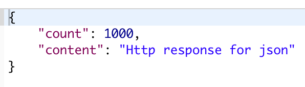

# Pure Django API


##  1. 매우 간단한 JSON 응답 보내기

```python 
def very_simple_json_response(request):
    data = {
        "count": 1000,
        "content": "Some new content"
    }
    return JsonResponse(data)
```


## 2. HttpResponse를 이용한 JSON 응답 보내기

```python
def use_http_response_for_json(request):
    data = {
        "count": 1000,
        "content": "Http response for json"
    }
    json_data = json.dumps(data)
    return HttpResponse(
        json_data,
        content_type='application/json'
    )
```




## 3. CBV, mixin을 이용한 JsonResponse

```python
# config/mixins.py
from django.http import JsonResponse


class JsonResponseMixin(object):
    def render_to_json_response(self, context, **response_kwargs):
        return JsonResponse(self.get_data(context), **response_kwargs)

    def get_data(self, context):
        return context

```


```python
# app/views.py

class JsonCBV2(JsonResponseMixin, View):
    def get(self, request, *args, **kwargs):
        data = {
            "count": 1000,
            "content": "CBV with mixin"
        }
        return self.render_to_json_response(data)
```


## 4. 데이터 직렬화

```python
class SerializedDetailView(View):
    def get(self, request, *args, **kwargs):
        obj = Update.objects.get(id=1)
        data = serialize(
            "json",
            [obj,],
            fields=('user', 'content')
        )
        json_data = data

        return HttpResponse(
            json_data,
            content_type='application/json'
        )
    
class SerializedListView(View):
    def get(self, request, *args, **kwargs):
        qs = Update.objects.all()
        data = serialize(
            "json",
            qs,
            fields=('user', 'content')
        )
        json_data = data

        return HttpResponse(
            json_data,
            content_type='application/json'
        )
```


## 5. Manager를 이용한 직렬화 데이터 다루기

```python 
import json

from django.core.serializers import serialize
from django.conf import settings
from django.db import models


def upload_update_image(instance, filename):
    return "updates/{user}/{filename}".format(
        user=instance.user, 
        filename=filename
    )


class UpdateQuerySet(models.QuerySet):
    def serialize(self):
        qs = self
        final_array = []
        for obj in qs:
            stuct = json.loads(obj.serialize())
            final_array.append(stuct)
            
        return json.dumps(final_array)


class UpdateManager(models.Manager):
    def get_queryset(self):
        return UpdateQuerySet(self.model, using=self.db)
    
    
class Update(models.Model):
    user = models.ForeignKey(
        settings.AUTH_USER_MODEL, 
        on_delete=models.CASCADE
    )
    content = models.TextField(
        blank=True, 
        null=True
    )
    image = models.ImageField(
        upload_to=upload_update_image, 
        blank=True, 
        null=True
    )
    updated = models.DateTimeField(
        auto_now=True
    )
    timestamp = models.DateTimeField(
        auto_now_add=True
    )
    
    objects = UpdateManager()
    
    def __str_(self):
        return self.content or ''
    
    def serialize(self):
        json_data = serialize("json", [self], fields=('user', 'content', 'image'))
        stuct = json.loads(json_data)
        data = json.dumps(stuct[0]['fields'])
        return data


```

```python 
class SerializedDetailView(View):
    def get(self, request, *args, **kwargs):
        obj = Update.objects.get(id=1)
        json_data = obj.serialize()
        return HttpResponse(
            json_data,
            content_type='application/json'
        )


class SerializedListView(View):
    def get(self, request, *args, **kwargs):
        qs = Update.objects.all()
        json_data = qs.serialize()
        return HttpResponse(
            json_data,
            content_type='application/json'
        )

```


## 6. The Dot Values Method

```python
import json

from django.core.serializers import serialize
from django.conf import settings
from django.db import models


def upload_update_image(instance, filename):
    return "updates/{user}/{filename}".format(
        user=instance.user, 
        filename=filename
    )


class UpdateQuerySet(models.QuerySet):
    def serialize(self):
        list_values = list(self.values("user", "content", "image"))
        return json.dumps(list_values)


class UpdateManager(models.Manager):
    def get_queryset(self):
        return UpdateQuerySet(self.model, using=self.db)
    
    
class Update(models.Model):
    user = models.ForeignKey(
        settings.AUTH_USER_MODEL, 
        on_delete=models.CASCADE
    )
    content = models.TextField(
        blank=True, 
        null=True
    )
    image = models.ImageField(
        upload_to=upload_update_image, 
        blank=True, 
        null=True
    )
    updated = models.DateTimeField(
        auto_now=True
    )
    timestamp = models.DateTimeField(
        auto_now_add=True
    )
    
    objects = UpdateManager()
    
    def __str_(self):
        return self.content or ''

    def serialize(self):
        try:
            image = self.image.url

        except:
            image = ""

        data = {
            "content": self.content,
            "user": self.user.id,
            "image": image
        }
        data = json.dumps(data)
        return data


```


## 7. API 파일 분리

```python 
# api/views.py

import json
from django.views.generic import View
from django.http import HttpResponse
from updates.models import Update as UpdateModel


class UpdateModelDetailAPIView(View):
    def get(self, reqeust,id, *args, **kwargs):
        obj = UpdateModel.objects.get(id=id)
        json_data = obj.serialize()
        return HttpResponse(
            json_data,
            content_type='application/json'
        )

    def post(self, request, *args, **kwargs):
        return HttpResponse(
            HttpResponse(
                {},
                content_type='application/json'
            )
        )

    def put(self, request, *args, **kwargs):
        return HttpResponse(
            {},
            content_type='application/json'
        )


class UpdateModelListAPIView(View):
    '''
    List View
    Create View
    '''


    def get(self, request, *args, **kwargs):
        qs = UpdateModel.objects.all()
        json_data = qs.serialize()
        return HttpResponse(
            json_data,
            content_type='application/json'
        )

    def post(self, request, *args, **kwargs):
        return HttpResponse(
            {},
            content_type='application/json'
        )
```


## 8. CsrfExemptMixin 적용

```python 
from django.views.decorators.csrf import csrf_exempt
from django.utils.decorators import method_decorator


class CSRFExemptMixin(object):
    @method_decorator(csrf_exempt)
    def dispatch(self, *args, **kwargs):
        return super().dispatch(*args, **kwargs)


```

```python 
class UpdateModelListAPIView(CSRFExemptMixin, View):
    '''
    List View
    Create View
    '''
    def get(self, request, *args, **kwargs):
        qs = UpdateModel.objects.all()
        json_data = qs.serialize()
        return HttpResponse(
            json_data,
            content_type='application/json'
        )

    def post(self, request, *args, **kwargs):
        data = json.dumps({"message": "Unknown data"})
        return HttpResponse(
            data,
            content_type='application/json'
        )

    def delete (self, request, *args, **kwargs):
        data = json.dumps({"message": "You cannot delete an entire list."})
        return HttpResponse(
            data,
            content_type='application/json'
        )
```


## 9. HttpResponseMixin 을 통한 상태코드 추가

```python 

class UpdateModelListAPIView(HttpResponseMixin,
                             CSRFExemptMixin,
                             View):
    '''
    List View
    Create View
    '''
    def get(self, request, *args, **kwargs):
        qs = UpdateModel.objects.all()
        json_data = qs.serialize()
        return self.render_to_response(json_data)

    def post(self, request, *args, **kwargs):
        data = json.dumps({"message": "Unknown data"})
        return self.render_to_response(data, status=400)

    def delete (self, request, *args, **kwargs):
        data = json.dumps({"message": "You cannot delete an entire list."})
        return self.render_to_response(data, status=403)
```


```python 
class HttpResponseMixin(object):
    is_json = False
    
    def render_to_response(self, data, status=200):
        content_type = 'text/html'
        if self.is_json:
            content_type = 'application/json'
        return HttpResponse(data, content_type=content_type, status=status)
```


## 10. form을 이용한 POST 구현

```python 
import json
from django.views.generic import View
from django.http import HttpResponse
from updates.models import Update as UpdateModel

from config.mixins import HttpResponseMixin

from .forms import UpdateModelForm
from updates.models import Update as UpdateModel

from .mixins import CSRFExemptMixin


class UpdateModelDetailAPIView(HttpResponseMixin,
                                CSRFExemptMixin,
                                View):
    is_json = True

    def get(self, reqeust,id, *args, **kwargs):
        obj = UpdateModel.objects.get(id=id)
        json_data = obj.serialize()
        return self.render_to_response(json_data)

    def post(self, request, *args, **kwargs):
        json_data = json.dumps(
            {
                "message": "Not allowed, please use the /api/updates/endpoint"
            }
        )
        return self.render_to_response(json_data, status=403)

    def put(self, request, *args, **kwargs):
        json_data = {}
        return self.render_to_response(json_data)

    def delete(self, request, *args, **kwargs):
        json_data= {}
        return self.render_to_response(
            json_data,
            status=403
        )


class UpdateModelListAPIView(HttpResponseMixin,
                             CSRFExemptMixin,
                             View):
    '''
    List View
    Create View
    '''
    def get(self, request, *args, **kwargs):
        qs = UpdateModel.objects.all()
        json_data = qs.serialize()
        return self.render_to_response(json_data)

    def post(self, request, *args, **kwargs):
        form = UpdateModelForm(request.POST)
        print(form)
        if form.is_valid():
            obj = form.save(commit=True)
            obj_data = obj.serialize()
            return self.render_to_response(obj_data, status=201)
        if form.errors:
            data = json.dumps(form.errors)
            print("kwon")
            return self.render_to_response(data, status=400)
        data = {"message": "Not Allowed"}
        return self.render_to_response(data, status=400)

    def delete (self, request, *args, **kwargs):
        data = json.dumps({"message": "You cannot delete an entire list."})
        return self.render_to_response(data, status=403)
```


```python 
from django import forms
from updates.models import Update as UpdateModel

class UpdateModelForm(forms.ModelForm):
    class Meta:
        model = UpdateModel
        fields = [
                'user',
                'content',
                'image'
            ]
    def clean(self, *args, **kwargs):
        data = self.cleaned_data
        content = data.get('content', None)
        if content == "":
            content = None

        image = data.get("image", None)
        if content is None and image is None:
            raise forms.ValidationError('Content or image is required.')
        return super().clean(*args, **kwargs)
```

