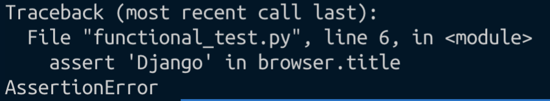
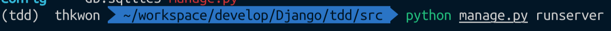
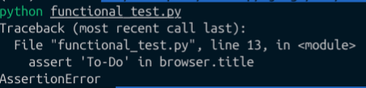
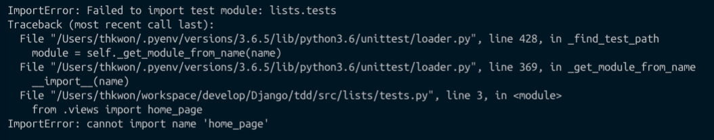
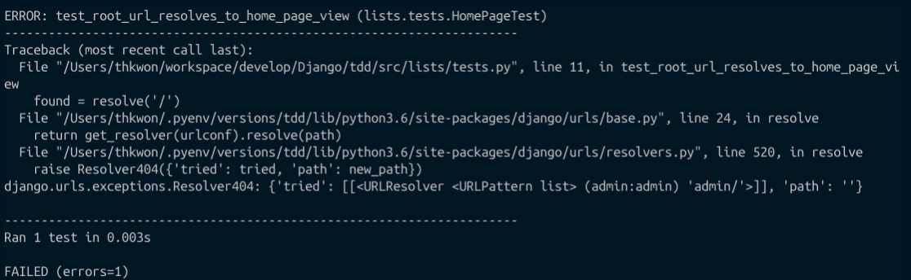
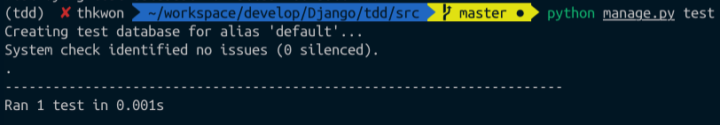
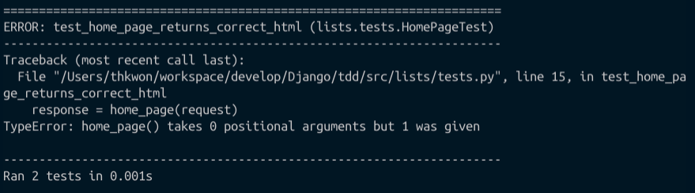

# 클린코드를 위한 테스트 주도 개발

## 1. 기능 테스트를 이용한 Django 설치

### TDD 개발 방법론

1. 테스트를 작성하고 실행한다.
2. 테스트가 예상대로 실패하는지 확인한다.
3. 개발코드를 작성한다.


### 알아두어야 할 것

> 1. 한번에 한가지만 한다.
> 2. 단계를 작게 나눈다.


### 단계 1 : Django가 제대로 설치됐는지, 사용할 준비가 됐는지 확인



다음 메세지가 뜨면, 예상한대로 테스트가 틀림을 알 수 있다. 왜냐하면, 아직 서버를 올리지도 않은 상태이기 때문에, 오류가 나는 것이 당연하다


### Django 가동 및 실행



서버를 실행하고, 코드를 다시 실행한다.

```python
"""
functional_test
"""
from selenium import webdriver

browser = webdriver.Chrome()
browser.get('http://localhost:8000')

assert 'Django' in browser.title

```

> 더이상 위와 같은 에러는 발생하지 않고, 테스트는 통과하였다.


## 2. Unittest  모듈을 이용한 기능 테스트 확장

### 기능 테스트를 이용한 최소 기능의 애플리케이션 설계

* 기능 테스트
  * 실제 웹 브라우저를 실행해서 애플리케이션이 어떻게 동작 하는지 사용자 관점에서 확인할 수 있다.
  * 사용자 스터리 라고 하는 방식을 따르는 경향이 있는데, 특정 기능을 사용자가 어떻게 사용하며 이때 애플리케이션이 어떻게 반응하는지를 확인하는 방식
  * 사람이 이해할 수 있는 스토리를 가져야하고, 이를 **분명히 정의 하기 위해서 테스트 코드에 주석을 기록한다.**
    * 새로운 FT를 만들 때는 사용자 스토리의 핵심을 정리하기 위해 주석을 먼저 작성할 수도 있다.

> 주석
>
> * 코드로 작성한 것을 그대로 반복해서 글로 표현하는 것은 의미가 없다.
> * 코드 자체만 보고도 해석이 가능한 것이 좋다.
> * 주석이 유용히 사용되는 경우는 API 적용을 위한 유용한 정보들을 담을 때,
> * 사용자 스토리를 표현하기 위해서




* 당연하게도 assertionError 가 발생한다. 테스트 실패에 대한 정당한 이유를 가지고 있기 떄문에 테스트를 제대로 작성했다는 자신감을 가져도 좋다.
* To-Do라는 텍스트가 brower 상에 없기 떄문에 당연히 발생하는 에러 이다.


### 파이썬 기본 라이브러리의 unittest 모듈

* Assert 문 다음에 설명 덧붙히기

  * ```python
    assert 'To-Do' in browser.title, 'Browser title was " + browser.title' -> 이와 같이 쓴다.
    ```

* Unittest 모듈을 사용해서, 코드 개선하기

  ```python
  """
  functional_test
  """
  from selenium import webdriver
  import unittest
  
  
  class newVisitorTest(unittest.TestCase):
    	# unittest.TestCase를 상속해서 테스트를 클래스 형태로만든다.
  
      # setUp과 tearDown은 특수 메소드로, 각 테스트 시작 전과 후에 실행된다.
      # 테스트에 에러가 발생해도 tearDown이 실행된다.
      # 이것을 이용해서, 창의 띄운 것이 쓸데없이 떠다니는 것을 막을 수 있다.
      
      def setUp(self):
          self.browser = webdriver.Chrome()
  
      def tearDown(self):
          self.browser.quit()
  
      def test_can_start_a_list_and_retrieve_it_later(self):
          # 에디스는 멋진 작업 목록 온라인 앱이 나왔다는 소식을 듣고
          # 해당 웹 사이트르 확인하러 간다.
          self.browser.get('http://localhost:8000')
  
          # 웹 페이지 타이틀과 헤더가 'To-D'를 표시하고 있다.
          
          # 테스트 어셜션을 만들기위해서 self.assertI을 사용한다.
          self.assertIn('To-Do', self.browser.title)
          
          #self.fail은 강제적으로 테스트 실패를 발생시켜서 에러 메세지를 출려갛ㄴ다.
          self.fail('Finish the test!')
          
  
  # 그녀는 바로 작업을 추가하기로 한다.
  
  # "공작깃털 사기"라고 텍스트 상자에 입려갛ㄴ다.
  # #(에디스의 취미는 날치 자비용ㅇ 그물을 만드는 것이다.)
  #
  # # 엔터키를 치면 페이지가 갱신되고 작업 ㅁ록록에
  # # "1: 공작깃털 사기" 아이템이 추가된다.
  
  # 추가 아이엩ㅁ을 입력할 수 있는 여분의 텍스트 상자가 존재한다.
  # 다시 "공작깃털을 이용해서 그물 만들기"라고 입력한다.
  #
  # # 페이지는 다시 갱신되고, 두 개 아이템이 목록에 보인다"
  # 에디스는 사이특 ㅏ입력한 목록을 저장하고 있는지 궁금하다
  # 사이트는 그녀를 위한 특정 URL을 생성해준다.
  # 이떄 URL에 대한 설명도 함꼐 제공된다.
  
  # 해당 URL에 접소갛면 그녀가 만든 작업 목록이 그대로 있는 것을 확인할 수 있다.
  # 만족하고 잠자리에 든다.
  
  
  # 파이썬 스크립트가 다른 스크립트에 임포트된 것이 아니라, 커맨드 라인을 통해 실행됐다는 것을 확인하는 코드
  # unittest.main을 호출해서 unittest 테스트 실행자를 가동한다.
  # 자동으로 파일 내 테스트 클래스와 메소드를 찾아서 실행해주는 역할을 한다.
  if __name__ == '__main__':
    	#warnings = 'ignore'는 테스트 작성 시에 발생하는 불필요한 리소스 경고를 제거하기 위한 것
      unittest.main(warnings='ignore')
  
  ```


### 암묵적 대기

`Implicitly-wait` 기능을 setUp에 추가하자.

```python
...

def setUp(self):
  self.browser = webdriver.Chrome()
  self.browser.implicitly_wait(3)
  
 ...
```

> `implicitly-wait` 는 셀레늄 테스트에 있어서 기본적인 로직이다. 비교적 안정적으로 페이지 로딩이 끝날 때 까지 기다렸다가 테스트를 실행하지만 완벽하진 않다.
>
> * 필요에 따라 지정한 시간만큼 동작을 대기 상태로 둘 수 있다.
> * But, 복잡한 애플리케이션을 다룰 때는 명시적인 대기 알고리즘을 별도로 작성해야한다.


## 2. 첫 Django 애플리케이션과 첫 단위 테스트

> ```shell
> python manage.py startapp lists
> ```


### 단위 테스트는 무엇이고, 기능 테스트와 어떤 차이가 있을 까?

* 기능 테스트
  * 사용자 관점에서 애플리케이션 외부를 테스트하는 것
* 단위 테스트
  * 프로그래머 관점에서 그 내부를 테스트한다는 것


* 작업 순서
  1. 기능 테스트를 작성해서 사용자 관점의 새로운 기능성을 정의하는 것부터 시작한다.
  2. 기능 테스트가 실패하고 나면 어떻게 코드를 작성해야 테스트를 통과할지를 생각해본다.
     * 이 시점에서 하나 또는 그 이상의 단위 테스트를 이용해서 어떻게 코드가 동작해야 하는지 정의한다.
  3. 단위 테스트가 실패하고 나면 단위 테스트를 통과할 수 있을 정도의 최소한의 코드만 작성한다. 기능 테스트가 완전해질 때 까지 과정 2와  3을 반복해야 할 수 도 있다.
  4. 기능 테스트를 재실행해서 통과하는지 또는 제대로 동작하는지 확인한다. 이 과정에서 새로운 다위 테스트를 작성해야 할 수도 있다.

> **기능 테스트** 는 제대로 된 기능성을 갖춘 애플리케이션을 구축하도록 도우며, 그 기능성이 망가지지 않도록 보장해준다.
>
> **단위 테스트** 는 깔끔하고 버그 없는 코드를 작성하도록 돕는다.


### Django 에서의 단위 테스트

```python
from django.test import TestCase


class SmokeTest(TestCase):

    def test_bad_maths(self):
        self.assertEqual(1 + 1, 3)

```

* TDD 주기는 실패 테스트를 작성한 후 테스트를 통과할 수 있는 코드를 작성하는 과정

### Django의 MVC, URL, 뷰 함수

```python
from django.urls import resolve
from django.test import TestCase
from .views import home_page


class HomePageTest(TestCase):

    def test_root_url_resolves_to_home_page_view(self):
        # resolve는 Django가 내부적으로 사용하는 함수로, URL을 해석해서 일치하는 뷰 함수를 찾는다. 여기서는 / 가 호출될 때, resolve를 실행해서
        # home_page라는 함수를 호출한다.
        found = resolve('/')
        self.assertEqual(found.func, home_page)

```


위 테스트 결과로 



가 발생하고, 이는 우리가 예측한 실패 이기 때문에 TDD 과점에서 좋은 소식이다.


### 마침내 실질적인 애플리케이션 코드를 작성한다.

> 트레이스백 읽기
>
> 
>
> 1. 가장 먼저 확인해야할 것은 "에러" 이다. -> 맨 아래쪽 부분
> 2. 어떤 테스트가 실패하고 있는가? -> 맨 윗부분
>    * 이 실패가 예측된 실패인지 아닌지를 확인해야한다.
> 3. 마지막ㅇ론 실패를 발생시키는 테스트 코드를 찾는다.
>    * 트레이브백 상단부터 아래로 내려가면서 테스트 파일명을 찾는다. 그래서 어떤 테스트 함수의 몇번째 코드 라인에서 실패가 발생하는지 확인한다.

이를 통해 알 수 있는 점은 404에러가 발생하고 있다는 점이다.

> 즉, Django가 "/"에 해당하는 URL 맵핑을 찾을 수 없는 것이다.


### Urls.py

```python
#lists/tests.py

from django.urls import resolve
from django.test import TestCase
from .views import home_page


class HomePageTest(TestCase):

    def test_root_url_resolves_to_home_page_view(self):
        # resolve는 Django가 내부적으로 사용하는 함수로, URL을 해석해서 일치하는 뷰 함수를 찾는다. 여기서는 / 가 호출될 때, resolve를 실행해서
        # home_page라는 함수를 호출한다.
        found = resolve('/')
        self.assertEqual(found.func, home_page)

```


```python
#config/urls.py
from django.contrib import admin
from django.urls import path, include

urlpatterns = [
    path('', include('lists.urls'))
]
```


```python
#lists/views.py

from django.shortcuts import render


def home_page():
    pass

```


```python
#lists/urls.py


from django.urls import path, include
from . import views

urlpatterns = [
    path('', views.home_page, name="home"),
]

```





테스트가 통과함을 알 수 있다.

But, 서버를 실행시키면,  위의 views.py 내 home_page() 에 대한 오류가 발생한다.

* 그러나 테스트를 통과했기 때문에, 우리가 의도한 것에 대한 것은 성공했다


### 뷰를 위한 단위 테스트

* HTML 식의 실제 응답을 반환하는 함수를 작성해야 한다.

```python
from django.urls import resolve
from django.test import TestCase
from django.http import HttpRequest
from .views import home_page


class HomePageTest(TestCase):

    def test_root_url_resolves_to_home_page_view(self):
        found = resolve("/")
        self.assertEqual(found.func, home_page)

    def test_home_page_returns_correct_html(self):
        # HttpRequest 객체를 생성해서 사용자가 어떤 요청을 브라우저에 보내는지 확인한다.
        # 이것을 home_page 뷰에 전달해서 응답을 취득한다. 이 객체는 HttpResponse라는 클래스의 인스턴스이다.
        # 응답내용이 특정 속성을 가지고 있는지 확인한다.

        request = HttpRequest()
        response = home_page(request)

        # html 의 값이 처음에 <html> , 나중에 </html>인지를 확인한다.
        # 그 중간에, To-Do lists라는 텍스트가 있는지도 확인한다.
        self.assertTrue(response.content.startswith(b'<html>'))
        self.assertIn(b'<title>To-Do lists</title>', response.content)
        self.assertTrue(response.content.endswith(b'</html>'))

```




Home_page() 의 인자가 최소 1개가 필요한데 아무것도 들어가지 않아서 에러가 생겼다.


#### 단위테스트 - 코드 주기

여기서부터는 TDD 단위 테스트 - 코드 주기에 대해 생각해야 한다.

1. 터미널에서 단위 테스트를 실행해서 어떻게 실패하는지 확인한다.
2. 편집기상에서 현재 실패 테스트를 수정하기 위한 최소한의 코드를 변경한다.
3. 이것을 반복한다.

> 코드 품질을 높이고 싶다면 코드 변경을 최소화해야한다.
>
> 또한, 이렇게 최소화한 코드는 하나하나 테스트에 의해 검증되어야 한다.


`test_home_page_returns_correct_html()` 에 대한 테스트 통과하기

```python
#tests.py

from django.urls import resolve
from django.test import TestCase
from django.http import HttpRequest
from .views import home_page


class HomePageTest(TestCase):

    def test_root_url_resolves_to_home_page_view(self):
        found = resolve("/")
        self.assertEqual(found.func, home_page)

    def test_home_page_returns_correct_html(self):
        # HttpRequest 객체를 생성해서 사용자가 어떤 요청을 브라우저에 보내는지 확인한다.
        # 이것을 home_page 뷰에 전달해서 응답을 취득한다. 이 객체는 HttpResponse라는 클래스의 인스턴스이다.
        # 응답내용이 특정 속성을 가지고 있는지 확인한다.

        request = HttpRequest()
        response = home_page(request)

        # html 의 값이 처음에 <html> , 나중에 </html>인지를 확인한다.
        # 그 중간에, To-Do lists라는 텍스트가 있는지도 확인한다.
        self.assertTrue(response.content.startswith(b'<html>'))
        self.assertIn(b'<title>To-Do lists</title>', response.content)
        self.assertTrue(response.content.endswith(b'</html>'))

```


```python
#views.py
from django.shortcuts import render
from django.http import HttpResponse

def home_page(request):
    return HttpResponse('<html><title>To-Do lists</title></html>')

```


## 4. 왜 테스트를 하는 것인가?

### 프로그래밍은 우물에서 물을 퍼 올리는 것과 같다.

> TDD는 훈련이다.
>
> * 자연스럽게 익힐 수 있는 것이 아니다.
> * 성과가 즉시 보여지는 것이 아니라, 오랜 기간을 거쳐야 보이기 때문에 TDD 자체에 익숙해지도록 노력해야한다.


### 셀레늄을 이용한 사용자 반응 테스트

```python 
class NewVisitorTest(TestCase):
    def setUp(self):
        self.browser = webdriver.Chrome()
        self.browser.implicitly_wait(3)

    def tearDown(self):
        self.browser.quit()

    def test_can_start_a_list_and_retrieve_it_later(self):
        # 에디스는 멋진 작업목록 앱이 나왔다는 소식을 듣고
        # 해당 웹 사이트를 확인하러 간다.
        self.browser.get('http://localhost:8000')

        # 웹 페이지 타이틀과 헤더가 'thkwon'를 표시하고 있다.
        self.assertIn('To-Do', self.browser.title)
        header_text = self.browser.find_element_by_tag_name('h1').text
        self.assertIn('thkwon', header_text)

        # 그녀는 바로 작업을 추가하기로 한다.
        inputbox = self.browser.find_element_by_id('id_new_item')
        self.assertEqual(inputbox.get_attribute('placeholder'), '작업 아이템 입력')

        # "공작깃털 사기" 라고 텍스트 상자에 입력한다."
        # (에디스의 취미는 날치 잡이용 그물을 만드는 것이다.)
        inputbox.send_4('공작 깃털 사기')

        # 엔터키를 치면 페이지가 갱신되고 작업 록록에
        # "1: 공작깃털 사기" 아이템이 추가된다.
        inputbox.send_keys(Keys.ENTER)

        table = self.browser.find_element_by_id('id_list_table')
        rows = table.find_element_by_tag_name('tr')
        self.assertTrue(
            any(row.text == '1: 공작 깃털 사기' for row in rows),
        )

        # 추가 아이템을 입력할 수 있는 여분의 텍스트 상자가 존재한다.
        # 다시 "공작 깃털을 이용해서 그물 만들기" 라고 입력한다(에디스는 매우 체계적인 사람이다.)
        self.fail('Finish the test!')

        # 페이지는 다시 갱신되고, 두 개 아이템이 목록에 보인다.

```


### "상수는 테스트하지 마라"는 규칙과 탈출구로 사용할 템플릿

* 단위 테스트는 로직이나 흐름 제어, 설정 등을 테스트하기 위한 것이다.
* 어떤 글자들이 html 문자열에 배열되어 있는지 체크하는 어설션은 아무 의미가 없다.
* 리팩토링
  * 기능은 바꾸지 않고 코드 자체를 개선하는 작업
  * **"기능은 바꾸지 않고"** 가 핵심이다.

* 상수를 테스트하지 않고 템플릿을 이용해서 렌더링하는 것을 테스트하도록 수정

  * 이것은 `render_to_string` 함수를 이용하면 간단히 구현할 수 있다.

  ```python
  def test_home_page_returns_correct_html(self):
          # HttpRequest 객체를 생성해서 사용자가 어떤 요청을 브라우저에 보내는지 확인한다.
          # 이것을 home_page 뷰에 전달해서 응답을 취득한다. 이 객체는 HttpResponse라는 클래스의 인스턴스이다.
          # 응답내용이 특정 속성을 가지고 있는지 확인한다.
  
          request = HttpRequest()
          response = home_page(request)
  
          expected_html = render_to_string('home.html')
          self.assertEqual(response.content.decode(), expected_html)
  ```

  * `.decode()`를 이용해서 `response.content` 바이트 데이터를 **파이썬 유니코드 문자열로 변환**한다.
  * 이를 통해서 바이트와 바이트를 비교하는 것이 아니라 문자열과 문자열을 서로 비교할 수 있다.


### 리팩토링에 대해

> 리팩토링 시에는 앱 코드와 테스트 코드를 한번에 수정하는 것이 아니라 하나씩 수정해야 한다.


### 메인페이지 추가 수정

테스트를 통과하도록 코드를 수정해보자.

HTML이 이젠 템플릿 형태이기 때문에 추가적인 단위 테스트 없이 바로 수정 할 수 있다.


> Commit : 확인


## 정리 : TDD 프로세스

* 기능 테스트
* 단위 테스트
* 단위 테스트-코드 주기
* 리팩토링


