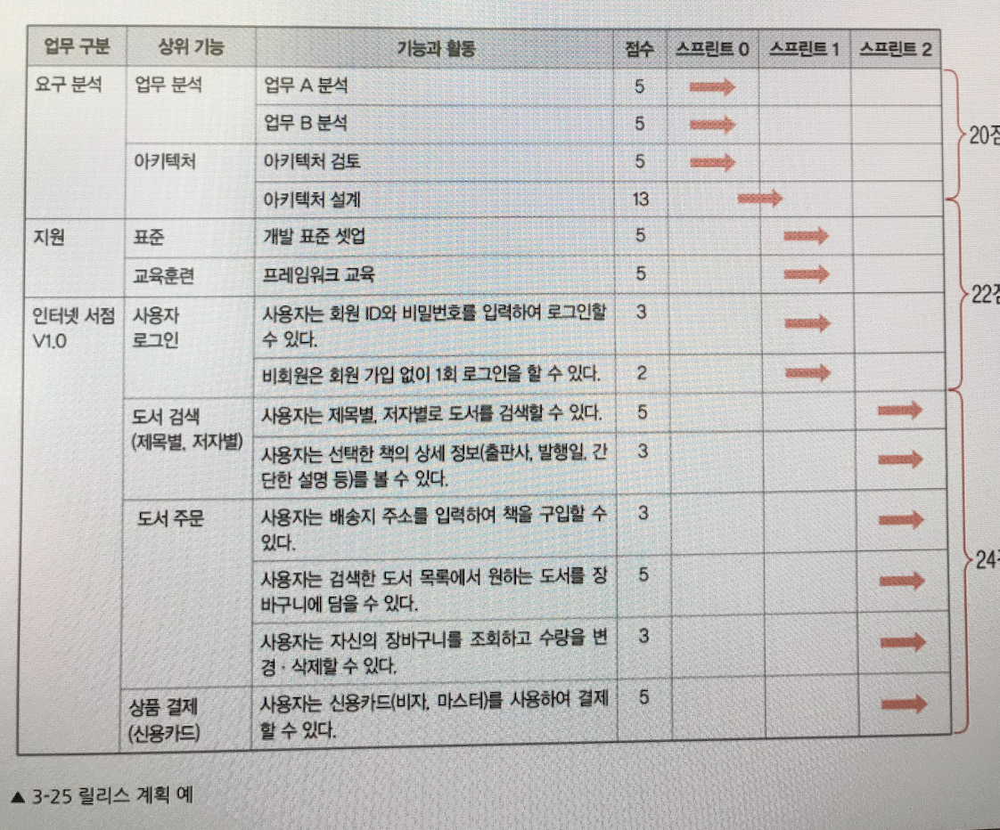
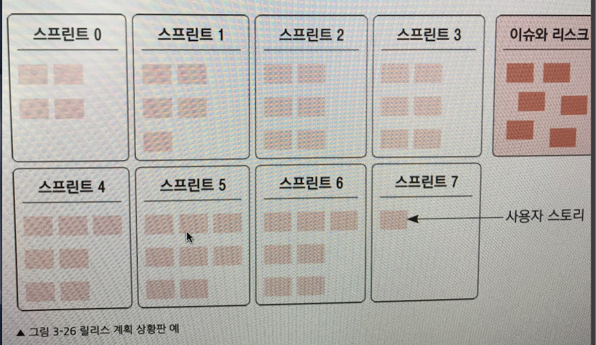
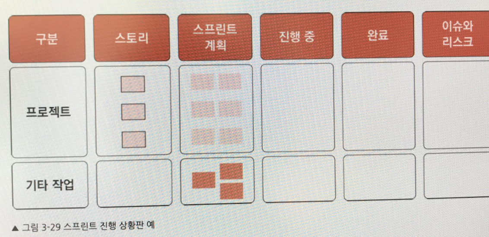

# 애자일 & 스크럼 프로젝트 관리

## Ch1. 전통적 프로젝트 경영에서 벗어나기

### 1.1 업무 범위, 일정, 비용은 반드시 지켜야 하는가?

* 프로젝트에서는 초기에 설정된 조건들을 **신축성 있게 조절하는 것이 오히려 프로젝트의 가치를 높이는데 도움이된다.**
* 따라서, 프로젝트 초기에 설정한 일정, 비용은 **불확실한 요구사항을 반영한 것이므로 절대 변할 수 없다는 고정관념은 버릴 필요가 있다.**

### 1.2 프로젝트 일정 및 예산에 대한 진실

* 상세 요구사항이 변동되기때문에, 프로젝트 초기에는 일정이나 비용을 신뢰하기 어렵다.
* 프로젝트 **일정과 비용을 적정 규모 이하로 줄이면 프로젝트의 생산성과 품질에 오히려 악영향을 미친다는 것을 깨달아야 한다.**
* **일정을 필요 이상으로 줄일 때 미치는 악영향**
  * 의사소통할 시간이 없다.
  * 여유가 없어서, 창의적으로 생각할 시간이 부족하다.
  * 요구사항과 설계에 투자하는 시간이 적어 후반부에 재작업을 많이 하거나 품질이 떨어진다.
  * 예상치 못한 리스크에 대처할 시간적 여유가 없어 일정이 지연되거나 품질에 문제가 생긴다.

### 1.3 업무 범위 내 요구사항은 모두 구현해야 하는가?

* 발주자가 개략적인 업무 범위를 기반으로 일 정과 비용을 설정하고 이후 범위에서 발생하는 모든 요구사항을 충족하라는 이야기는 매우 비상식적이다.
* 프로젝트 일정과 예산이 고정되어 있고, 요구사항의 변경이 자주 발생하는 상황이라면 기존 요구사항과 변경사항의 **우선순위를 관리하여 주어진 제약 조건을 충족 시켜야 한다**.
* 요구사항의 업무 범위와, 깊이를 구분해서 생각해야한다.
  * 엄무범위는 프로젝트에서 달성해야하는 업무 영역이고,
  * 깊이는 범위에 따른 상세 요구사항이다.

### 1.4 상습적인 야근이 프로젝트의 성과를 높일 수 있을 까?

* 단기간의 야근은 생산성 증대를 가져올 수 있지만 장기적인 야근은 **주어진 일을 늘려서 할 뿐 초과근무로 인한 생산성 향상은 없다.**

### 1.5 협력 업체는 파트너인가, 소모품인가?

### 1.6 비즈니스 환경은 어떻게 변화하는가?

* 과거 우리 사고방식은 제조업에 일하느 방식에 맞춰져 있고, 성실하고 근면하게 일하는 것을 미덕으로 여기었다.
* 그러나, 소프트웨어 산업의 환경은 많이 다르다.
* 이런 비즈니스 환경의 변화는 크게 두 가지로 요약할 수 있다.
  1. **요구사항이 불확실해지면서 개발 일정이 점점 짧아진다.**
  2. **고객에게 매력적인 가치를 제공해야 시장에서 살아남는다.**
* 단순히 초기에 주어진 요구사항을 개발하는 것으로 그쳐서는 안되고, **과정 중에 끊임없이 고객에게 가치를 줄 수 있는 매력적인 기능을 탐색하고, 이를 달성해야만 프로젝트의 가치를 높일 수 있다.**

### 1.7 전통적 프로젝트 수행 방식에는 어떤 한계가 있는가?

* 한계점
  1. **프로젝트 초기에 구체적인 요구사항을 도출하기 어렵다.** —> 폭포수 개발 방식
  2. **프로젝트 중간에 발생하는 요구사항의 변경을 반영하기 어렵다.**
  3. 프로젝트 과정 중 중간 산출물을 많이 요구하는데, **개발팀은 어떤 목적으로 만드는 산출물인지도 모르고 기계적으로 만들다 보니, 결국 발주자와 개발팀 누구에게도 필요하지 않은 산출물이 나온다.** 이는 점점 짧아지는 프로젝트 일정과 요구사항 변경이 빈번한 상황에서 매우 비효유적인 요소로 작용한다.
  4. 프로젝트 관리자 중심의 명령과 통제 방식 때문에 구성원은 **수동적으로 바뀌고, 커뮤니케이션은 매우 부족하다.**

> 전통적 프로제트 경영은 '폭포수' 개발방식으로 볼 수 있다. 이는 프로젝트 초기에 기획, 설계, 개발, 요구사항 등을 모두 정해 놓고, 관리자 중심의 명령과 통제 방식으로 진행이 된다. 이러한 방법은 프로젝트의 규모가 커지고, 개발자가 많아 졌을 때, 다음과 같은 단점이 있는데, 첫째로는 주도적이지 않고, 주어진 스펙에 대해서 개발하다보니, 수동적이게 되고, 그로인해 산출물의 만족도가 낮아진다. 또한 고객의 요구사항이 바뀌었을 때, 기존의에 짜여진 요구사항을 바꿔야 되는데, 그런 프로세스에 유연하지 못하다. 
>
> 우리는 단순히 초기에 주어진 요구사항을 개발하는 것 보다는 과정 중에 끊임 없이 고객에게 가치를 줄 수 있는 매력적인 기능을 탐색하고, 이를 달성하도록 해야한다.

## Ch2. 애자일 주요 원리: 자기 조직화, 린, 몰입

### 2.1 애자일 소프트웨어 개발 선언문의 이해

* 개발 과정에서 간과했던 구성원 간의 커뮤니케이션을 강조하면서 프로젝트 상황에 따른 적응형 개발 방법을 주장
* 2001년 17명의 애자일 전문가가 모여서, 개발 철학을 정리 하였는데, 이를 애자일 소프트웨어 개발 선언문 이라 한다.
* 선언문의 중심 내용은 다음과 같다.
  1. 프로세스와 도구  보다는 개인과 개인 간의 상호작용에 더 큰 가치를 둔다.
  2. 포괄적 문서화보다는 둥작하는 소프트웨어에 더 큰 가치를 둔다.
  3. 계약 협상보다는 고객과 협력에 더 큰 가치를 둔다.
  4. 계획을 따르기보다는 변화에 대응하는 것에 더 큰 가치를 둔다.

### 2.2 애자일 소프트웨어의 개발 원칙 열두 가지

1. 소프트웨어 개발을 수행하는 최우선 목표는 지속
2. 애자일 프로세스는 고객의 경쟁력을 위해서라면 비록 개발 후반일지라도 요구사항의 변경을 환영한다.
3. 동작하는 소프트웨어를 2주일에서 2개월까지 짧은 간격으로 자주 전달하라.
4. 요구사항을 내는 고객과 개발자는 전체 프로젝트에서 매일 함께 일해야 한다.
5. 동기가 부여된 개인들 중심으로 프로젝트를 구성하고, 그들에게 필요한 환경과 지원을 제공하고, 일을 잘 끝낼 수 있도록 신뢰하라.
6. 개발팀 내부에서 정보를 전하는 가장 효율적인 방법은 서로가 얼굴을 마주 보면서 대화하는 것이다.
7. 작동하는 소프트웨어는 진척의 주된 척도다.
8. 애자일 프로세스는 지속가능한 개발을 장려하며 스폰서, 개발자, 사용자는 일정한 개발 속도를 계속 유지해야 한다.
9. 기술적 탁월성과 좋은 설계에 갖는 지속적 관심이 민첩성을 높인다.
10. 간단함, 즉 하지 않은 일의 양을 최대화하는 기술이 필수적이다.
    * 과도한 분석 설게는 바람직 하지 않고 해당 요구사항이 분명하고 명확할 때 개발에 착수한다.
11. 최고의 아키텍처, 요구사항, 설계는 자기 조직화된 팀에서 창발한다.
    * 누군가의 지시가 없어도 자기 주도적으로 업무를 수행하고 유기적으로 협력하는 팀을 의미한다.
    * 혁신은 계획할 수 있는 것이 아니며, 구성원이 자유롭게 소통하고 협력할 때 나타난다.
12. 정기적으로 어떤 방법이 팀에 더 효과적일지 숙고하며 이에 따라 팀의 행동을 조율하고 조정한다.

### 2.3 프로젝트는 복잡 적응계다.

* 복잡적응계는 복잡계가 확장된 형태로, 많은 구성요소가 상호작용하면서 경험과 학습으로 상황에 적응해 나가는 시스템이다. 즉, 성공적으로 제품을 개발하는 절대적인 방법이 있다고 가정하지 않는다.

* 한 때 잘 나가던 기업이 한 순간 판단 실수로 업계에서 추락하는 일은 비일비재하다. 이런 원인 중 하나는 성공해왔던 방식을 너무 과신한 것 때문이다. 사회 생태계가 복잡계라는 것을 간과하고 환경에 적응하는 노력을 게을리 한 것이다.
* 애자일은 프로젝트 자체를 예측하기 어려운 복잡 적응계로 인식한다.
* 애자일은 경험과학습으로 기존에 알려진 표준 프로세스보다 더 좋은 방법을 찾을 수 있다고 가정한다.

### 2.4 스스로 일하는 개발팀 : 자기 조직화된 팀

* 팀원 스스로 해야 할일을 계획하고 상호 협력하여 업무를 수행하는 팀의 형태를 자기 조직화된 팀이라고 한다.
* 자기 조직화가 효과적으로 작동하기 위한 중요한 조건은 조직에서 팀원이 스스로 계획하고 수행할 수 있도록 팀원에게 자율성과 책임감을 주어야 한다.

### 2.5 테일러리즘 vs 린

* 테일러리즘
  * 사람을 생산 시스템을 구성하는 기계적인 요소의 하나로 보고 표준화,분업화 하여 노동 생산성을 증진하고자 했던 과학적 관리기법
* 린
  * 생산 단계에서 인력이나 생산설비 등 생산능력을 필요한 만큼만 유지하면서 생산효율을 극대화하는 방식
* 도요타 생산방식(린) 패러다임 전환
  1. 장비의 가동률을 무조건 늘리는데 초점을 맞추기보다 장비와 인력을 효율적으로 활용하면서 제품의 리드 타임을 줄이는데 초점
  2. 생산자에게 단순하게 작업을 수행하는 기계적요소로 보지 않고 업무를 개선하는 부가가치 창출의 원천으로 봄

### 2.6 린의 주요 원리

* 개발 과정 중에 비효율적 요소를 효과적으로 제거할 수 있는 방법을 제공
  1. 지속적인 가치 흐름을 확인하고 낭비를 제거한다.
  2. 풀 시스템을 활용하여 과잉 생산을 피한다.
     * 풀
       * 고객 수요에 따라 제품을 생산한다는 개념
       * 개발 프로세스상의 재고를 최소로 하고 과잉생산을 피할 수 있는 장점이 있다.
  3. 사람이나 장비의 작업 부담을 줄이고 작업 오더의 불균일성을 제거
     * 과도한 부담을 주지 말자 -> 균일한 작업량 유지
  4. 품질과 문제를 해결하는 스톱 문화를 구축
     * 단위테스트, 통합테스트 
  5. 어떤 문제도 숨길 수 없도록 시각적 관리 기법을 사용하고 직접 현장을 확인한다.
  6. 근로자의 책임과 참여하에 프로세스를 수립하고 지속적인 개선을 추구
  7. 협엽업체를 돕고 지원하여 동반성장의 길을 모색
  8. 냉정한 반성과 지속적인 개선으로 학습하는 조직을 구축
     * 실수를 새로운 지식을 습득할 수 있는 좋은 기회로 삼아야한다.
  9. 개발팀은 기능 혼합팀으로 구성하며 상호 협력한다.
  10. 개발 과정의 낭비를 제거

### 2.7 소프트웨어 개발의 낭비 요소 일곱 가지

1. 미완성 작업
2. 추가 프로세스
3. 추가 기능
   * 불필요한 일을 하지 말라
4. 멀티 태스킹
   * 한 가지 업무에 집중 하다가 진전이 없는 시점에 도달 할 때 다른 문제로 넘어가는 것이 바람직
5. 대기시간
6. 이관: 문서전달
   * 전적으로 문서에만 의존하면 안된다.
7. 결함
   * 결함이 발생했다는 것 자체가 낭비요소이다.
   * TDD를 해서 결함을 줄이자.

### 2.8 몰입

* 좋아하는 일을 수행할 떄 경험하는 최고로 즐거운 순간
* 구성원이 몰입할 수 있는 환경을 제공해야한다.

### 2.9 애자일 프로젝트 관리의 목표

* 고객에게 가치있는 제품 개발
* 제품 적시 출시
* 신뢰성과 확장성 있는 제품

### 2.10 전통적, 애자일 프로젝트 관리의 비교

#### 애자일

* 계획 수립
  * 개략적인 요구사항과 일정을 수립하고 주기적으로 상세 요구사항 도출 및 계획 수립(유동적인 범위, 일정, 비율)
* 개발 및 테스트
  * 점진적으로 개발을 진행, 이터레이션 단위로 동작하는 제품 개발에 초점
* 프로세스
  * 유연하고 간소하며 주기적으로 개선
* 업무 수행 형태
  * 자기조직화된 팀 관리
  * 팀 공동 책임으로 업무 수행
* 조직
  * T자형 인재
* 팀 관리
  * 코치 및 퍼실리테이션, 협력
* 평가
  * 절대 평가
* 성공척도
  * 고객 가치 전달

> 애자일은 여러면에서, 전통적 개발 방법론과 다르다. 내가 느낄 때, 가장 큰 차이는 구성원들 각각의 태도의 차이이다.
>
> 수동적인 자세보다는 능동적인 참여를 중요시하고, 고객 요청에 대한 유연성을 중요시 한다. 특히, 자지 조직화된 팀으로써, 구성원들이 자신이 하는 일에 대해서, 자부심과 열정을 가지고 할 수 있다면, 단순히 관리자가 시키는 일을 스펙에 따라 하는 것 보다, 좀 더 창의적으로 문제를 접근하고 해결할 수 있다고 생각한다.

## Ch3. 애자일 프로젝트 계획

### 3.1 기존 개발 방법론은 어떻게 활용해야 하는가?

* 어떤 개발 프로세스가 좋을 수 있지만, 조직의 특성과 문화를 고려하지 않는다면 최선의 방법이 아닐 수 있다.
* 프로젝트 방법론을 적용할 떄는 두가치 측면을 고려해야한다.
  1. 방법론에서 제시하는 산출물을 어떤 목적을 활용하느지
  2. 개발 방법론을 개발 기간 내내 그대로 가져가서는 안된다.
     * 주기적으로 그 효과를 평가하고 개선할 필요가 있다.

### 3.2 애자일은 개발 생명주기와 어떻게 다른가?

* 개발 생명주기

  * 개발 단계의 집합
  * 제품을 어떤 전략으로 개발할 것인지 결정하는 접근 방식
  * 분석, 설계, 구현, 테스트를 순차적으로 진행하는 폭포수 개발 방식이 있다.
    * 초반 요구 사항을 모두 분석하기 어렵고 고객은 실제 제품을 프로젝트 후반부에 가서야 제대로 볼 수 있기 때문에 요구사항이 많이 변경된다는 단점이 있다.

* 점진적 개발

  * 전체 시스템 요구사항을 분석후, 전체 시스템을 여러 개의 빌드로 나누고, 빌드 하나를 순차적으로 수행하여 점진적으로 기능을 완성한다.
  * 여러개의 폭포수 개발을 순차적으로 진행하는 형태

* 진화적 개발

  * 초기에 요구사항이 완전히 파악되지 않은 상태에서 알려진 요구사항만으로 개발하는 방식
  * 고객에게 피드백을 받아 요구사항이 좀 더 명확해지면 점진적으로 기능을 개선하여 목표 시스템을 완성

* 스테이지 게이트 개발

  * R&D 및 신제품 개발에 사용하는 개발 생명주기, 상품 기획 단계부터 출시까지 관리

* 애자일 개발

  * 점진적 개발의 장점을 살리면서 요구사항의변화를 주기적으로 수용하는 반복적 개발

    1. 스프린트 단위로 요구사항의변화를 수용하면서 개발한다.
       * 즉, 스프린트를 계획할 때, 기존에 계획한 요구사항을 전 스프린트에서 나온 변경사항을 비교하고, 구성원 간의 검토를 거쳐서 우선순위화하여 반영

    2. 동시공학적으로 접근하여서, 어떻게 중간 산출물을 최소화하면서 품질 높은 제품을 만들 수 있는지에 초점을 맞춘다. 
       * 스프린트 안에서 분석, 설계, 구현, 테스트 같은 공정은 발생하나, 공식적으로 산출물을 만들고 다음 단계로 넘어가는 형태가 아님
    3. 애자일 개발에서는 특별한 경우가 아니면 개발 주기가 규칙적

  * 예시

    1. 프로젝트 기획
       * 제품 기획
       * 타당성 검토
       * 프로젝트 승인
       * 외주 발주
    2. 스프린트 0
       * 요구사항 분석
       * 아키텍처 정의
       * 개발 환경 셋업
       * 릴리스 계획 수립
    3. 스프린트 1, 2
       * 스프린트 계획
       * 분석과 설계
       * 구현과 테스트
       * 스프린트 리뷰, 회고
    4. 스프린트 N
       * 시스템 테스트
       * 시범 운영

### 3.3 요구사항 이해관계자 식별

### 3.4 요구사항 도출: 린 스타트업과 디자인 씽킹의 활용

* 린스타트업
  *  최소한의 요건만 갖춘 제품(MVP, Minimal Viable Products)을 신속하게 개발하여 시장에 출시한다.
  * 초기 투자의 낭비를 줄이고, 고객의 피드백을 받아 제품을 개선해 나가는 방식으로 개발한다.
* 요구사항을 도출할 때, 고객과 다양한 개발팀원이 함께 참여함으로써, 고객이 인지하지 못하는 문제를 도출하는 데 좀 더 많은 시간을 할애한다.
* 디자인 씽킹의 활용
  * 요구사항을 도출할 때 '공감' 이라는 활동을 별도로 추가하여 사용자와 고객의 본질적인 문제를 파악하는 데 더욱 중점을 둔다.
  * 예시
    1. 공감
       * 사용자를 경청, 관찰, 공감형성
    2. 문제 정의
       * 통찰로 사용자의 문제나 니즈 정의
    3. 아이디어 도출
       * 문제를 해결하는 아이디어 도출
    4. 프로토타입 만들기
       * 검증을 위한 간단한 프로토타입 작성
    5. 사용자 검증
       * 고객에게 보여서 반응 확인

### 3.5 요구사항 정의와 제품 백로그

* 기능적 요구사항(시스템이 수행하는 입출력 및 저장 )
* 성능 요구사항(응답시간, 동시 처리량, 자원사용률 등)
* 인터페이스 요구 사항(시스템과 사용자 간 인터페이스)
* 품질 요구사항(신뢰성, 사용성, 이식성, 보안성 등)
* 기타 요구사항(운영, 데이터, 법규, 표준 등)

> 위와 같은 내용의 문서화는 필요하지만, 초기부터 완벽히 정의할 필요는없다. 고객의 피드백을 받으며 보완해 나간다.

위와 같은 요구사항 의저서를 애자일 개발에서는 제품 백로그라는 문서에 기술한다.

* 각 업무 파트에서 수행해야 할 요구 기능을 중심으로 기술하고, 해당 기능을 수행하는 세부작업(상세분석과 설계, 구현, 단위 테스트)는 포함하지 않는다.
* 제품 백로그 구성 항목
  * 요구 기능과 비기능 요구사항
  * 기술적, 관리적 업무(아키텍처 수립, 하드웨어 선정과 발주, 교육훈련, 통합 테스트 등)
  * 문제 해결(모듈 안정화, 사용화 개선 등)
  * 수정해야 할 버그

### 3.6 사용자 스토리, 기술 스토리, 완료 조건

* 사용자 스토리

  * 제품 백로그에서 기능 요구사항을 기술할 때 사용하는 방식, 고객과 사용자에게 가치를 줄 수 있는 기능을 서술

  * 작성방법

    (누가) (비즈니스 가치)를 위해 (어떤 기능)을 원한다.

    * 사용자는 회원 가입을 위해 고객 이름, 주민번호, ID, 비밀번호를 입력할 수 있다.
    * 교육생은 수강 신청을 위해 신처, 취소, 리스트 보기를 할 수 있다.

  * 초기 제품 백로그에서는 개략적으로 기술하더라도 해당 스토리를 본격적으로 개발하는 스프린트 계획 미팅에서는 상세히 구체화해야한다.

* 기술 스토리

  * 사용자 스토리를 지원하는 기술적 관리적 업무를 서술할 때 사용한다. 형식은 따로 없지만 고객이 이해할 수 있는 수준으로 작성한다.
    * 요구분석과 아키텍처, 도구 셋업 등 기술적인 활동
    * 비기능 요구사항과 인프라 시스템 개선 활동
    * 코드 리뷰, 리팩토링 등 품질 개선 활동
    * 버그 수정, 모듈 안정화, 사용성 개선 활동
  * 기술 스토리는 개발팀이 중심이 되어 도출한다.

### 3.7 제품 백로그 작성 지침

1. 상호 독립적
2. 변경 가능
3. 사용자와 고객에게 가치가 있음
4. 추정 가능
5. 크기가 적절
   - 스프린트 기간안에 완료할 수 있는 수준으로 쪼개거나 합한다.
6. 테스트가 가능

### 3.8 제품 백로그 vs 작업 분류 체계(WBS)

다른 점

1. wbs가 단순히 프로젝트에서 해야할 업무를 분할한 수준이라면, 제품백로그는 업무를 분할할 뿐 아니라, 우선순위도 설정되어 있다.
2. wbs는 기능을 구현하는 작업중심으로 작성, 제품 백로그는 사용자와 기술 스토리 중심으로 작성되어 있다.

### 3.9 개발 규모 추정과 스토리 점수

소프트웨어 규모 추정 문제를 해결하고자 스토리 점수를 도입한다.

### 3.10 애자일 추정 기법과 플래닝 포커

### 3.11 가치 점수와 요구사항 우선순위

* 우선순위가 낮은 요구 사항을 개발하느라 시간을 많이 소비한다면 최종 제품은 완성하지 못한 채 마감할 수밖에 없을 것이다.
* 애자일 개발에서는 고객에게 가치 있는 제품을 빠르게 전달하는 것을 기본 목표로 삼는다.
* 이렇게 하기 위해서 고객이 가장 원하는 기능과 나중에 개발할 기능을 구분ㄴ하여 순위를 매길 필요가 있다.
  * 필수
  * 중요
  * 선택
    * 다음 릴리스로 넘겨도 크게 문제가 없는 사항
  * 보류
    * 이번 릴리스에 포함하지 않기로 결정한 사항

### 3.12 요구사항 관리 전략

* 백로그는 초기계획일 뿐, 프로젝트 진행에 따라 내부 스토리들은 언제든지 갱신할 수 있다는 것을 전제로 한다.

### 3.13 릴리스 계획을 이용한 전체일정 수립

* 초기부터 상세한 일정 계획을 세우지 않는다.
* 대신 뼈대가 되는 전체 일정과 주기적인 상세 일정을 수립하는 형태로 관리한다.
  * **마일스톤 계획**
    * 프로젝트의 주요 단계와 업무, 이벤트 등을 표시한 **요약 일정**
  * **릴리스 계획**
    * 프로젝트에서 수행할 제품 백로그를 표현한 **전체 일정 계획**
  * **스프린트 계획**
    * 2~4주 단위로 개발 팀이 실제 수행하는 작업들로 구성된 **상세 계획**

* 릴리스 계획 수립 절차

  1. 제품 백로그 작성
     * 프로젝트에서 수행할 사용자 스토리와 기술 스토리를 도출하고 우선순위를 선정하여 정리
  2. 스토리 점수 추정
     * 제품 백로그의 스토리 점수를 추정하고, 해결해야할 이슈와 리스크를 식별하고 별도로 기록 관리한다.
  3. 스프린트기간 설정 4. 평균 개발 속도 추정

  5. 전체 일정 추정
  6. 스토리 우선순위 선정

### 3.14 스프린트 계획을 이용한 단기 일정 수립

* 스프린트 계획의 목적은 어떤 작업들을 수행하고 이를 수행하는 최적의 방법은 무엇인지 계획하는 것

* 스프린트 계획은 프로젝트 기간 동안 주기적으로 수립하는데 절차는 다음과 같다.

  1. 제품 백로그 정제 미팅
  2. 스프린트 목표와 범위 설정
     * 스프린트 기간 동안 완료할 수 있는 스토리들을 제품 백로그 우선순위에 따라서 가져온다.
     * 제품 책임자에게 해당 기능의 업무 시나리오의 완료 조건, 제약사항 등을 자세히 물어보고 범위를 확정한다.
  3. 스프린트백로그 도출 / 4. 평균 투입 공수 추정
     * 스프린트 백로그는 개발팀이 실제 수행하는 개발 용어로 작성한다.
     * 모델링, UI 디자인, 코딩, 단위 테스트 등
     * 스토리를 구현하는 작업뿐 아니라, 개발팀에서 수행하는 모든 작업을 도출해야한다.
       * 코드리뷰, 특정 업무 회의, 교육과 세미나 등
     * 스프린트 백로그에는 팀에서 하는 일이 모두 나타나야 한다.
     * 스프린트 백로그의 크기는 2~3일 안으로 끝낼 수 있도록 분할 하면 좋다.
     * 백로그를 잘 게 나누는 이유는 해야 할 업무를 구체화하려는 의도도 있지만 학생증후군(미뤘다가 한번에 하는 것)을 예방하려는 목적도 내포되어 있다.

  5. 작업 담당자 할당

     * 팀원이 스스로 원하는 작업을 선택할 것을 권장
     * 업무 할당이 되었다고 맡은 업무만 잘하면 된다고 생각해서는 안된다.
     * 애자일에서 스프린트 백로그는 팀으 ㅣ공동 책임이기 때문이다.

  6. 스프린트 목표 업루량 결정

     * 팀원이 자발적으로 스프린트 백로그를 선택하면 프로젝트 리더는 팀원과 함께 예상되는 이슈들을 공동으로 점검한다.
     * 팀원에게 할당된 업무량이 이번 스프린트에서 완료 가능한지 개별적으로 확인한다.
     * 팀원 중에서 누군가가 업무량이 부담스럽다고 이야기한다면, 팀원의 역량과 업무량을 체크하여 해당 팀원이 몰입할 수 있는 수준으로 조정한다.
     * 이런 과정을 거쳐서 스프린트 목표 업무량을 걸정한 후에는 최종 결과를 제품 책임자에게 전달하고 조율한다.
     * 애자일에서 개발팀에 과도한 목표량을 부여하지 않는 이유는 업무 몰입을 유도하기 위해서지 그것만 완료하면 된다는 의미는 아니다.
     * 스프린트 기간이 끝나기 전에 업무 목표를 달성한다면 다음 스프린트에서 수행할 예정인 스토리들을 가져와서 작업해야 한다.

     > 스프린트 계획에서 토론은 반드시 필요하며, 올바른 요구사항과 효율적인 작업 방법을 찾는과정이다.
     >
     > 스프린트 계획에 시간을 투자하는 것을 아까워하지 말자.
     >
     > 2주 스프린트라면 계획 미팅에 최소 반나절, 길게는 하루 이상 소요한다.

### 3.15 프로젝트 계획 검토

### 3.16 프로젝트 킥오프

*  프로젝트 이해관계자를 모두 모아 놓고 프로젝트의 목표와 진행 방법, 상호 간의 책임과 역할 등을 공유하는 공식적인 활동이다.
* 프로젝트의 개발 방법론 이해와 주요 이슈 토론 등을 포함할 것을 권장한다.
  * 프로젝트의 목적과 범위, 수행 전략, 릴리스 일정 소개
  * 개발, 관리 방법론과 수행 참여들 간의 책임과 역할
  * 프로젝트의 이슈, 리스크 도출, 해결 방안 탐색

### 3.17 전통적, 애자일 일정 계획의 비교

1. 프로젝트 일정 계획을 바라보는 관점
   * 정확한 일정을 예측하기보다는 요구사항의 변경에 따른 일정의 유연성을 추구
2. 작업 담당자를 할당하는 방식의 차이
   * 개발팀원이 스스로 백로그를 도출하고 작업을 배정
3. 프로젝트 추정 방식의 차이
   * 개발팀이 공동으로 개발 규모와 공수를 추정, 동기부여에 도움을 준다.

 

## Ch4. 애자일 프로젝트 진행 관리

### 4.1 전통적 진행 관리의 한계

* 계획을 아무리 완벽하게 수립했더라도 업무를 진행하다 보면 프로젝트는 예상치 못한 방향으로 틀어지게 된다. 초기에 불명확하거나 불확실했던 요구사항은 프로젝트가 진행될 수록 구체화되거나 변경되어 업무량을 증가시킨다.
* 이러한 전통적 진행 방식에는 몇가지 근본적인 한계가 있다.
  1. 관리자가 업무의 불확실성을 고려하지 않는다.
  2. 업무 불균형과 개인 중심의 평가로 상호 협력이 떨어진다.
  3. 팀원의 사기와 업무 만족도를 별로 고려하지 않는다.
  4. 팀원에게 멀티태스킹을 강요한다.

### 4.2 애자일 진행 관리의 특징

1. 업무 작업의 불확실성을 고려하면서 수행 성과에 초점을 맞춘다.
   * 개별 작업의 세부 일정을 지키보다 서로 힘을 합쳐 목표 달성에 최선을 다하는 의미
2. 개인보다는 팀 공동 책임 업무 수행을 추구
   * 개인에게 할당했더라도 그것을 개인의 업무가 아니라 팀의 업무로 간주한다.
3. 팀원의 사기와 업무 만족도를 중요시 한다.
4. 멀티 태스킹을 최소화한다.
   * 팀원이 동시에 여러 가지 일을 하지 않도록 관리한다.

### 4.3 애자일 프로젝트 성과 지표

### 4.4 시각적 관리와 데일리 스탠드업 미팅

1. 시각적 관리
   * 릴리스 계획과 스프린트 계획에서 나온 백로그를 포스트잇을 사용하여 상황판에 붙이고, 백로그의 진행상황과 주요 이슈를 주기적으로 점검하는 활동
2. 데일리 스탠드업 미팅
   * 어제 내가 한일
   * 오늘 내가 한일
   * 업무 진행 중 발생한 장애 요인
   * 도움이 필요한 사항

### 4.5 단계별, 스프린트 리뷰를 이용한 고객 피드백

### 4.6 효율적 이슈 및 리스크 관리

### 4.7 산출물 검토 방법

1. 검토 준비
   * 소스 코드 점검 체크 리스트
     1. 각 프로그램 크기는 적당한 크기로 분리되어 있는가?
     2. 모듈별 작성자의 이름과 개요, 일자 등을 명시하고 있는가?
     3. 변수가 미리 선언되어 있고 중복 선언되지 않았으며 적절한 type이 사용되었는가?
     4. 비슷한 유형의 프로그램을 개발하기 위한 표준 프로그램이 작성되어 있는가?
     5. 입력 데이터 또는 전역 변수 등이 제대로 초기화되고 있는가?
     6. 적절한 주석 및 들여쓰기로 소드 코드 가독성을 향상 시켰는가?
     7. 조건문은 단순화 되어 있는가?
     8. 주석의 서술은 상세히 기록되어 있는가?
     9. 코딩 시 소스 코드의 백업 관리를 수행하고 있는가?
     10. 코딩 표준 및 명명 규칙을 준수했는가?
     11. 프로그램과 모듈 간의 주고 받는 파라미터가 서로 일치하는가?
     12. 프로그램의 백업 처리는 하고 있는가?
     13. 프로그램의 버젼 번호를 확실히 명시하여 관리하고 있는가?
     14. count 제어 loop에서 count 값을 강제로 변경하고 있지 않은가?
     15. loop 시작 값, 종료 값, 증감자가 적절히 정의되었고 무한 반복이 되지 않도록 했는가?
2. 개별 검토
3. 합동 검토
4. 결과 분석

### 4.8 지속적인 프로세스 개선: 프로젝트 교훈 미팅과 스프린트 회고

1. 프로젝트 교훈 미팅
   * 프로젝트 계획과 비교하여 실적 차이가 발생한 원인?
   * 고객과 팀 간에 효과적으로 의사소통 했는가?
   * 이슈와 리스크를 적절하게 관리했는가?
   * 요구사항을 적절하게 관리했는가?
   * 사용한 개발 방법론이 효율적이었는가?
   * 개발 도구는 적절했고, 효과적을 ㅗ활용했는가?
   * 조직 표준 프로세스에서 개선사항은?
   * 외주업체는 적절하게 관리했는가?
2. 스프린트 회고
   * 스프린트 회고활동을 이용하여 프로젝트의 비효유적인 프로세스나 커뮤니케이션을 주기적으로 개선한다.
     * 업무 수행 과정에서 효율적이고 좋았던 활동은?
     * 업무 수행 과정에서 비효율적이고 좋지 않았던 활동은?
     * 업무를 진행할 때 어려움이 있었다면 그 원인은?
     * 업무를 좀 더 효과적으로 수행하려면 무엇을 개선해야 하는가?
     * 좀 더 즐겁게 일할 수 있는 방법은?
   * 스프린트 회고 절차
     1. 회고 준비
     2. 데이터 모으기
        * 스프린트에서 진행한 사건이나 상황 등을 되돌아보면서 문제를 개고간적으로 인식하는 과정
          * 이번 스프린트 동안 효율적이거나 좋게느꼈던활동?
          * 비효율적이거나 좋지 않게 느꼈던 활동?
          * 제품 개발 과정에서 우리가 놓치고 있는 것은?
          * 이번 스프린트 동안 내가 새롭게 알게 된 사실은?
     3. 통찰 이끌어 내기
        * 이번 스프린트 목표를 달성하지 못한 원인은?
        * 업무 수행 중에 발생한 이슈나 문제점의 원인은?
        * 업무를 좀 더 효과적으로 수행하려면 개선할 점은?
        * 좀 더 즐겁게 일할 수 있는 방법은?
     4. 개선 계획 수립
        * 개선 할 대상을 선정하고 상세한 실행 계획을 수립한다.
     5. 회고 마무리
     6. 기타 주의 사항
        * 성과가 저조할 때는 팀원을 비난하기 보다 시스템이나 프로세스 측면에서 개선점을 찾아야 한다.

### 4.9 요구사항 조정과 협의

### 4.10 요구사항 추적 관리

### 4.11 이해관계자 관리

## Ch5. 효과적인 애자일 팀 구성

### 5.1 애자일 팀에 동기를 부여하는 방법

1. 팀원의 욕구를 이해하라.
   * 자신의 일을 자아실현의 일부로 인식하면 더욱 열정적으로 일할 수 있다.
2. 내재적 동기를 활용하라.
   * 내재적 동기
     * 행위 자체가 즐거워서 그 일을 하는 것을 의미한다.
       * 지속성이 강한 장점이 있다.
   * 외재적 동기
     * 보상을 받거나, 처벌을 피하려고 그 일을 하는 것을 의미
3. 애자일 팀의 동기부여 활동
   * 릴리스와 스프린트 계획을 수립할 때는 지시보다 팀원 스스로 자신이 원하는 업무를 선택하고 책임질 수 있도록 지원한다.

### 5.2 팀원 존중

* 일부 팀원이 업무에 집중하지 않는 모습을 보여도 게으르고 나태한 직원으로 인식하기보다는 목표가 명확하게 주어지지 않았거나 동기부여가 필요한 직원으로 인식한다.

### 5.3 기술 리더와 애자일 프로젝트 리더의 역할

* 프로젝트 관리자가 개발 업무와 프로젝트 관리 업무를 병행하는 것은 가장 위험

### 5.4 애자일 리더쉽

#### 애자일 팀 코칭 방법

1. 프로젝트 리더는 팀원의 관심사나 심리적 상태, 고충에 관심을 보이고 팀원의 사기를 주기적으로 점검한다.
2. 프로젝트 리더는 팀원과 주기적으로 1:1 미팅을 수행한다.
3. 적극적으로 경청하고 적절한 질문을 던진다.
   * 조언보다는 적절한 질문을 던져 팀원이 스스로 생각하고 판단하게 도와주는 것이 훨씬 효과적

> 사람들은 누군가가 어려움을 이야기하면 자신의 경험에 기반하여 조언을 해줄 때가 많다. 하지만 그 조인이 그 사람에게 맞는 해법이라고 보기 어렵고 상대방이 원하지 않는 조언은 오히려 상대방의 기분을 상하게 하기 쉽다. 스스로 해답을 찾을 수 있도록 도와주는 것이 질문이다.

4. 팀원의 잘못된 행동을 고치고 싶을 때 잘못된 점을 지적하는 것도 필요하다 하지만 스스로 무엇을 잘못했는지 생각하게 하는 것이 더 효과적이다.

5. 팀원이 수행한 업무 성과에 적절한 피드백을 한다.

   

### 5.5 프로젝트 팀 코칭

### 5.6 하이 퍼포먼스 팀의 조건

### 5.7 애자일 팀 형성을 방해하는 요인

1. 리더가 모든 의사 결정을 내리려고 한다.
2. 팀에 위계질서가 강하다
3. 팀원이 자신의 역할을 한정한다.

### 5.8 개발팀의 역할과 팀스피릿

1. 개인에게 주어진 업무를 팀 전체의 책임으로 받아들인다.
2. 잘 모르는 부분이 있으면 언제든지 서로에게 도움을 요청하거나 돕는다.
3. 상대방을 항상 존중하고 배려해야 한다.
4. 자신이 약속한 것은 최선을 다해 지키려고 노력한다.
5. 업무상황을 솔직하게 이야기 한다.
6. 동료, 이해관계자와 적극대화하고 협력한다.

> 애자일에 대해, 조금씩 알아가면서, 느끼는 점은 애자일은 각 개인을 좋은 하나의 팀으로 만들기 위한 지속적인 노력의 연속이라는 생각이 들었다. 내가 했던 것을 반성하고, 개선사항으로 여기고, 단순 성과 중심보다는 성과가 안좋더라도, 원팀으로써, 서로 더 잘할 수 있도록 격려해주고, 응원해주는 것 등등 내가 어태 지향해온 성과 중심의 마인드에 많은 영향을 주었고, 단순히 팀 만이 아니라, 각 개인에게도 적용할 수 있는 방법론이라는 생각이 들었다.

## Ch6. 대규모 프로젝트에서 애자일 적용법

## Ch7. 애자일 프로젝트 관리 적용 사례

## Ch8. 전사 애자일 적용 방안

## 리뷰

> 이번 애자일 스크럼 책을 읽으면서 초반에 느낀 점은, 우리가 흔히 아는 전통적인 개발 프로세스인, 폭포수 개발방식에 대해서 너무 익숙하다보니, 이 책에서 제안하는 사항들에 대해서, 좀 어색하게 느껴졌다. 아무래도, 애자일에 관한 책이다보니, 애자일에 대한 것은 장점만, 폭포수 개발방식의 장점에 대한 부분보단 단점만 부각시키는 것이 아쉬웠다.
>
> 나의 경우는 폭포수 개발방식을 쓰면서, 장점도 알고, 그것의 단점에 대해서는 너무 잘 알고 있었고, 다른 대안으로 바꾸어보고자하는 노력을 해보려하였지만, 어떻게 고치는게 올바른 방향인지에 대한 확신이 없어서, 어쩔 수 없이 전통적인 개발 프로세스를 계속 따르고 있었다.
>
> 애자일에 대해서 들어보지 않은 것은 아니다. 이전부터 이런 저런 경로에서, 들어왔는데, 대개 들어왔던 얘기는 현실성이 없다. 실제 적용한다는 회사는 많아도 제대로 하는 회사는 없다 등등 대개 부정적인 내용들이였다.
>
> 나 스스로도, 애자일에서 주장하는 방법론 자체는 매우 이상적이고, 이렇게만 이루어진다면, 개인, 팀뿐만 아니라, 조직의 발전에도 큰 영향을 줄 수 있다고 생각한다. 그러나, 이게 현실적으로 모든 사항을 다 지키면서 할 수 있을 지에 대한 의심은 아직 남아 있는 편이다. 
>
> 그러나, 이 책을 읽으면서, 적어도 애자일방법론에 대해서 관심을 가지게 되었고, 이러한 방법론을 만들어내는데, 깊은 고민이 있었음이 느껴졌다. 나 또한 꼭 한번 실천해보고 싶다는 생각이 들었다. 특히 나는 '자기 조직화'라는 단어가 매우 인상 깊었다. 팀원 자율성과 책임감을 바탕으로 스스로가 주도적으로 프로젝트를 수행해나가는 것을 말하는데, 나 스스로가 개인적으로는 이러한 방법론을 따라서, 모든 일을 수행하기 때문이다. 내가 좋아하는 것을 주도적으로 하는 것에 대한 긍정적 효과를 나 스스로 느끼고 있었기 때문에, 책을 읽어가면서, 개인 발전을 위해 더 시도해볼 수 있는 다양한 요소를 접할 수 있었고, 이것을 팀에 적용한다고 했을 때, 성공할 수 있을 것이라는 판단을 함께 얻을 수 있었다.
>
> 또 인상 깊었던 것은 짧은 개발 주기와 끊임 없는 회고를 강조하고, 소통을 강조하는 것이였다. 조금은 지나치지 않은가? 싶을 정도로 책을 보는 내내 소통을 강조하는데, 여러 프로젝트를 하면서, 팀원 간의 소통이 매우 중요하다는 것을 아는 나로써는 매우 공감 되는 내용이였다. 그리고, 그런 소통의 수단으로, 회고를 실천하는 방안을 쓰는데, 나 자신에 대해서 되돌아보고, 항상 개선할 점을 찾고, 고쳐나가다라는 관점, 실수를 해도 발전의 계기로 삼는다는 관점이 매우 와닿았고, 좋은 방향이라고 생각이들었다.
>
> 아무튼 이 책을 읽으면서, 애자일/스크럼 방법론에 대해서, 기존에 어렴풋이 알고 있던 것을 벗어나, 어떤 철학을 가졌는지, 어떤 방법론을 주장하는지, 그 구체적인 것은 무엇인지에 알 수 있었고, 개발 프로세스를 팀 혹은 개인에게 적용할 때, 하나의 또다른 대안에 대해 배울 수 있어서 좋은 경험이였다.