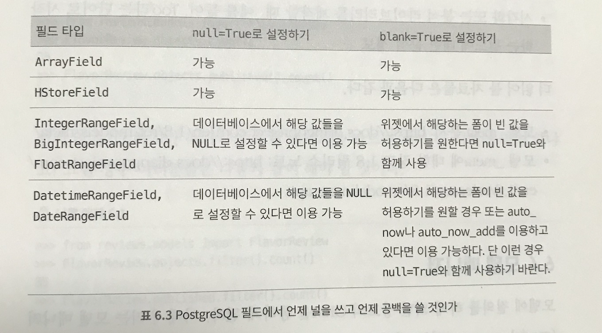

# Two scoops of django


## 들어가기전에


### 핵심 개념

* #### 단순 명료하게 하라(Keep it Simple, Stupid)

* #### **모델은 크게**, **유틸리티는 모듈**로, **뷰는 가볍게**, **템플릿은 단순**하게

  * 뷰와 템플릿을 제외한 다른 부분에 더 많은 로직을 넣는 방법을 추천
  * 코드는 좀 더 깔끔해지고, 문서화도 잘 될 것이고, 중복되는 부분이 줄어들고,  재사용 측면에서 유용하다.

* #### 템플릿 태그와 필터는 가능한 최소의 로직을 포함하고 있어야 한다.

* #### 시작은 장고 기본 환경으로부터

  * '장고 코어 모듈을 교체할 때 주의점' 참고

* #### 장고의 디자인 철학을 이해하도록 한다.

* #### 12팩터 앱

  * 확장 가능하고 배포 가능한 앱을 만드는 방법론


## 1장 코딩 스타일

### 1.1 읽기 쉬운 코드를 만드는 것이 왜 중요한가?

* 축약적이거나 함축적인 변수명은 피한다.
* 함수 인자의 이름들은 꼭 써준다.
* 클래스와 메서드를 문서화 한다.
* 코드에 주석은 꼭 달도록 한다.
* **재사용 가능한 함수 또는 메서드 안에서 반복되는 코드들은 리팩토링을 해둔다.**
* **함수와 메서드는 가능한 한 작은 크기를 유지한다. 어림잡아 스크롤 없이 읽을 수 있는 길이가 적합하다.**


### 1.2 PEP 8

* 파이썬 공식 스타일 가이드
  * [PEP 8 코딩 관례](http://www.python.org/dev/peps/pep-0008)
    * 들여쓰기에는 스페이스를 네 칸 이용
    * 최상위 함수와 클래스 선언 사이를 구분 짓기 위해 두 줄을 띄운다.
    * 클래스 안에서 메서드들을 나구기 위해 한줄을 띄운다.
  * 코드 품질을 위해서 `flake8` 을 이용하자.
    * 코딩 스타일과 코드 품질, 논리적 에러를 점건하는데 매우 유용한 도구

#### 1.2.1 79 칼럼의 제약

* 한 줄 당 79글자를 넘어서는 안된다.


### 1.3 임포트에 대해

* 우선순위(PEP8 기준)

  1. 표준 라이브러리 임포트
  2. 연관 외부 라이브러리 임포트
  3. 로컬 애플리케이션 또는 라이브러리에 한정된 임포트

  ```python
  #표준 라이브러리 임포트
  from math import sqrt
  from os.path import abspath
  
  #코어 장고 임포트
  from djangodb import models
  from django.utilstranslation import ugettext_lazy as _
  
  # 서드 파티 앱 임포트
  from django_extensions.db.models import TimeStampedModel
  
  # 프로젝트 앱 임포트
  from splits.models import BananaSplit
  ```


* 우선순위(Django)
  1. 표준 라이브러리 임포트
  2. 코어 장고 임포트
  3. 장고와 무관한 외부 앱 임포트
  4. 프로젝트 앱


### 1.4 명시적 성격의 상대 임포트 이용하기

* 코드를 이동시키거나 이름을 변경하거나 버젼을 나누는 등의 재구성을 손쉽게 할 수 있도록 구성하는 것은 매우 중요하다.

* 명시적 성격의 상대 임포트를 통해 모듈의 패키지를 하드 코딩하거나 구조적으로 종속된 모듈을 어렵게 분리해야하는 경우들을 피해갈 수 있다.

* 하드 코딩된 임포트 문을 이용했을 때, 단지 앱의 이름을 바꿈으로써 모든 것이 해결되지는 않는다

* 왜 하드 코딩된 임포트문을 쓰면 안되는가?

  1. 앱의 이름을 바꾸어야 할 상황 이라서 수정이 필요할 떄, 임포트 문을 일일이 수정하기 힘들다.

* 요약

  | 코드                               | 임포트 타입     | 용도                                                         |
  | ---------------------------------- | --------------- | ------------------------------------------------------------ |
  | `from core.views import FoodMixin` | 절대 임포트     | 외부에서 임포트해서 현재 앱에서 이용할 떄                    |
  | `from .models import WaffleCone`   | **명시적 상대** | 다른 모듈에서 임포트해서 현재 앱에서 이용할 때               |
  | `from models import WaffleCone`    | 암묵적 상대     | 다른 모듈에서 임포트해서 현재 앱에서 이용할 때 쓰지만 **좋은 방법은 아니다.** |

  * 명시적 성격의 상대 임포트를 이용하는 습관을 길러두자.


### 1.5 import * 은 피하자


나쁜예제

```python
from django.forms import *
from django.db.models import *
```

* 다른 파이런 모듈의 이름공간들이 현재 우리가 작업하는 모듈의 이름 공간에 추가로 로딩되거나 기존 것 위에 덮여 로딩되는 일을 막기 위해서

* 예를들면,

  ```python
  #from django.db import models
  from django.db import *
  
  #의도치 않게 이러한 함수를 만들었다고 가정했을 때
  def models():
    print("django.db 에 있는 models와 해당 함수와 이름이 겹칠 수 있다.")
   
  ```

  ```python
  #forms, db.models 에 모두 CharField가 존재
  from django.forms import CharField
  from django.db.models import CharField
  
  #아래와 같이 * 을 했을 경우 위를 구분할 방법이 없다.
  from django.forms import *
  from django.db.models import *
  
  # 해결책으론 이렇게 써서, 구분해준다.
  from django import forms #forms.CharField
  from django.db import models #models.CharField
  
  ```


### 1.6 장고 코딩 스타일

* 내부적으로 PEP 8을 확장한 장고만의 스타일 가이드가 있다.
* [장고 코딩 스타일 가이드](<https://docs.djangoproject.com/en/2.0/internals/contributing/writing-code/coding-style/>)


#### 1.6.2 URL 패턴의 이름(name)에는 (-) 대신 (_)을 이용한다.

```python
patterns = [
  path('', views.home, name="example_home"), # O
  path('', views.home, name="example-home"), # X
  ...
]
```

* 주소 URL에 대시를 쓰는 것은 문제 없다.

  ex) https://www.example-home.com


#### 1.6.3 템플릿 블록 이름에 (-) 대신 (_)을 이용

* 위와 같은 이유로 템플릿 블록을 정의하는 이름을 만들 때도 밑줄을 쓰자
* `템플릿 블록`이라는 공식 표현이 존재하진 않고, 검색을 해봐도 명확히 정의 내린 곳을 찾지 못하였다
* 그래서  `템플릿 태그` ,  `render` 에서 인자로 넘어오는 `template_name` 등에  위와같은 규칙이 적용된다고 이해하였다.
  * Ex) `` , `` 
  * Ex) `my_home.html`


### 1.7 자바스크립트 HTML CSS 스타일 선택하기

#### 생략


### 1.8 통합개발환경이나 텍스트 편집기에 종속되는 스타일의 코딩은 지양한다.

* 나와 같은 도구를 이용해서 개발하지 않는다는 것을 고려해야한다.


### 1.9 요약

* 일관된 코딩 스타일을 정한 후 일관성 있게 따라야 한다.


## 2장 최적화된 장고 환경 꾸미기

### 2.1 같은 데이터베이스를 이용하라.(운영 / 개발 모두)

두 개의 다른 데이터베이스(개발, 운영)가 똑같이 작동하는 가정 아래 데이터 베이스를 이용할 때 나타날 수 있는 상황 전반에 대해 이야기한다.

#### 2.1.1 운영 데이터를 완전히 똑같이 로컬에서 구동할 수는 없다.

#### 2.1.2 다른 종류의 데이터베이스 사이에는 다른 성격의 필드 타입과 제약 조건이 존재한다.

* `sqlite3`는 동적이고 느슨한 타이핑을 지원하므로 문제에 봉착하게 된다.
* 하지만 운영 환경으로 가면 `PostgreSQL`이나 `MySQL`는 로컬 환경에서는 전혀 본 적이 없는 제약 조건 에러를 뱉어 낼 것이다.

> 최고의 조합 = `장고` + `PostrgreSQL`


#### 2.1.3 픽스처는 마법을 부리지 않는다.

* 픽스처는 단순히 하드 코딩된 간단한 데이터 세트를 생성하는 데는 좋은 도구다.
* 픽스처는 한 데이터베이스 엔젠에서 다른 데이터베이스 엔진으로 큰 크기의 데이터 세트를 이전하는 데는 그다지 신뢰할 만한 도구가 아니다. 도구 자체가 그런 목적으로 만들어지지 않았기 때문


### 2.2 pip와 virtualenv 이용하기

사실상의 표준이고, 장고를 이용하는 대부분의 회사에서 이 둘을 매우 의존적으로 이용하고 있다.

* `pip`는 파이썬 패키지 인덱스와 그 미러 사이트에서 파이썬 패키지를 가져오는 도구
  * 파이썬 패키지를 설치하고 관리하는데 이용한다.
* `virtualenv` 는 파이썬 패키지 의존성을 유지할 수 있게 독립된 파이썬 환경을 제공하는 도구


### 2.3 pip를 이용하여 장고와 의존 패키지 설치하기

* pip와 requirements 파일을 이용하자.


### 2.4 버전 컨트롤 시스템 이용하기


### 2.5 선택 사항: 동일한 환경 구성

* 문제 상황
  * 서로 다른 운영체제
  * 서로 다른 파이썬 셋업
  * 개발자와 개발자 간의 차이
* 동일한 환경을 구성하기 위해서
* 베이그런트(Vagrant), 버츄얼 박스 사용


#### 2.5.1 베이그런트와 버추얼 박스

* 버추얼 박스와 쉽게 연동된다.
* 프로젝트 개발 팀원 모두에게 똑같은 개발환경 제공
* 생성된 로컬 개발 환경의 설정을 스테이징, 테스트, 운영 환경과 비슷하게 설정 


단점

* 필요하지 않는 기능까지 제공되어, 복잡성이 높다.단순한 프로젝트에는 적용하지 않는편이 좋다.
* 구형 기기들은 가상머신 돌리는 것 자체가 속도 저하를 가져온다.

> 도커 컨테이너를 이용하여 독립환경 만들기


### 2.6 요약

* pip
* virtualenv
* 버전 컨트롤
* 동일 환경 구성하기
  * 도커

### 3장 어떻게 장고 프로젝트를 구성할 것인가

코어 장고 개발자들 사이에서도 의견이 분분하다.


### 3.1 장고 2.0의 기본 프로젝트 구성

```
.
├── manage.py
├── myapp
│   ├── __init__.py
│   ├── admin.py
│   ├── apps.py
│   ├── migrations
│   ├── models.py
│   ├── tests.py
│   └── views.py
└── test1
    ├── __init__.py
    ├── __pycache__
    ├── settings.py
    ├── urls.py
    └── wsgi.py

```

> 튜토리얼 용으로는 유용하지만, 실제 프로젝트에 적용해 보면 그다지 유용하지 않다.


### 3.2 우리가 선호하는 프로젝트 구성

```
<respository_root>/
	<django_project_root>/
			<configuration_root>/
```


#### 3.2.1 최상위 레벨: 저장소 루트

* `README`, `docs`, `.gitignore`, `requirements.txt` ,` 배포 관련 파일`들


#### 3.2.2 두 번째 레벨: 프로젝트 루트

#### 3.2.3 세번 째 레벨: 설정 루트

* 디 디렉토리는 유효한 파이썬 패키지 형태여야 한다.(__ init.__.py 모듈이 존재해야한다.)

### 3.3 예제 프로젝트 구성


##### <repository_root>


##### <django_project_root>


> 정적 미디어 디렉토리 이름 관계
>
> * `static`
> * 이를 수정하려면, `STATICFILES_DIRS ` 를 수정해야한다.


### Virtualenv 설정

* `virtualenv`의 내용까지 버전 컨트롤 시스템에 넣어서 관리할 필요는 없다.
* `requirements.txt`는 반드시 버전 컨트롤 시스템으로 관리해야 한다


### 3.5 startproject 살펴보기

* 쿠키커터

### 3.6 요약

* 어떤 구성을 택하더라도 반드시 명확하게 문서로 남겨놓아야 한다.


## 4장 장고 앱 디자인의 기본

### 용어정리

* 장고 프로젝트
  * 장고 웹 프레임워크를 기반으로 한 웹 애플리케이션을 지칭한다.
* 장고 앱
  * 프로젝트의 한 기능을 표현하기 위해 디자인된 작은 라이브러리를 지칭한다.
  * 장고 프로젝트는 다수의 장고 앱으로 구성되어 있다.
  * 일부는 프로젝트 내부적으로 한 번만 이용되고 재사용되지 않기도 한다.
  * 외부 장고 패키지를 지칭하기도 한다.
* INSTALLED_APPS
  * 프로젝트에서 이용하려고, INSTALLED_APPS 세팅에 설정한 장고 앱들을 지칭한다.
* 서드 파티 장고 패키지
  * 파이썬 패키지 도구들에 의해 패키지화된, 재사용 가능한 플러그인 형태로 이용가능한 장고 앱


### 4.1 장고 앱 디자인의 황금률

> 각 앱이 그 앱의 주어진 임무에만 집중할 수 있어야한다.


### 4.2 장고 앱 이름 정하기

* 가능한한 한 단어로 된 이름을 이용
* 앱의 중심이 되는 모델이름의 복수형태
* url도 고려해야한다.
* PEP 8 규약에 맞게 임포트될 수 있는 이름 이용


### 4.3 확신 없이는 앱을 확장하지 않는다.

* 앱들을 될 수 있으면 작게 유지하려고 하자.


### 4.4 앱 안에는 어떤 모듈이 위치하는가?

#### 4.4.1 공통 앱 모듈

* `__init__.py`
* adimn.py
* forms.py
* management/
* migrations
* models.py
* templatetags/
* tests/
* urls.py
* views.py

> / 으로 끝나는 모듈은 하나 또는 여러 모듈을 내장할 수 있는 파이썬 패키지를 의미한다.


#### 4.4.2 비공통 앱 모듈

* behaviors.py
  * 모델 믹스인 위치에 대한 옵션
* constants.py
  * 앱 레벨에서 이용되는 세팅을 저장하는 장소의 이름
* context_processors.py
* decorators.py
* db/
  * 여러 프로젝트에서 이용되는 커스템 모델이나 컴포넌트
* exceptions
* fields.py
  * 폼 필드 이용에 쓰인다.
* factories.py
  * 테스트 데이터 팩토리 파일
* helpers.py
  * 뷰와 모델을 가볍게 하기위해 뷰와 모델에서 추출한 코드를 저장하는 장소
  * Utils.py와 비슷한 기능을 한다.
* managers.py
  * models.py가 너무 커질 경우, 일반적인 해결책으로 커스템 모델 매니저가 여기로 이동된다.
* middleware.py
* Signals.py
* utils.py
* viewmixins.py
  * 뷰 믹스인을 이 모듈로 이전함으로써 뷰 모듈과 패키지를 더 가볍게 할 수 있다.


#### 4.5 요약

> 그 앱 자체가 지닌 한 가지 역할에 초점이 맞추어져야 하고, 단순하고 쉽게 기억되는 이름을 가져야 한다.


## 5장 settings와 requirements 파일

### 최선의 장고 설정 방법

* 버전 컨트롤 시스템으로 모든 설정 파일을 관리해야 한다.
  * 운영 환경에서 날짜, 시간 등 세팅 변화에 대한 기록이 반드시 문서화 되어야 한다.
* 반복되는 설정들을 없애야 한다.
  * 기본 세팅 파일로부터 상속을 통해 이용해야 한다.
* 암호나 비밀 키 등은 안전하게 보관해야 한다.
  * 민감한 보안 관련 사항은 버전 컨트롤 시스템에서 제외해야 한다.


### 5.1 버전 관리되지 않는 로컬 세팅은 피하도록 한다.

> 비밀 정보 보호하기
>
> `SECRET_KEY` 세팅은 장고의 암호화 인증 기능에 이용되고 이 세팅 값은 다른 프로젝트와는 다른 유일무이한 값이 되어야 하며, **버전 컨트롤 시스템에서 제외해야 한다.** 
>
> * `SECRET_KEY` 가 외부에 알려지면 장고의 보안 기능을 무력화 할 수 있고, 심각한 보안 취약점을 야기할 수 있다.
> * 데이터베이스 비밀번호, AWS 키, OAuth 토큰 , 프로젝트를 운영하기 위해 필요한 민감한 자료들에 모두 해당된다.

* 가장 일반적인 해결방법
  * `local_settings.py` 라는 모듈을 생성하고 해당 파일을 각 서버나 개발 머신에 위치시켜 이 파일을 버전 컨트롤 시스템에서 빼 버리는 방법
  * 스테이징 서버와 개발 서버에서는 버전 컨트롤 관리 없이도 해당 위치에 세팅과 로직을 유지할 수 있게 된다.
  * But,
    * 모든 머신에 버전 컨트롤에 기록되지 않는 코드가 존재하게 된다.
    * 운영 환경, 로컬 환경 등에서 발생하는 문제의 원인이 특정환경에서만 발생하는 것인지 아닌지에 대해서 파악하기 힘들다.
    * 개발 환경에서 발견된 '버그'를 수정해서 운영환경으로 푸시했는데, 해당 버그의 문제점이 개발환경에서 커스터마이징된 local_settings.py 모듈에 기인 하였을 때,
    * 여러 팀원이 local_settings.py를 복사해서 여기저기 붙여 쓰기 시작 한다면, 같은 일을 반복하지 말라는 규칙을 위반하는 것이다.
* 다른 방법
  * 개발환경, 스테이징 환경, 테스트 환경, 운영 환경 설정을 공통되는 객체로부터 상속받아 구성된 서로 다른 세팅 파일로 나누어 버젼 컨트롤 시스템에서 관리하는 것
  * 이 상태에서 서버의 암호 정보 등을 버전 컨트롤에서 빼서 비밀스럽게 유지


### 5.2 여러 개의 settings 파일 이용하기

> 한 개의 settings.py 파일을 이용하기보다는 settings/ 디렉토링 아래에 여러 개의 셋업 파일을 구성하여 이용한다.

```
settings/
├── __init__.py
├── base.py
├── local.py
├── production.py
├── staging.py
└── test.py
```

> `requirements` + `settings`
>
> 각 세팅 모듈은 그에 해당하는 독립적인. requirements 파일을 필요로 한다.


| 세팅 파일       | 설명                                                         |
| --------------- | ------------------------------------------------------------ |
| `base.py`       | 프로젝트의 모든 인스턴스에 적용되는 공용 세팅 파일           |
| `local.py`      | 로컬 환경에서 작업할 때 쓰이는 파일이다. 디버그 모드, 로그 레벨, `django-debug-toolbar` 같은 도구 활성화 등이 설정되어 있는 개발 전용 로컬 파일, 때떄로 `dev.py`로 수정해서 이용한다. |
| `staging.py`    | 운영 환경 서버에서(반쯤은) 프라이빗 버전을 가지고 구동되는 스테이징 서버를 위한 파일이다. **운영 환경으로 코드가 완전히 이전되기 전에 관리자들과 고객들의 확인을 위한 시스템** |
| `test.py`       | 테스트 러너, 인메모리 데이터 베이스 정의, 로그 세팅 등을 포함한 테스트를 위한 세팅 |
| `production.py` | 운영 서버에서 실제로 운영되는 세팅 파일, 운영서버에서만 필요한 설정이 들어있다. Prod.py 라고 부르기도 한다. |
| `ratings/`      | 이용자가 매긴 점수를 관리하는 앱                             |
| `static/`       | css, 자바스크립트, 이미지 등 사용자가 올리는 것 이외의 정적 파일들을 위치시키는 곳, 큰 ㅡㅍ로젝트의 경우 독립된 서버에서 호스팅 |
| `templates/`    | 시스템 통합 템플릿 파일 저장 장소                            |

* `settings/local.py` 세팅 파일을 이용 장고/파이썬 쉘 시작

  ```shell
  python manage.py shell --settings=twoscoops.settings.local
  ```

* 로컬 개발 서버 구동

  ```shell
  python manage.py runserver --settings=twoscoops.settings.local
  ```

> `—-settings` 혹은 `DJANGO_SETTINGS_MODULE` 를 사용하여 세팅한다.


#### 5.2.1 개발 환경의 settings 파일 예제

콘솔 환경에서의 

* 메일 설정, 

* 프로젝트를 디버그 모드로 운영하는 설정

* 여러개발 환경에서만 적용이 필요한 설정 

  들을 포함한 여러 설정 파일이 필요

```python
# settings/local.py
from .base import *

DEBUG = True
EMAIL_BACKEND = 'django.core.mail.backends.console.EmailBackend'

DATABASES = {
  "default": {
    "ENGINE": "django.db.backends.postgresql_psycopg2",
    "NAME": 'twoscoops",
    "USER": "",
    "PASSWORD: "",
    "HOST": "localhost",
    "PORT": "",'
  }
}

INSTALLED_APPS += ("debug_toolbar", )
```

```shell
python manage.py runserver --settings=twoscoops.settings.local
```

* 위의 설정을 버전 컨트롤에 추가함으로써 이제 개발자들은 같은 개발 세팅 파일들을 공유하게 된다.
* 또 다른 장점은 프로젝트와 프로젝트 사이를 이동하면서 `if DEBUG` EHsms `if not DEBUG` 코드를 복사 , 붙이기 하지 않아도 된다는 것이다.
* 장고 세팅 파일에서는 유일하게 `import * ` 을 쓸 수 있다.


#### 5.2.2 다중 개발 환경 세팅

* 버전 컨트롤시스템에서 관리되는 파일들을 구성하여 이용, 이를 위해서 여러 개의 개발 세팅 파일들을 생성하는 것이 좋다.
* `dev_audrey.py`와 `dev_pydanny.py` 같은 이름을 가진 파일을 생성
  * 개발 환경 또한 버전 관리를 하면 더 좋을 뿐 아니라, 팀원 간 서로의 개발 세팅 파일을 참고할 수 있기 때문


### 5.3 코드에서 설정 분리하기

* `local_settings` 안티 패턴을 이용했던 이유 중 하나는 SECRET_KEY 등을 서버에 따라 특별하게 설정된 값들이 세팅 파일에 위치하게 된다는 것 때문
  * 설정은 배포 환경에 따라 다르지만 코드는 그렇지 않다.
  * 비밀 키들은 설정값들이지 코드가 아니다.
  * 비밀값들은 반드시 남이 알 수 없어야 한다. 
  * 독립된 서버에서 직접 코드를 수정하는 것은 매우 위험
  * 이를 해결하기 위해서 `환경변수` 를 이용, `환경변수패턴` 이라 한다.
    * 환경 변수를 이용하여 비밀 키를 보관함으로써, 걱정없이 세팅파일을 버전 컨트롤 시스템에 추가할 수 있다.
    * 파이썬 코드 수정 없이 시스템 관리자들이 프로제트 코드를 쉽게 배치할 수 있다.
    * 대부분 PaaS가 설정을 환경변수를 통해 이용하기를 추천하고 있고 이를 위한 기능들을 내장하고 있다.


#### 5.3.1 환경 변수에 비밀 키 등을 넣어 두기 전에 유의할 점

환경 변수를 세팅하기 이전에 다음 사항을 고려해야 한다.

* 저장되는 비밀 정보를 관리할 방법
* 서버에서 배시(bash)가 환경 변수와 작용하는 방식에 대한 이해 또는 PaaS 이용 여부

> 환경 변수를 아파치와 같이 이용해서는 안된다.


#### 5.3.2 로컬 환경에서 환경 변수 세팅하기

`~/.zshrc`, `~/.bashrc`, `~/.bash_profile` 에 환경 변수 세팅을 한다.

```shell
export SOME_SECRET_KEY=1c3-cr3am-15-yummy
export AUDREY_FREESER_KEY=y34h-r1ght-d0nt-t0uch-my-1c3-cr34m
```


#### 5.3.3 운영 환경에서 환경 변수를 세팅하는 방법

자체 서버를 운영하는 경우  사용하는 도구와 자체 서버 설정의 복잡도에 따라 각기 다른 방법을 적용하게 된다.

```python
# settings/production.py

import os
SOME_SECRET_KEY = os.environ["SOME_SECRET_KEY"]
```


#### 5.3.4 비밀 키가 존재하지 않을 때 예외 처리하기

환경 변수에 비밀 키를 저장하는 방식을 이용할 경우 다음 코드를 settings.base.py 파일에 추가하면 된다.

```python
#settings/base.py
import os
from django.core.exceptions import ImproperlyConfigured

def get_env_bariable(var_name):
  """ 환경 변수를 가져오거나 예외를 반환한다."""
  try:
    	return os.environ[var_name]
  except KeyError:
    	error_msg = "Set the {} environment variable".format(var_name)
      raise ImproperlyConfigured(error.r_msg)
```


```python
SOME_SERET_KEY = get_env_variable("SOME_SECRET_KEY")
```

> 세팅 모듈 안에서 장고 컴포넌트 임포트는 금물이다.


### 5.4 환경 변수를 이용할 수 없을 때

경우에 따라 위의 방법을 쓸 수 없을 수 있다.

* 아파치를 웹 서버로 이용할 때
* Nginx 기반 환경
* 이떄는 `비밀 파일 패턴` 을 이용한다.
  * 장고에서 실행되지 않는 형식의 파일을 버전 컨트롤 시스템에 추가하지 않고 사용하는 방법
    1. JSON, COnfig, YAML 또는 XML 중 한 가지 포맷을 선택하여 비밀 파일을 생성
    2. 비밀 파일을 관리하기 위한 비밀 파일로더를 간단하게 추가한다.
    3. 비밀 파일의 이름을 .gitignore에 추가한다. 

#### 5.4.1 JSON 파일 이용하기

```json
//secrets.json

{
  "FILENAME": "secrets.json",
  "SECRET_KEY": "I've got a secret!",
  "DATABASES_HOST": "127.0.0.1",
  "PORT": "5432"
}
```


settings 모듈에 추가한다.

```python
# settings/base.py
import json

from django.core.exceptions import ImproperlyConfigured

# JSON 기반 비밀 모듈
with open("secrets.json") as f:
  secrets = json.loads(f.read())
  
def get_secret(setting, secrets=secrets):
  """비밀 변수를 가져오거나 명시적 예외를 반환한다."""
  try:	
    	return secrets[setting]
  except KeyError:
    	error_msg = "Set the {0} environment variable".format(setting)
      raise ImproperlyConfigured(error_msg)
      
  SECRET_KEY = get_secret("SECRET_KEY")
```


### 5.5 여러 개의 requirements 파일 이용하기

* 각 세팅 파일에 대해서 각각 해당하는 requirements 파일을 이용하자는 것이다.
* `base.txt`, `local.txt`, `staging.txt`, `production.txt` 를 각각 만들어서, 관리한다.


### 5.6 settings에서 파일 경로 처리하기

 **나쁜 예제**!

```python
#settings/base.py

# 하드코딩된 파일 경로를 넣지 말자.
MEDIA_ROOT = "home/pydanny/project/media"
```

`Unipath` 라는 것을 이용해서 경로를 지정해줄 수 있다.

```python
# settings/base.py

from unipath import Path

BASE_DIR = Path(__file__).ancestor(3)
MEDIA_ROOT = BASE_DIR.child("media")
STATIC_ROOT = BASE_DIR.child("static")
STATICFILES_DIRS = (
	BASE_DIR.child("assets"),
)
TEMPLATES = [
  {
    'BACKEND': 'django.template.backends.django.DjangoTemplates',
    DIRS = (BASE_DIR.child("templates"))
  }
]
```


기본 라이브러리인 `os.path` 만으로도 BASE_DIR 세팅을 하고 싶다면

```python
# settings/base.py

from os.path import join, abspath, dirname
#positional arguments로 전달받은 문자열을 해당 파일이 위치한 절대 경로 뒤에 이어서 붙인다
here = lambda *dirs: join(abspath(dirname(__file__)), *dirs)
BASE_DIR = here("..", "..")
root = lambda *dirs: join(abspath(BASE_DIR), *dirs)

#MEDIA_ROOT 설정
MEDIA_ROOT= root("media")
#정적 파일의 추가 위치
STATICFILES_DIRS = (
	root("assets"),
)

# TEMPLATE_DIRES 설정
TEMPLATES = [
  {
    'BACKEND': 'django.template.backends.djagno.DjangoTemplates',
    DIRS = (root("templates"))
  }
]
```


## 6장 장고에서 모델 이용하기

* Django-model-utils: TimeStampedModel 같은 일반적인 패턴들을 처리하는데 이용했다.
* django-extensions


### 6.1 시작하기

#### 6.1.1 모델이 너무 많으면 앱을 나눈다.

#### 6.1.2 모델 상속에 주의하자

* 추상화 기초 클래스
* 멀티테이블 상속
* 프락시 모델


| 모델의 상속 스타일                                           | 장점                                                         | 단점                                                         |
| ------------------------------------------------------------ | ------------------------------------------------------------ | ------------------------------------------------------------ |
| `상속을 이용하지 않는 경우`: 모델들 사이에 공통 필드가 존재할 경우, 두 모델에 전부 해당 필드를 만들어 준다. | 데이터 베이스 테이블에 어떤 식으로 매핑되는지 상고나없이 장고 모델을 한 눈에 이해하기 쉽게 구서된다. | 모델들 사이에 서로 중복되는 테이블이 많을 경우 이를 지속적으로 관리하는데 어려움ㅁ이 따른다. |
| `추상화 기초 클래스`: 오직 상속받아 생성된 모델들의 테이블만 생성된다. | 추상화된 클래스에 공통적인 부분을 추려 놓음으로써 한 번만 타이핑을 하면 된다. 추가 테이블이 생성되지 않고 여러 테이블에 걸쳐 조인을 함으로써 발생하는 성능저하도 없다. | 부모 클래스를 독립적으로 이용할 수 없다.                     |
| `멀티테이블 상속`: 부모와 자식 모델에 대해서도 모두 테이블이 생성된다. OneToOneField는 부모와 자식 간에 적용된다. | 각 모델에 대해 매치되는 테이블이 생성된다. 따라서, 부모 또는 자식 모델 어디로든지 쿼리를 할 수 있다. 부모 객체로 부터 자식 객체를 호출하는 것이 가능하다.: `paret.child` | 자식 테이블에 대한 각 쿼리에 대해 부모 테이블로의 조인이 필요하므로 이에 따른 상당한 부하가 발생한다. 멀티테이블 상속을 이용하지 않기를 권한다. |
| `프락시 모델` : 원래 모델에 대해서만 테이블이 생성된다.      | 각기 다른 파이썬 작용을 하는 모델들의 별칭을 가질 수 있다.   | 모델의 피리드를 변경할 수 없다.                              |


#### 언제 상속을 쓸까?

* 모델사이에 중복되는 내용이 최소라면, 당연하게도 상속자체가 피리요 없다.
* 모델들 사이에 중복된 필드가 많을 때, 공통필드 부분이 추상화 기초 모델로 이전 될 수 있게 리팩토링 한다.
* 프락시 모델은 종종 편리하게 이용되지만 다른 두 가지 모델 상속 방식과는 다르게 작동한다.
* 멀티테이블 상속은 혼란과 상당한 부하를 일으키므로 반드시 피한다.
  * [ ] OneToOneFields와 ForeginKeys를 이용해서, 조인이 난립할 때 좀 더 수월히 컨트롤 할 수 있다. —> ~~내용 이해 필요~~


#### 6.1.3 실제로 모델 상속해보기: `TimeStampedModel`

`TimeStampedModel` 을 만들어서, 모든 모델 마다, `created` ,`modified` 를 따로 작성해야하는 수고를 덜자

```python
# models.py
from django.db import models

class TimeStampedModel(models.Model):
  """
  'created'와 'modified' 필드를 자동으로 업데이트해 주는 추상화 기반 클래스 모델
  """
  created = models.DateTimeField(auto_now_add=True)
	modified = models.DateTimeField(auto_now=True)
  
  #아래 코드를 통해 추상화 기초 클래스로 변경이 된다.
  class Meta:
    	abstract = True
```

* 추상 기초 클래스로 선언함으로써, 마이그레이션을 실행할 때 위 모델의 테이블이 생성되지 않는다.


#### 6.1.4 데이터베이스 마이그레이션

* `sqlmigrate` 명령을 통해 어떤 SQL 문이 실행되는지 확인 가능
* 자체적인 `django.db.migrations` 스타일로 이루어지지 않은 외부 앱에 대해 마이그레이션을 처리할 때는 `MIGRATION_MODULES` 세팅을 이용
* 마이그레이션 개수가 많을 때, `squashmigrations`를 사용
* 마이그레이션의 배포와 관리
  * 배포 전 마이그레이션을 롤백 할 수 있는지 확인해야한다.
  * 테이블에 수백만 개의 데이터가 이미 존재할 때, 운영서버에 실제로 마이그레이션을 실행하기 이전, 스테이징 서버에서 비슷한 크기의 데이터에 대해 충분히 테스트하자 운영 서버에서의 마이그레이션은 생각하는 것보다 더 '많은' 시간이 걸린다.
  * MySQL을 이용하면 다음과 같이 한다.
    * 스키마를 변환하기 전에 데이터베이스를 반드시 백업한다.
    * MySQL은 스키마 변경에 대해 트랜잭션을 지원하지 않는다. 따라서 롤백이 불가능 하다.
    * 데이터베이스를 변환하기 이전에 프로젝트를 읽기 전용 모드로 변경해준다.
    * 상당히 큰 테이블의 경우 주의하지 않으면 스키마 변경에 상당한 시간이 소요된다.


### 6.2 장고 모델 디자인

#### 6.2.1 정규화하기

* 장고 모델 디자인은 항상 정규화로부터 시작하자.

#### 6.2.2 캐시와 비정규화

* 적절한 위치에서 캐시를 세팅하는 것은 모델을 비정규화할 때 발생하는 문제점들을 상당 부분 해결해 주기도 한다.

#### 6.2.3 반드시 필요한 경우에만 비정규화를 하도록 하자

* 비정규화를 생각하기 이전에 캐시에 대해 좀 더 연구해 보자.


#### 6.2.4 언제 널을 쓰고 언제 공백을 쓸 것인가?

* 모델 필드를 정의할 때 `null=True`와 `blank=True`를 설정하는 옵션을 선택할 수 있다.

* 기본값은 두 값 다 False로 되어있다.


#### 6.2.5 언제 BinaryField를 이용할 것인가

* 메세지 팩 형식의 콘텐츠
* 원본 센서 데이터
* 압축된 데이터


#### 6.2.6 범용 관계 피하기

* 범용 관계란 한 테이블로부터 다른 테이블을 서로 제약 조건이 없는 외부 키로 바인딩하는 것
* 외부 키 제약조건이 존재하지않는 NoSQL를 이용하는 것과 비슷하다. - 외부키 제약 조건이 필요한 프로젝트에서 외부 키 제약 조건을 사용하지 않는 것과 같은 경우
  * 모델 간의 인덱싱이 존재하지 않으면 쿼리속도에 손해를 가져온다.
  * 다른 테이블에 존재하지 않는 레코드를 참조할 수 있는 데이터 충돌의 위험성이 존재

#### 6.2.7 PostgreSQL에만 존재하는 필드에 대해 언제 널을 쓰고 언제 공백을 쓸 것인가




### 6.3 모델의 _meta API

* ` _meta` 의 원래 목적은 모델에 대한 부가적인 정보를 장고 내부적으로 이용하기 위해서
* `_meta` 의 사용
  * 모델 필드의 리스트를 가져올 때
  * 모델의 특정 필드의 클래스를 가져올 때
  * 앞으로 장고 버전들에서 이러한 정보를 어떻게 가져오게 되었는지 확실하게 상수로 남기기를 원할 때
  * 다음과 같은 상황에서 사용
    * 장고 모델의 자체 검사도구
    * 라이브러리를 이용해서 특별하게 커스터마이징된 자신만의 장고를 만들 때
    * 장고의 모델 데이터를 조정하거나 변경할 수 이씨는 일종의 관리 도구를 제작할 때
    * 시각화 또는 분석 라이브러리를 제작할 떄,

### 6.4 모델 매니저

* 모델에 질의를 하게 되면 장고의 ORM을 통하게 된다.
* 이때 **모델 매니저** 라는 데이터베이스와 연동하는 인터페이스를 호출하게 된다.
* 이 모델 매니저는 원하는 클래스들을 제어하기 위해 모델 클래스의 모든 인스턴스에 작동하게 된다.

```python
from django.db import modoels
from django.utils import timezone

class PublishedManager(models.Manager):
  
  	user_for_related_fields = True
    
    def published(self, **kwargs):
      	return self.filter(pub_date__lte=timezone.now(), **kwargs)
      
class FlavorReview(models.Model):
  	review = models.CharField(max_length=255)
  	pub_date = models.DateTimeField()
  
  	#커스텀 모델 매니저를 여기에 추가
  	objects = PublishedManager()
```


```shell
>>> from reviews.models import FlavorReview
>>> FlavorReview.objects.count()
35

>>> FlavorReview.objects.published().count()
31
```


```shell
>>> from reviews.models import FlavorReview
>>> FlavorReview.objects.filter().count()
35

>>> FlavorReview.published.filter().count()
31
```


주의할 점

* 모델을 상속받아 이용할 때 추상화 기초 클래스들의 자식들은 부모 모델의 모델 매니저를 받게 되고 접합 기반 클래스들의 자식들은 그렇지 못하다.
* 모델 클래스에 적용되는 첫 번ㅉ ㅐ매니저는 장고가 기본값으로 취급하는 매니저이다. 이는 파이썬의 일반적인 패턴을 무시하는 것으로 쿼리셋으로부터의 결과를 예상할 수 없게 만든다.
* `objects = models.Manager()`를 커스텀 모델 매니저 위에 일일이 정의해 주자.


### 6.5 거대 모델 이해하기

* 거대 모델은 프로젝트 전체를 통해 코드 재사용을 개선할 수 있는 최고의 방법
* 허나 문제점이 있다.
  * 모델 코드가 수만줄이 되어버려서 복잡성이 높아진다.
  * 유지보수가 힘들다.
* 이를 해결하기 위해서 다른 모델들 사이엣 ㅓ공통으로 쓰일 수 있거나 복잠한것을 좀더 낮게 관리할 수 있는 기본적인 형태로 코드를 분리한다.
* 로직을 모델 행동(model behavior)이나, 헬퍼 함수(stateless helper function)로 이전한다.


#### 6.5.1 모델 행동(믹스인)

* 믹스인을 통한 캡슐화와 구성화의 개념
* 모델은 추상화 모델로 부터 로직들을 상속받는다.


#### 6.5.2 상태 없는 헬퍼 함수

* 모델로 부터 로직을 떼어내 유틸리티 함수로 넣음으로써 좀 더 독립적인 구성이 가능하다.
* 로직에 대한 테스트가 좀 더 쉬워진다.
* 단점
  * stateless 이기 때문에 함수에 더 많은 인자를 필요로 하게 된다.


### 7장 쿼리와 데이터베이스 레이어

여러종류의 각기 다른 데이터를 데이터베이스 종류와는 독립적인 형태로 객체화한다. 그리고 생성된 객체에 상호 작용할 수 있는 메서드 세트를 제공한다.

#### 7.1 단일 객체에서 `get_object_or_404()` 이용하기 

> 단일 객체를 가져와서 작업하는 세부 페이지 같은 뷰에서는 `get()` 대신, `get_object_or_404()` 를 이용하도록 한다.

* `get_object_or_404()` 는 뷰에서만 이용하자.
  * **뷰에서만 이용한다.**
  * 헬퍼함수, 폼, 모델 메서드, 뷰를 제외한 다른 곳 그리고 뷰와 직접적으로 관련된 곳이 아닌 곳에서는 이용하지 말자.


### 7.2 예외를 일으킬 수 있는 쿼리를 주의하자

`get_object_or_404()` 를 쓸 땐, `try-except`가 필요 없다.

#### 7.2.1 `ObjectDoesNotExist` 와 `DoesNotExist`

`ObjectDoesNotExist` 는  어떤 모델 객체에도 이용할 수 있지만 `DoesNotExist` 는 특정 모델에서만 이용할 수 있다.

```python
from django.core.exceptions import ObjectDoesNotExist

from flavors.models import Flavor
from store.exceptions import OutOfStock

def list_flavor_line_item(sku):
    try:
        return Flavor.objects.get(sku=sku, quantity__gt=0)

    except Flavor.DoesNotExist:
        msg = "We are out of {0}".format(sku)
        raise OutOfStock(msg)
      
      
def list_any_line_item(model, sku):
    try:
        return model.objects.get(sku=sku, quantity_gt=0)

    except ObjectDoesNotExist:
        msg = "We are out of {0}".format(sku)
        raise OutOfStock(msg)
```


#### 7.2.2 여러 개의 객체가 반환되었을 때

쿼리가 하나 이상의 객체를 반환할 수도 있다면 `MultiipleObjectReturned` 예외를 참고해보자.

```python
from flavors.models import Flavor
from store.exceptions import OutOfStock, CorruptedDatabase

def list_flavor_line_item(sku):
  	try:
      	return Flavor.objects.get(sku=sku, quantity__gt=0)
    except Flavor.DoesNotExist:
      	msg = "We are out of {}".format(sku)
        raise OutOfStock(msg)
        
    except Flavor.MultipleObjectsReturned:
      	msg = "Multiple items have SKU {}. Please fix!".format(sku)
        raise CorruptedDatabase(msg)
```


### 7.3 쿼리를 좀 더 명확하게 하기 위해 지연 연산 이용하기

장고ORM은 매우 강력하고, 이 강력함 때문에 코드를 명확하게 해야 하는 책임도 따른다. 복잡한 쿼리의 경우 몇줄 안되는 코드에 너무 많은 기능을 엮어서 기술하는 것은 피해야 한다.

```python
#나쁜 예제
from django.models import Q

from promos.models import Promo

def fun_function(**kwargs):
  """유효한 아이스크림 프로모션 찾기"""
  	return Promo.objects.active().filter(Q(name__startswith=name) |
                                      Q(dscription__icontains=name))
```

위의 코드를 `지연 연산`으ㄹ 이용하여 더 깔끔하게 만들 수 있다.

`지연 연산`은 데이터가 정말로 필요하기 전까지는 장고가 SQL을 호출하지 않는 특징을 가리킨다. 결과를 실행하기 전까지 장고는 실제 데이터베이스에 연동되지 않는다.

```python
from django.models import Q

from promos.models import Promo

def fun_function(**kwargs):
    results = Promo.objects.active()
    results = results.filter(
    					Q(name__startswith=name |
              Q(description__icontains=name)
           )
    results = results.exclude(status='melted')
    results = results.select_related('flavors')
    return results
```

* 좀 더 간결하고 명확하게 코드를 구성할 수 있다.


### 7.4 고급 쿼리 도구 이용하기

장고 ORM이 모든 경우를 다 완벽히 처리할 수 있는 것은 아니다 따라서, 쿼리의 요청 세트가 반환된 후 파이썬을 이용해 데이터들을 더욱 다듬을 필요가 있다.

파이썬을 이용하여 데이터를 가공하기 이전에 장고의 고급 쿼리 도구들을 이용해 데이터베이스를 통한 데이터 가공을 시도한다. 이렇게 하면, 성능이 향상되고, 파이썬 기반 데이터 가공보다 더 잘 테스트되어 나온 코드를 이용하는 장점이 생긴다.


#### 7.4.1 쿼리 표현식

데이터베이스에서 읽기작업이 수행될 때 쿼리 표현식은 해당 읽기가 실행되는 동안 값을 산출해 내거나 연산을 수행하는데 이용될 수 있다.

```python
#나쁜 예제
from models.customers import Customer

customers = []
for customer in Customer.objects.iterate():
  	if customer.scoops_ordered > customer.store_visits:
      	customers.append(customer)
```

* 위의 예제는 문제가 많은 코드 이다.
* 데이터 베이스 안의 모든 고객 레코드에 대해 하나하나 파이썬을 이용한 루프가 돌고 있다. 매우 느리고 메모리도 많이 이용된다.
* 코드 자체가 경합 상황에 직면 하게 된다.
  * 단순 read가 아닌, update 처리가 되는 환경에서라면 데이터 분실이 생길 여지가 있다.
* 쿼리 표현식을 통해서, 코드들이 서로 경합을. 펼치는 상황을 피해갈수 있다.

```python
from django.db.models import F
from models.customers import Customer

customers = Customer.objects.filter(scoops_ordered_gt=F('store_visits'))
```

* 이 코드는 데이터베이스 자체 내에서 해당 조건을 비교하는 기능

```sql
SELECT * FROM customers_customer where scoops_ordered > store_visits;
```

> 쿼리 표현식은 프로젝트의 안정성과 성능을 대폭 향상시켜 준다.


#### 7.4.2 데이터베이스 함수들

`UPPER()`, `LOWER()`,` COALESCE()`,` CONCAT()`,` LENGTH()`,` SUBSTR()` 등의 일반적인 데이터베이스 함수를 이용할 수 있다.

1. 이용이 매우 쉽고 간결하다.
2. 파이썬으로 데이터를 처리하는 것이 데이터베이스 내에서 처리하는 것보다 빠를 수 없기 때문에 성능 향상에 도움이된다.
3. 데이터베이스 함수들은 데이터베이스별로 다르게 구현되어 있지만, 장고의 ORM은 이를 하나로 통합했다.
4. 데이터베이스 함수들은 쿼리 표현식이기도 하다.


### 7.5 필수불가결한 상황이 아니라면 로우 SQL은 지향하자.

> 이용하려는 쿼리를 ORM으로 표현할 수 있다면 반드시 ORM을 이용하자
>
> * 높은 생산성 뿐만 아니라, 단순 쿼리 작성뿐아니라, 모델에대한 접근과 업데이트를 할 때 유효성 검사와 보안을 제공한다.

* 만약 써야한다면,
* 파이썬 코드나 ORM을 통해 생성된 코드가 월등히 간결해지고 단축되는 경우에만 이용하자.


### 7.6 필요에 따라 인덱스를 이용하자

모델에 그냥 `db_index=True` 를 추가하면 된다, 그러나 언제 추가해야하는지는 판단이 피리요하다.

* 처음에는 인덱스 없이 시작하고,
* 필요에 따라 하나하나 추가해 나간다.
* 인덱스가 필요할 때
  * 인덱스가 빈번하게(쿼리의 10~25퍼 사이) 이용될 때,
  * 실제 데이터 또는 실제와 비슷한 데이터가 존재해서 인덱싱 결과에 대한 분석이 가능할 때,
  * 인덱싱을 통해 성능이 향상되는지 테스트할 수 있을 때


### 7.7 트랜잭션

장고 1.8이 되면서 기본적으로 ORM이 모든 쿼리를 호출할 때마다 자동으로 커밋하게 되었다. 즉 .create(), .update()가 호출될 때 마다 SQL 데이터베이스 안의 값들이 실제로 변한다는 의미이다. 데이터베이스 충돌을 해결하기 위해 데이터베이스 트랜잭션을 이용하는 방법이 있다. 데이터베이스 트랜잭션이란 둘 또는 그 이상의 데이터베이스 업데이트를 단일화된 작업으로 처리하는 기법을 말한다. 하나의 수정 작업이 실패하면 트랜잭션상의 모든 업데이트가 실패 이전 상태로 복구된다.

이전 제대로 이용하기 위해서는 데이터베이스 트랜잭션이 원자성, 일관성, 독립성, 지속성을 가져야한다.


#### 7.7.1 각각의 HTTP 요청을 트랜잭션을 처리하라

```python
#settings/base.py

DATABASES = {
  'default': {
    #...
    'ATOMIC_REQUESTS': True,
  },
}
```

장고에서는 ATOMIC_REQUESTS 설정을 통해 모든 웹 요청을 트랜잭션으로 쉽게 처리할 수 있다. 

위 구조의 장점은 모든 데이터베이스 쿼리가 보호되는 안정성을 얻을 수 있다는 것이다. 반면 단점은 성능 저하를 가져올 수 있다.

또한 주의할 점은 오직 에러가 발생하고 나서야 데이터베이스 상태가 롤백된다는 것이다. 데이터가 아닌 아이템에 대해 데이터를 생성, 변경, 삭제 하는 뷰를 만들 때는 해당 뷰를 TRANSaction.non_atomic_requests()로 데코레이팅하는 선택을 고려하자.


### 7.7.2 명시적인 트랜잭션 선언

명시적인 트랜잭션 선언은 사이트 성능을 개선하는 방법 중 하나다. 트랜잭션에서 어떤 뷰와 비즈니스 로직이 하나로 엮여있고, 어떤 것이 그렇지 않은지 명시해 주는 것이다.

트랜잭션에 관한 몇가지 가이드 라인
* 데이터베이스에 변경이 생기지 않는 데이터베이스 작업은 트랜잭션으로 처리하지 않는다.

* 데이터베이스에 변경이 생기는 데이터베이스 작업은 반드시 트랜잭션으로 처리한다.

* 데이터베이스 읽기 작업을 수반하는 데이터베이스 변경 작업 또는 데이터베이스 성능에 관련된 특별한 경우에는 앞의 두 가이드 라인 모두를 고려한다.

  

> 독립적인 ORM 메소드 호출을 트랜잭션을 처리하지 말자.
> * 내부적으로 트랜잭션을 이용하고 있기 때문에,
> * 대신 여러 ORM 메소들을 뷰나 함수 또는 메서드 내에서 호출할 때, 트랜잭션을 이용하자.


## 8장 함수 기반 뷰와 클래스 기반 뷰

### 8.1 함수 기반 뷰와 클래스 기반 뷰를 각각 언제 이용할 것인가?

>   대부분의 경우 클래스 기반 뷰를 더 선호하며, 클래스 기반 뷰로 구현했을 경우 특별히 더 복잡해지는 경우나 커스템 에러뷰들에 대해서만 함수 기반 뷰를 이용한다.


### 8.2 URLConf로 부터 뷰 로직을 분리하기

*   urls.py라는 모듈 내에서 URLConf를 통해 뷰로 라우팅 된다.

*   뷰와 URL의 결합은 최대한의 유연성을 제공하기위해 느슨하게 구성해야한다.

    1.  뷰 모듈은 뷰 로직을 포함해야 한다.
    2.  URL 모듈은 URL 로직을 포함해야 한다.

    ```python
    #나쁜 예제
    
    from django.conf.urls import url
    from django.views.generic import DetailView
    
    from tastings.models import Tasting
    
    urlpatterns = [
        url(r''^(?P<pk>\d+)/$",
           DetailView.as_view(
           	model=Tasting,
           template_name="tastings/detail.html"),
           name="detail"),
        url(),
        url(),
        ...
    ]
    ```

    *   단단하게 종속적인 결합
    *   반복을 계속한다.
    *   클래스 기반 뷰의 최대 장점인 클래스 상속을 이용하지 못한다.

### 8.3 URLConf에서 느슨한 결합 유지하기

>   아래와 같이 코드를 작성하자

```python 
#tastings/views.py
from django.views.generic import listView, DetailView, UpdateView
from django.core.urlresolvers import reverse

from .models import Tasting

class TaseListView(ListView):
    model = Tasting
    
class Taste DetailView(DetailView):
    model = Tasting
```


```python
#tastings/urls.py
from django.conf.urls import url

from . import views

urlpatterns = [
    url(
        regex=r"^$",
        view=views.TasteListView.as_view(),
        naem="list"
    ),
    url(
        regex=r"^(?P<pk>\d+)$",
        view=views.TasteResultsView.as_view(),
        naem="results"
    ),
    url(
    	...
    ),
    url(
    	...
    )
]
```


### 8.4 URL 이름공간 이용하기

*   `tastings_detail` 이라는 이름을 정의하는 대신 `tastings:detail` 로 사용 할 수 있다.

#### 8.4.1 URL 이름을 짧고 ,명확하고, 반복되는 작업을 피해서 작성하는 방법

*   `testings_detail` ,  `testings_results` 보다는 `detail`, `results` 로

#### 8.4.3 검색, 업그레이드, 리팩토링을 쉽게하기

*   `testings_detail` 은 뷰이름인지, URL 이름인지 어떤 것인지 알수 없다.
*   but, `tastings:detail`이 쫌 더 명확핟.

### 8.5 URL conf에서 뷰를 문자열로 지목하지 말자

```python
# 나쁜예제
from django.conf.urls import patterns, url

urlpatterns = patterns('',
    # 뷰를 문자열로 정의
   url(r'^$', 'polls.views.index', name='index')
)
```

```python
from django.conf.urls import url

from . import views

urlpatterns = patterns('',
   url(r'^$', views.index, name='index')
)
```


### 8.6 뷰에서 비즈니스 로직 분리하기

*   PDF 생성
*   REST API cnrk
*   다른 포맷을 지원
*   이 때문에
    *   모델 메서드
    *   매니저 메서드
    *   일반적인 유틸리티 헬퍼함수들을 이용하는 전략을 선호
        *   비즈니스 로직이 쉽게 재사용한 컴포넌트가 되고 이를 뷰에서 호출하는 경우 프로젝트에서 해당 컴포넌트를 확장하기가 매우 쉽다.

### 8.7 장고의 뷰와 함수

*   뷰
    *   http를 요청하는 객체를 받아서, HTTP를 응답하는 객체로 변경하는 함수

#### 8.7.1 뷰의 기본 형태들

```python
from django.http import HttpResponse
from django.views.generic import View

def simplest_view(request):
    #비즈니스 로직이 여기에 위치
    return HttpResponse("FBV")

class SimplestView(View):
    def get(self, request, *args, **kwargs):
        #비즈니스 로직이 여기에 위치한다.
    return HttpResponse("CBV")
```


### 8.8 locals()를 뷰 콘텍스트에 이용하지 말자

>   localst()를 호출형으로 반환하는 것은 안티패턴이다.


## 9장 함수 기반 뷰의 모범적인 이용

### 9.1 함수 기반 뷰의 장점

함수 기반 뷰를 가지고 코드를 작성할 때 다음 가이드라인을 따른다.

> 1. 뷰 코드는 작을수록 좋다.
> 2. 뷰 에서 절대 코드를 반복해서 사용하지 말자.
> 3. 뷰는 프레젠테이션 로직을 처리해야 한다. 비즈니스 로직은 가능한 한 모델 로직에 적용시키고 만약 해야 한다면 폼 안에 내재 시켜야 한다.
> 4. 뷰를 가능한 한 단순하게 유지하자.
> 5. 403, 404, 500을 처리하는 커스텀 코드를 쓰는데 이용하라.
> 6. 복잡하게 중첩된 if 블록 구문을 피하자.

### 9.2 HttpRequest 객체 전달하기

뷰에서 코드를 재사용하기 원할 때, **프로젝트 전체를 아우르는 유틸리티 함수를 만드는 것을 추천한다.**

많은 유틸리티 함수 중 `django.http.HttpRequest` 객체의 속성을 가져와서 데이터를 가공

```python 
#sprinkles/utils.py

from django.core.exceptions import PermissionDenied

def check_sprinkle_rights(request):
    if request.user.can_spinkle or request.user.is_staff:
        return request
    # HTTP 403을 사용자에게 반환
    raise PermissionDenied
```

```python 
#sprinkles/utils.py

from django.core.exceptions import PermissionDenied

def check_sprinkle_rights(request):
    if request.user.can_spinkle or request.user.is_staff:
        request.can_sprinkle = True
        return request
    # HTTP 403을 사용자에게 반환
    raise PermissionDenied
```

이런 식으로 만든, 유틸리티 함수는 아래와 같이 사용된다.

```python
# sprinkles/views.py

from django.shortcuts import get_object_or_404, render

from .utils import check_sprinkles
from .models import Sprinkle

def sprinkle_list(request):
    request = check_sprinkles(request)
    
    return render(
        request,
        "sprinkles/sprinkle_list.html",
        {
            "sprinkles": Sprinkle.objects.all()
        }
    )

def sprinkle_detail(request, id):
    request = check_sprinkles(request)
    
    sprinkle = get_object_or_404(Sprinkle, pk=id)
    
    return render(
        request,
        "sprinkles/sprinkle_detail.html",
        {
            "sprinkles": sprinkle
        }
    )


```

위 코드를 보면, 함수 안에서 함수 이용하기를 반복하고 있는 것을 볼 수 있고, 그것을 자동으로 처리하는 방법에 대해서 고민 할 수 있다. 이것을  `decorator` 로 해결한다.


### 9.3 편리한 데코레이터

파이썬에서 데코레이터는 코드를 좀 더 간결하게 해 주고 사람이 읽기 편하게 해주는 기능을 한다.

```python 
# 간단한 데코레이터 템플릿
import functoools

def decorator(view_func):
    @functools.wraps(view_func):
    def new_view_func(request, *args, **kwargs):
        # 여기에서 request(HTTPRequest) 객체를 수정하면 된다.
        response = view_func(request, *args, **kwargs)
        # 여기에서 response(HttpResponse) 객체를 수정하면 된다.
        return response
   	return new_view_func
```


```python
#sprinklesdecorators.py
from functools import wraps

from . import utils

def check_sprinkles(view_func):
    """사용자가 스프링클을 추가할 수 있는지 확인"""
    @wraps(view_func)
    def new_view_func(request, *args, **kwargs):
        # request 객체를 utils.can_sprinkle()에 넣는다.
        request = utils.can_sprinkle(request)

        # 뷰 함수를 호출
        response = view_func(request, *args, **kwargs)

        #HttpReposne 객체를 반환
        return resposne
    return new_view_func
	
```

- 위를 views.py에 적용 시킨다.


```python
# sprinkles/views.py

from django.shortcuts import get_object_or_404, render

from .utils import check_sprinkles
from .models import Sprinkle

@check_sprinkles
def sprinkle_list(request):
    
    return render(
        request,
        "sprinkles/sprinkle_list.html",
        {
            "sprinkles": Sprinkle.objects.all()
        }
    )
@check_sprinkles
def sprinkle_detail(request, id):
    sprinkle = get_object_or_404(Sprinkle, pk=id)
    
    return render(
        request,
        "sprinkles/sprinkle_detail.html",
        {
            "sprinkles": sprinkle
        }
    )


```

#### 9.3.1 데코레이터 남용하지 않기

- 얼마나 많은 데코레이터가 뷰에 이용될 것인지 한정 지어두고 그 정해진 수만큼만 쓰자.

### 9.4 HttpResponse 객체 넘겨주기

- HttpRequest 객체엇 그랬듯이, HttpResponse 객체 또한 함수와 함수 사이에서 서로 전달 받을 수 있다. Middlewrae.process_request() 메소드와 비슷하다.