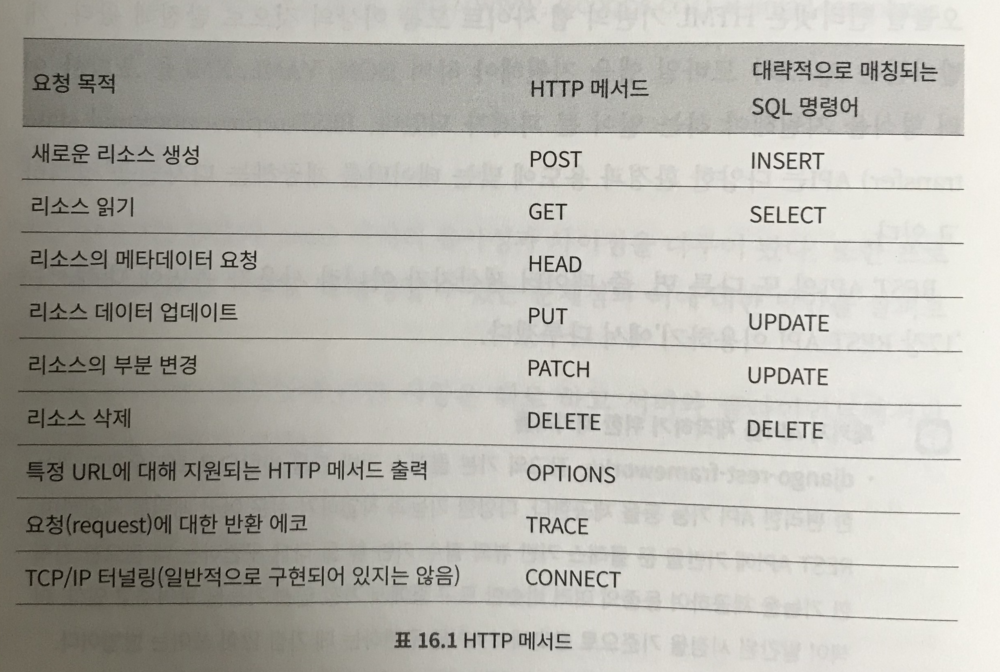

# Two scoops of Django Part 2


## 10장 클래스 기반 뷰의 모범적인 이용

* 장고의 뷰는 요청 객체를 받고 응답 객체를 반환하는 내장 함수이다.
* 클래스 기반 뷰에서는 뷰 클래스가 내장 함수를 반환하는 as_view() 클래스 메서드를 제공한다.
* `django.views.generic.View` 에서 해당 메커니즘이 구현되면 모든 클래스 기반 뷰는 이 클래스를 직간접적으로 상속받아 이용한다.

### 10.1 클래스 기반 뷰를 이용할 때의 가이드 라인

* 뷰 코드의 양은 적으면 적을수록 좋다.
* 뷰 안에서 같은 코드를 반복적으로 이용하지 말자.
* 뷰는 프레젠테이션 로직에서 관리하도록 하자. 비즈니스 로직은 모델에서 처리하자.
* 뷰는 간단 명료해야 한다.
* 403, 404, 500 에러 핸들링에 클래스 기반 뷰는 이용하지 않는다. 대신 함수 기반 뷰를 이용하자.
* 믹스인은 간단 명료해야 한다.

### 10.2 클래스 기반 뷰와 믹스인 이용하기

* 믹스인

    * 실체화된 클래스가 아닌, 상속해 줄 기능들을 제공하는 클래스를 의미

    * 다중상속을 해야 할 때, 믹스인을 쓰면 클래스에 더 나은 기능과 역할을 제공할 수 있다.

    * 파이썬의 메서드 처리순서(method resolution order)에 기반을 둔, 왼쪽에서 오른쪽의 순서로 처리하는 상속 규칙을 따른다.

        1. 장고가 제공하는 기본 뷰는 '항상' 오른쪽으로 진행한다.
        2. 믹스인은 기본 뷰에서부터 왼쪽으로 진행한다.
        3. 믹스인은 파이썬의 기본 객체 타입을 상속해야만 한다.

        ```python 
        from django.views.generic import TemplateView
        
        class FreshFruitMixin(object):
            def get_context_data(self, **kwrags):
                context = super(FreshFruitMixin, 
                                self).get_context_data(**kwrags)
                context["has_fresh_fruit"] = True
                return context
            
        class FruityFlavorView(FreshFruitMixin, TemplateView):
            template_name = "fruity_flavor.html"
        ```

        

### 10.3 어떤 장고 제네릭 클래스 기반 뷰를 어떤 태스크에 이용할 것 인가?

* 제네릭 클래스 기반 뷰의 장점은 단순화를 희생해서 얻은 결과이다.

* 각 클래스 기반 뷰의 목적과 이름을 에 대해서 알아야한다.

    

### 10.4 장고 클래스 기반 뷰에 대한 일반적인팁

* 클래스 기반뷰와 제네릭 클래스 기반 뷰는 뷰, 템플릿 그리고 뷰와 템플릿에 대한 테스트를 신속하게 제작하는데 그 목적이 있다.

#### 10.4.1 인증된 사용자에게만 장고 클래스 기반 뷰/제네릭 클래스 기반 뷰 접근 가능하게 하기

```python 
# flavors/views.py
from django.views.generic import DetailView

from braces.views import LoginRequiredMixin

from .models import Flavor

class FlavorDetailView(LoginRequiredMixin, DetailView):
    model = Flavor
```


#### 10.4.2 뷰에서 유효한 폼을 이용하여 커스텀 액션 구현하기

#### 10.4.3 뷰에서 부적합한 폼을 이용하여 커스텀 액션 구현하기

뷰에서 폼의 유효성 검사를 할 때 커스텀 애겻ㄴ을 구현하고자 한다면, form_valid()는 제네릭 클래스 기반 뷰가 요청을 보내는 곳에 자리잡게 된다.

```python
from django.views.generic import CreateView

from braces.views import LoginRequiredMixin

from .models import flavor

class FlavorCreateView(LoginRequiredMixin, CreateView):
    model = Flavor
    fields = ('title', 'slug', 'scoops_remaining')
    
    def form_valid(self, form):
        # Do custom logic here
        return super(FlavorCreateView, self).form_valid(form)
    
    def form_invalid(self, form):
        # Do custom logic here
        return super(FlavorCreateView, self).form_invalid(form)
```

#### 10.4.4 뷰 객체 이용하기

```python
from django.utils.functional import cached_property
from django.views.generic import UpdateView, TemplateView

from braces.views import LoginRequiredMixin

from .models import Flavor
from .tasks import update_users_who_favorited

class FavoriteMixin(object):
    @cached_property
    def likes_and_favorites(self):
        likes = self.object.likes()
        favorites = self.object.favorites()
        return {
            "likes": likes,
            "favorites": favorites,
            "favorites_count": favorites.count(),
        }
    
class FlavorUpdateView(LoginRequiredMixin, FavoriteMixin, UpdateView):
    model = Flavor
    fields = ('title', 'slug', 'scoops_remaining')
    
    def form_valid(self, form):
        update_users_who_favorited(
        	instance=self.object,
            favorites=self.likes_and_favorites['favorites']
        )
        return super(FlavorCreateView, self).form_valid(form)
    
class FlavorDetailView(LoginRequiredMixin, FavoriteMixin, TemplateView):
    model = Flavor
```

### 10.5 제네릭 클래스 기반 뷰와 폼 사용하기

```python
# flavors/models.py
from django.core.urlresolvers import reverse
from django.db import models

STATUS = (
	(0, 'zero'),
    (1, 'one'),
)

class Flavor(models.Modelytho):
    title = models.CharField(max_length=255)
    slug = models.SlugField(unique=True)
    scoops_remaining = models.IntegerField(default=0, choices=STATUS)
    
    def get_absolute_url(self):
        return reverse("flavors:detail", kwargs={"slug": self.slug})
```

#### 10.5.1 뷰 + 모델폼 예제

```python
from django.views.generic import CreateView, UpdateView, DetailView

from braces.views import LoginRequiredMixin

from .models import Flavor

class FlavorActionMixin(object):
    fields = ('title', 'slug', 'scoops_remaining')
    
    @property
    def success_msg(self):
        return NotImplemented
    
    def form_valid(self, form):
        messages.info(self,request, self.success_msg)
        return super(FlavorActionMixin, self).form_valid(form)

class FlavorCreateView(LoginRequiredMixin, FalvorActionMixin
                       CreateView):
    model = Flavor
    success_msg = "Flavor created!"
    
class FlavorUpdateView(LoginRequiredMixin, FalvorActionMixin,
                       UpdateView):
    model = Flavor
    success_msg = "Flavor updated!"
    
class FlavorDetailView(DetailView):
    model = Falvor
    

```


#### 10.5.2 뷰 + 폼 예제

```python
from django.views.generic import ListView

from .models import Flavor

class FlavorListView(ListView):
    model = Flavor
    
    def get_queryset(self):
        queryset = super(FlavorListView, self).get_queryset()
     
      	q = self.request.GET.get("q")
        if q:
            return queryset.filter(title__icontains=q)
        return queryset
```

### 10.6 `django.views.generic.View` 이용하기

```python
class FlavorView(LoginRequiredMixin, View):
    
    def get(self, request, *args, **kwargs):
        flavor = get_object_or_404(Flavor, slug=kwargs['slug'])
        return render(request,
                     "flavors/flavor_detail.html",
                     {"flavor": flavor}
                     )
    
    def post(self, request, *args, **kwargs):
        flavor = get_object_or_404(Flavor, slug=kwargs['slug'])
        form = FlavorForm(request.POST)
        if form.is_valid():
            form.save()
        return redirect("flavors:dtail", flavor.slug)
```

* json, pdf, 비 html 콘텐츠를 서비스하기 위해서 이용할 때 사용 될 수 있다.

### 10.7 추가 참고 자료

* django-extra-views
* django-vanila-views

### 10.8 요약

1. 믹스인과 클래스 기반 뷰를 이용하는 방법
2. 어떤 작업에 장고의 클래스 기반 뷰가 이용되어야 하는가?
3. 클래스 기반 뷰 사용에 대한 일반적인 팁들
4. 클래스 기반 뷰를 폼에 연동하기
5. 베이스 django.view.generic.View 이용하기


## 16장 REST API 구현하기

16.1 기본 REST API 디자인의 핵심



* 읽기 전용 API만 구현한다면 GET 메소드만 구현하면 된다.
* 읽기/쓰기 API를 구현한다면 최소한 POST 메소드는 구현해야하며 PUT, DELETE 또한 고려해야한다.
* GET, POST 만으로 구현되도록 설계하기도 한다.
* GET, PU, DELETE는 여러번 실행해도 그 겨로가가 변하지 않는 멱등 관계이며, POST와 PATCH는 그렇지 않다.
* PUT요청을 지원한다면 PATCH 또한 구현하는 것이 좋다.


16.3 REST API 아키텍쳐

16.3.1 프로젝트 코드들은 간결하게 정리되어 있어야한다.

* Api 만 전담해서 처리하는 앱을 따로구성(모든 시리얼라이저, 랜더러, 뷰가 위치하고 이름에 해당하는 api 버젼을 명시)하는 경우 특정 api가 위치한 곳을 찾기는 용이하지만, 해당 앱이 너무 커질 수 있고, 개별 앱으로부터 해당 api 앱이 단절될 수도 있다.


16.3.2 앱의 코드는 앱 안에 두자

* 일반적인 뷰가 따르는 가이드라인을 따라 `__init__.py` 를 포함하는 viewset패키지에 나누어 넣으면 모듈들이 너무 나뉘고, 수가 많아질 경우 api 컴포넌트들을 관리하기 어려워 질 수 있다.


### 16.3.3 비즈니스 로직을 api 뷰에서 분리하기

* api 뷰 또한 뷰의 한 종류이기 때문에, 비즈니스 로지고가 최대한 불리 필요


### 16.3.4 API URL을 모아 두기

* 앱 단위가 아닌 프로젝트 전반에 걸친 REST API 뷰의 경우, core/api.py의 형태로 구현된 모듈을 URLConf를 이용하여 urls.py 안에 포함

### 16.6 api에 접속을 제한하기

#### 16.6.1 제한 없는 api 접속은 위험하다.

#### 16.6.2 REST 프레임워큰 반드시 접속 제한을 해야한다.

#### 16.6.3 비즈니스 계획으로서의 접속제한

* 접근 수준에 따르 가격 정책


## 18장 Tradeoffs of Replacing Core Components

> 요약 : 할 이유가 없다.

* 서드 파티 django 패키지들을 포기할 수 있다면,
* django-admin을 버려도 문제가 없다면
* 이미 django로 할 수 있는 많은 시도를 했지만 해결할 수 없는 벽을 만났을 때,
* 이미 문제를 해결하기 위한 코드를 분석하여 문제를 해결하기위한 원인을 찾았을 때
* 캐싱, 비정규화 등의 옵션들을 다 고려하였을 때,
* 프로젝트가 거대한 유저들이 이용하고 있는 진짜 라이브 프로덕션이라 빠른 최적화가 아니라고 확신하는 경우
* SOA를 고려해보았지만 Django에서 다루는데 문제가 있어 보류 중일 때,
* Django를 업그레이드하며 계속 이용하는게 엄청나게 고통스럽거나 불가능해도 감수할 수 있을 때 

### 18.2 NOSQL vs 관계형 DB

#### 18.2.1 모든 비관계형 database가 ACID를 충족하진 않는다.

* 대부분 비관계형 database는 위 속성이 약하거나 없기 때문에 데이터가 오염될 위험이 높다.

#### 18.2.2 관계형 작업에 비관계형 db를 사용하지 마라.

#### 18.2.3 유행을 무시하고 스스로 연구를 해보아라.

#### 18.2.4 비관계 db를 어떻게 이용하나?

* Cache, queue 혹은 비정규화가 필요한 데이터를 다룰 때나 짧은 순간 데이터를 저장할 때 제한적으로 사용한다.
* 장기적인 데이터 보관과 비정규화 데이터가 필요할 때 이용한다.


## 20장 장고 유저모델

20.2.1 Subclass AbstractUser

장고 유저모델을 그대로 이용하면서, 추가로 필드가 필요할 때 쉽게 사용할 수 있는 옵션이다. 새롭게 프로젝트를 시작할 때, 접근할 수 있는 첫번째 방법이다.

```python 
# profiles/models.py
from django.contrib.auth.models import AbstractUser

class ParPerUser(AbstractUser):
    money = models.IntegerField(default=100000)
    
    
# Settings
AUTH_USER_MODEL = 'profiles.ParPerUser'
```


20.2.2 Subclass AbstractBaseUser

가장 최소한의 base 모델로부터 시작한다. Password, last_login, is_active를 제외하고는 모두 새로 만들어야 한다.