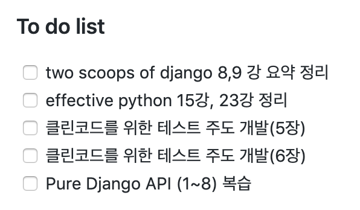
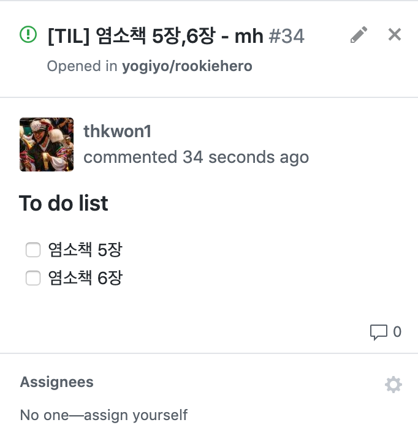

# :heavy_check_mark: 협업 프로세스 정리

> #### 해당 문서는 <u>깃허브를 활용한 협업 프로세스를 연습</u>하고, <u>익숙해지기 위해서</u>, <u>자체적으로 정한 규칙</u>에 대한 내용을 다룹니다.


-------------------


## :one: Card 생성 부터 Merge까지 

### :pencil2:TIL(Today I learned) PR 보내는 법

> 배운 내용을 정리한 후, Pull Request를 보내고, 리뷰 없이 바로 `master`예 `Merge` 합니다.


### 순서

1. 깃허브 `Projects`에서 TIL 보드로 들어 갑니다.

2. To do 에서 Card를 생성 합니다.

    * ex) `[TIL] 염소책 5장, 6장 - mh`

3. `Issue`로 Convert 합니다.

    * Body 부분에 To Do list를 작성합니다.

    * ex)

        

    * `Issue` 작성 완료후 `Assignee` 를 본인으로 지정합니다. - `assign yourself` 클릭

        

4. `Issue`에 맞는 로컬 `branch` 생성 합니다. - 아래 branch 네이밍 참고!

5. 학습 후 요약 내용 `commit` 합니다. `Issue` 있는 To do list 도 같이 체크 해줍니다.

6. `Issue` 에 적힌 To do list가 전부 체크 되면, 원격 저장소에 `push` 합니다.

7. 해당 `Issue`에 대한 `Pull Request`를 생성 합니다.

8. **승인 받지 않고 바로 `master`에 ` merge` 합니다.** 


### :bangbang:Code Review PR 보내는 법

> 배운 내용을 바탕으로 코드를 작성한 후, `Pull Request` 를 보내고, 승인 후, `master`에 `merge` 합니다.


### 순서

1. 깃허브 Projects에서 TIL 보드로 들어 갑니다.

2. To do 에서 Card를 생성 합니다.

    1. ex)
        - `[CodeReview] Django girls tutorial 심화 - sr`
        - `[CodeReview] Django girls tutorial 테스트 코드 작성 - th`

3. `Issue`로 Convert 합니다.
    - Body 부분에 To Do list를 작성합니다.

    - `Issue` 작성 완료후 `Assignee` 를 본인으로 지정합니다. - assign yourself 클릭

4. `Issue`에 맞는 로컬 `branch` 생성 합니다. - 아래 브랜치 네이밍 참고!

5. 학습 후 요약 내용 `commit` 합니다. `Issue` 있는 To do list 도 같이 체크 해줍니다.

6. `Issue` 에 적힌 To do list가 전부 체크 되면, 원격 저장소에 `push` 합니다.

7. 해당 `Issue`에 대한 Pull Request를 생성 합니다.

8. 본인을 제외한 나머지 2명을 `reviewer` 설정 합니다.

9. **2명 이상의 승인 후 본인이 Merge 합니다.**


#### 

## :two: Pull Request 규칙

- ### Pull request 생성

    - ##### title부분: Card 생성할 때, 정한 title을 그대로 사용

        - PR의 성격에 따라서, `[TIL]`  혹은 `[CodeReview]` 를 메세지 맨 앞에 적는다

        - Ex)

            - `[TIL] 장고 차근차근 하기 (1~5) - th / [TIL] 0409 - th`
            - `[CodeReview] Django girls 뷰 테스트 작성 - th`
            - `[CodeReview] Django girls 심화 - th`

            

    - ##### body부분

        - `Close #{{issue_number}}`
            - PR 종료 시 닫을 `Issue` 를 지정합니다.
            - ex)
                - `Close #15`
        - To do list를 체크리스트 형태로 작성합니다.

        

- ### Review 요청

    - 본인 제외 나머지 2명 필수로 `reviewer` 지정을 한다.
    - 리뷰 이후, 단순 수정에 대한 내용은 :thumbsup: 한번!

    

- ### Merge 조건

    - #### :pencil2:TIL

        - 승인 없이 바로 `merge` 한다.

    - #### :bangbang:Code Review

        * 방법1 : 인턴 인원 제외한 팀원 분들의 리뷰가 있을 때, 
            * **다른 팀원분의 리뷰를 반영 후, 승인을 받는다.**
            * 추가로 나머지 인턴 2명의 승인을 받는다.
            * `merge` 한다

        * 방법 2 : 인턴 2명의 리뷰만 있을 때,
            * **2명 모두에게 리뷰를 받고 승인을 받는다.**
            * `merge` 한다.

            

    

## :three: Branch 규칙

- ### Branch 네이밍

    - #### :pencil2:TIL의 경우

        - `TIL-{{이름 이니셜}}`
        - ex)
            - `TIL-mh`

    - #### CodeReview의 경우

        - `[이름 이니셜]-해당-branch의-개발-내용에-대한-설명`

            - ex)
                - `th-make-fbv-crud`

            

## :four: Commit message

### :bangbang:Code Review 관련

- `Feat`: 새로운 기능 추가

- `Fix`: 버그 수정

- `Docs`: 문서 수정

- `Style`: 코드 포맷팅, 세미콜론 누락, 로직 변경이 없는 경우

- `Refactor`: 코드 리팩토링

- `Test`: 테스트 코드 작성 시

- `Etc`: 위의 사항에 해당되지 않을 경우

- ex) `git commit` 입력 시,

    ```shell
    {{CommitPreFix}}: {{메인 커밋 메세지}} # git log --oneline으로 볼 수 있다.
    # 한칸 띄우고,
    * {{해당 커밋에 대한 보다 자세한 설명1 및 특이사항}}
    * {{해당 커밋에 대한 보다 자세한 설명1 및 특이사항}}
    * {{해당 커밋에 대한 보다 자세한 설명1 및 특이사항}}
    ...
    ```

    

    ```
    Feat: Post Detail 함수 작성
    
    * FBV를 이용해서, post_detail 함수를 생성
    * get_object_or_404()를 이용하여서 개발
    * 구현 시, try-except 말고 get_object_or_404()를 사용하라는 책 내용 참조
    ...
    ```

    

### :pencil2:TIL 관련

- **모든 커밋 메세지에 prefix `TIL:` 을 넣는다.**
- Ex)
    - `TIL: 장고 차근차근 하기 1강 완료`
    - `TIL: two scoops of django 8장 완료`